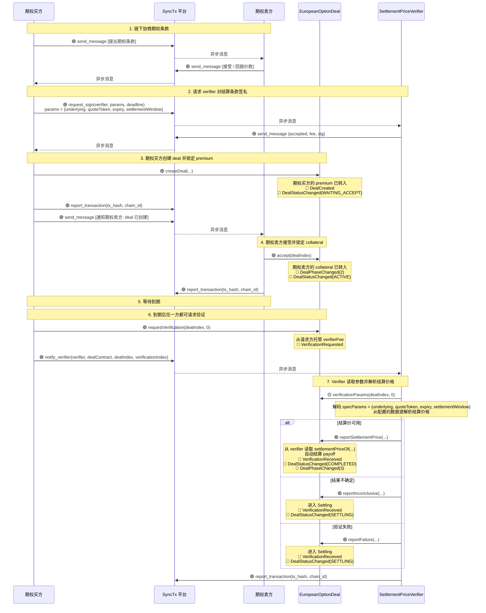
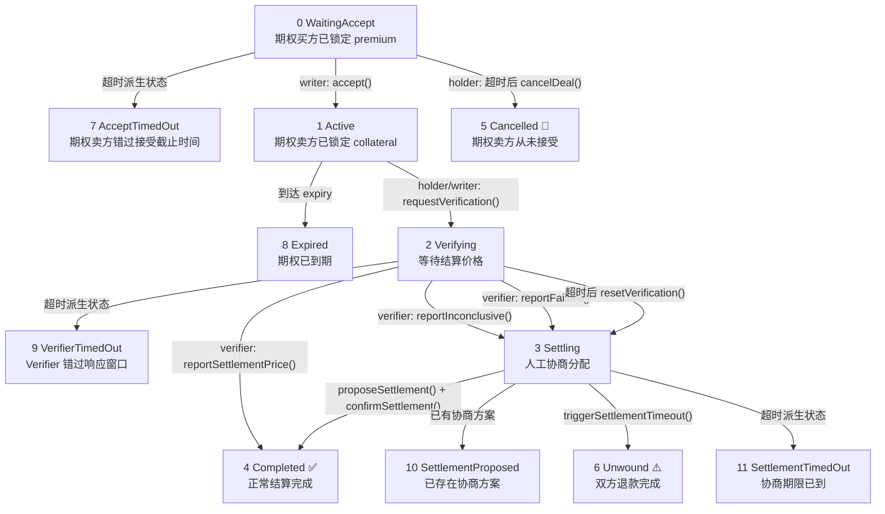
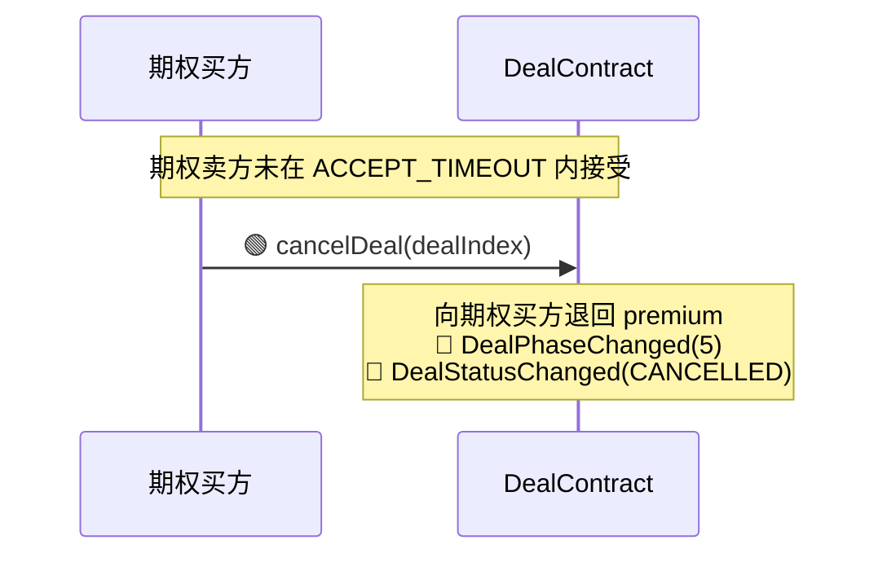
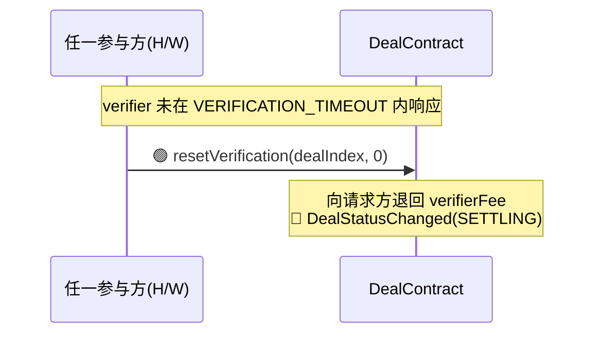
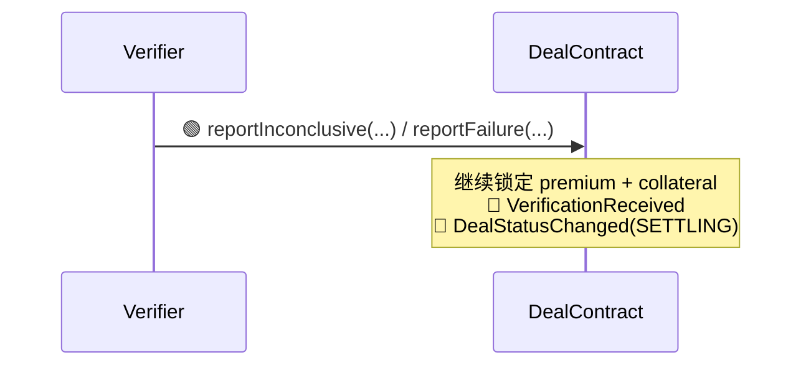
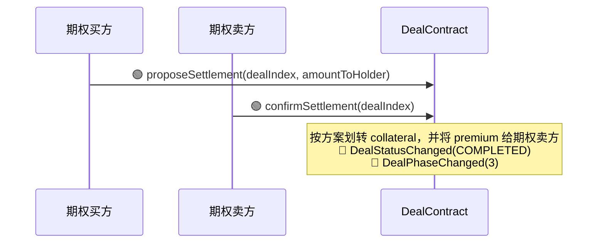
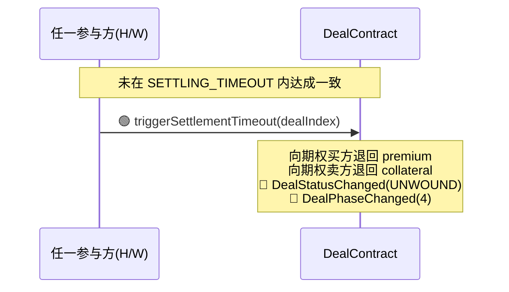

# EuropeanOptionDealContract 设计说明

> V1 把欧式期权拆成 SyncTx 当前标准真正能稳定承载的最小原语：`双方显式同意的 deal + 结算价 verifier`。
> 公开报价、series 市场层、自动做市曲线属于上层市场组件，不和核心 DealContract 混在一起实现。

---

## 1. V1 目标

V1 只解决三件事：

1. 如何让 `holder`（期权买方）和 `writer`（期权卖方）达成一笔标准欧式期权交易
2. 到期时如何把“结算价格”安全带回链上
3. 如何在价格验证失败时避免资金永久锁死

V1 不解决：

- 公开 series 市场
- 自动做市层
- 保证金 / 清算
- 二级转让（→ V2 头寸代币化方案，见第 13 节）

---

## 2. 为什么需要“价格旁路 verifier”

SyncTx 当前的 `onVerificationResult` 只支持：

```solidity
onVerificationResult(uint256 dealIndex, uint256 verificationIndex, int8 result, string reason)
```

这意味着 verifier 结果天然适合：

- 布尔结果：通过 / 不通过
- 分值结果：1 到 127 的打分

但期权结算需要的是：

- 一个真实的数值结算价 `settlementPrice`

因此 V1 的解法不是去改协议基类，而是引入一个专门的 `SettlementPriceVerifier`：

- `result > 0`：表示“价格已可用”
- `result == 0`：表示“不确定”
- `result < 0`：表示“验证失败”
- 真正的 `settlementPrice` 存在 verifier 合约里
- DealContract 在 `onVerificationResult` 中回读 `settlementPriceOf(...)`

这就是本文实现的 `VerifierSpec + Verifier + DealContract` 组合的核心原因。

---

## 3. 交易流程

### 3.1 场外达成条款

期权买方（holder）和期权卖方（writer）先在链下达成期权条款：

- `optionType`：`PUT` 或 `CALL`
- `underlying`
- `quantity`
- `strike`
- `premium`
- `expiry`
- `settlementWindow`
- `verifier`
- `verifierFee`

### 3.2 获取 Verifier 签名

Holder 向 `SettlementPriceVerifier` 请求一个 EIP-712 签名，证明 verifier 同意为下列结算条件服务：

- `underlying`
- `quoteToken`
- `expiry`
- `settlementWindow`
- `fee`
- `deadline`

### 3.3 期权买方创建 deal

期权买方先把 `premium` 转进合约，然后调用：

```text
createDeal(...)
```

创建后 deal 进入 `WaitingAccept`。

### 3.4 期权卖方接受 deal

期权卖方调用：

```text
accept(dealIndex)
```

并按 `optionType` 锁定抵押资产：

- `PUT`：锁 `USDC`
- `CALL`：锁 `underlying`

接受后 deal 进入 `Active`。

### 3.5 到期后请求价格验证

到期后，任一参与方都可以调用：

```text
requestVerification(dealIndex, 0)
```

并预付 `verifierFee`。

### 3.6 Verifier 回报结果

链下 verifier 读取 `verificationParams`，按 `(underlying, quoteToken, expiry, settlementWindow)` 获取结算价格，然后：

- 若价格明确：调用 `reportSettlementPrice(...)`
- 若无法确认：调用 `reportInconclusive(...)`
- 若验证失败：调用 `reportFailure(...)`

### 3.7 自动结算或进入 Settling

若价格明确，则 deal 自动结算：

- `PUT`：买方获得 `USDC` 计价的收益
- `CALL`：买方获得按 `underlying` 资产等值支付的收益

若不明确，则进入 `Settling`，双方可手动协商 `collateral` 的分配。

### 3.8 超时退出

若 verifier 超时，任何一方都可 `resetVerification` 并进入 `Settling`。

若 `Settling` 再次超时，则执行 `unwind`：

- `premium` 退回期权买方
- `collateral` 退回期权卖方

这不是理想金融语义，但好于永久锁死。

---

## 4. 交易流程

> **图例：**
> - 实线 `——▸`：直接链上 / 平台调用
> - 虚线 `┈┈▸`：异步平台消息
> - 🟣：平台 / verifier 服务动作
> - 🟢：链上写调用
> - 🟡：链上读调用
> - 🔵：事件发出



---

## 5. 状态机与状态迁移

### 5.1 状态枚举

| statusIndex | 状态 | 含义 |
|-----------|-------|---------|
| 0 | WaitingAccept | 期权买方已创建 deal，等待期权卖方接受 |
| 1 | Active | 期权卖方已接受，期权在到期前处于生效状态 |
| 2 | Verifying | 已到期，等待 verifier 返回结果 |
| 3 | Settling | 验证不确定 / 失败 / 超时，双方协商分配 |
| 4 | Completed | 正常结束，资金已分配 |
| 5 | Cancelled | 期权卖方长时间未接受，期权买方已取消 |
| 6 | Unwound | 在超时前仍未完成结算；`premium` 与 `collateral` 退回 |
| 7 | AcceptTimedOut | 派生状态：期权卖方错过接受截止时间 |
| 8 | Expired | 派生状态：活跃期权已到期，等待发起验证 |
| 9 | VerifierTimedOut | 派生状态：verifier 错过响应窗口 |
| 10 | SettlementProposed | 派生状态：已有结算协商方案 |
| 11 | SettlementTimedOut | 派生状态：协商窗口已过期 |
| 255 | NotFound | deal 不存在 |

### 5.2 状态迁移图



---

## 6. 非正常结束路径

### 6.1 WaitingAccept 超时 → Cancelled



结果：

- `premium` 退回期权买方
- deal 进入 `Cancelled`
- 期权卖方无资金变化

### 6.2 Verifier 超时 → resetVerification → Settling



结果：

- 预付的 `verifierFee` 退回请求方
- 交易不直接失败，进入 `Settling`

### 6.3 Verifier 不确定 / 失败 → Settling



结果：

- 不直接分配 `premium` / `collateral`
- 双方进入协商阶段

### 6.4 Settling → 协商分配



结果：

- `amountToHolder` 以 `collateral` 资产支付给期权买方
- 剩余 `collateral` 给期权卖方
- `premium` 给期权卖方
- deal 进入 `Completed`

### 6.5 Settling 超时 → Unwound



结果：

- `premium` 退回期权买方
- `collateral` 退回期权卖方
- deal 进入 `Unwound`

这不是金融上最优的结果，但它确保：

- 资金不会永久卡死
- 协议不需要引入早期仲裁层

### 6.6 非正常结束总表

| 场景 | 触发方法 | `premium` 去向 | `collateral` 去向 | 终态 |
|---|---|---|---|---|
| 期权卖方未接受 | `cancelDeal()` | 退回期权买方 | 无 | `Cancelled` |
| Verifier 超时 | `resetVerification()` | 暂不分配 | 暂不分配 | `Settling` |
| Verifier 不确定 | `reportInconclusive()` | 暂不分配 | 暂不分配 | `Settling` |
| Verifier 失败 | `reportFailure()` | 暂不分配 | 暂不分配 | `Settling` |
| 协商达成 | `proposeSettlement() + confirmSettlement()` | 给期权卖方 | 按方案分配 | `Completed` |
| 协商超时 | `triggerSettlementTimeout()` | 退回期权买方 | 退回期权卖方 | `Unwound` |

---

## 7. 需要什么样的 Verifier

V1 需要的不是“判断真假”的 verifier，而是“把数值价格安全带回链上”的 verifier。

因此它必须具备三种能力：

1. 能对 `(underlying, quoteToken, expiry, settlementWindow, fee, deadline)` 做 EIP-712 签名
2. 能在到期时产生一个单值 `settlementPrice`
3. 能把这个价格写进链上，并回调 DealContract

这对应三个组件：

- `SettlementPriceVerifierSpec.sol`
- `SettlementPriceVerifier.sol`
- `EuropeanOptionDealContract.sol`

---

## 8. Spec 的职责

`SettlementPriceVerifierSpec` 只做一件事：

> 验证某个 verifier 是否真的同意为指定结算条款服务。

它不负责：

- 返回价格
- 存价格
- 执行结算

它只负责恢复签名者地址，并让 DealContract 在 `createDeal` 时比对：

```text
recovered == verifier.signer()
```

---

## 9. DealContract 的职责

`EuropeanOptionDealContract` 只负责：

- 托管 `premium` 和 `collateral`
- 维护 deal 状态机
- 触发验证
- 在 verifier 给出价格后计算 `payoff`
- 执行资产划转

它不负责：

- 公开市场层 / series / 曲线报价
- 生成 oracle 数据
- 处理清算体系

---

## 10. 核心资产语义

V1 采用非对称抵押模型：

- `PUT`：`USDC collateral -> USDC payout`
- `CALL`：`underlying collateral -> underlying-equivalent payout`

这样可以在没有保证金追加 / 强平机制的前提下同时支持：

- `PUT`
- `CALL`

但代价是：

- `CALL` 不是严格意义上的“统一 `USDC cash payout`”
- 它更接近“标准 payoff + `underlying` 等值结算”

---

## 11. 为什么 V1 不直接实现公开 series

因为当前 SyncTx 核心标准是：

- `DealContract`
- `VerifierSpec`
- `Verifier`

如果一开始就在同一合约里塞入：

- maker vault
- 公开报价
- 参数曲线
- deal 结算
- 最终测试态拼装

那就会把“市场层”和“结算层”强耦合，难以验证真正的协议边界。

V1 更正确的路线是：

1. 先把期权结算原语落地
2. 再在其上做 series / quoting / vault 层

---

## 12. 实现清单

本目录实现：

- `SettlementPriceVerifierSpec.sol`
- `SettlementPriceVerifier.sol`
- `EuropeanOptionDealContract.sol`

它们共同构成一个可运行的欧式期权核心交易流示例。

---

## 13. V2 计划：头寸代币化与二级转让

### 13.1 动机

V1 中，Holder 和 Writer 的头寸绑定在地址上，一旦进入 deal 就无法退出，只能等到期结算。这导致：

- Writer 即使想止损也无法提前退出
- Holder 即使已经浮盈也无法提前变现
- 资金效率低，锁定周期完全由 expiry 决定

### 13.2 核心设计

双方质押时各铸造一个头寸 Token（ERC-721 或 ERC-1155），合约只认 Token 持有者，不再绑定原始地址：

- **Holder Token**：代表行权权。到期时持有者可发起 `requestVerification` 并领取收益
- **Writer Token**：代表对锁定抵押品的取回权。到期时若未被行权（或部分行权），持有者可 `withdraw` 剩余抵押品

### 13.3 流程变化

```text
createDeal(...)  → 锁定 premium  → 铸造 Holder Token 给 holder
accept(...)      → 锁定 collateral → 铸造 Writer Token 给 writer
```

到期结算时：

```text
settle(dealIndex) → 根据 Token 持有者地址分配资金
                  → 销毁两个 Token
```

Token 持有者可在到期前自由转让（直接转账或通过二级市场出售），合约不关心转让过程，只在结算时读取当前持有者。

### 13.4 Token 定价逻辑

**Holder Token 价值** ≈ 期权的市场价格（受标的价格、剩余时间、波动率影响）

**Writer Token 价值** = 预期可取回的抵押品 = 抵押品总额 - 预期赔付

示例（PUT 期权，Writer 锁定 $50 USDC）：

| 当前标的价格 | 行权可能性 | Writer Token 近似价值 |
|---|---|---|
| 远高于 strike | 极低 | ≈ $50（几乎全额取回） |
| 接近 strike | 中等 | ≈ $40-45 |
| 远低于 strike | 极高 | ≈ $0-10 |

### 13.5 关键约束

- 两个 Token **必须配对存在**，不能单独增发或销毁（除结算时）
- 质押品从头到尾锁在合约中，Token 只转让"谁来取"的权利
- 转让 Writer Token 不改变抵押品数量或义务——义务在质押时已完全履行（全额抵押）
- Token 的二级市场定价由外部市场决定，合约不参与
