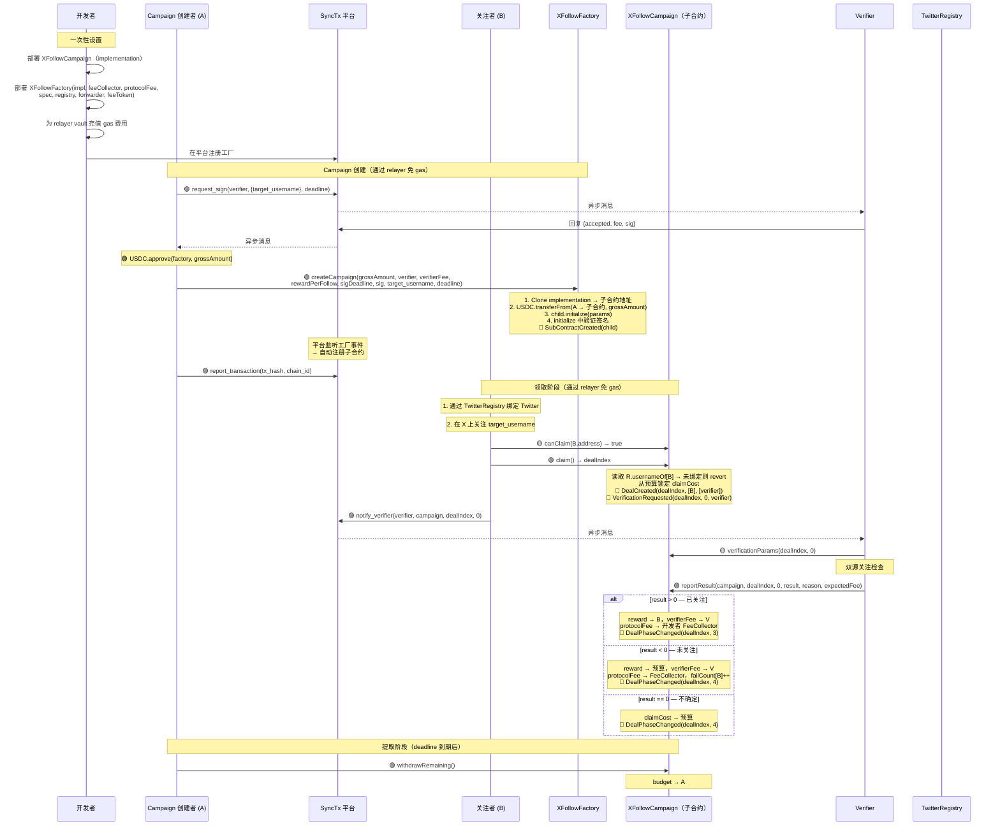
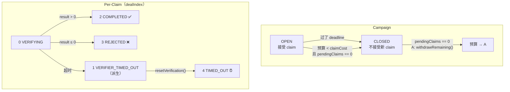

# X Follow Campaign — 工厂 + Clone 设计

> 开发者部署工厂合约，A 通过工厂创建 campaign（免 gas），B 在子合约中领取关注奖励（免 gas）。三方激励模型：开发者靠每次 claim 的手续费获利，A 不用懂合约即可获得粉丝，B 关注即赚钱无需支付 gas。

---

## 1. 概述

### 1.1 三方模型

| 角色 | 做什么 | 收益 |
|------|--------|------|
| **开发者** | 部署工厂 + implementation，设定 protocolFee，预充 relayer vault | 每次 claim 收手续费 |
| **A（Campaign 创建者）** | 在工厂调 createCampaign()，存入预算 | 无需部署合约或支付 gas |
| **B（关注者）** | 在 X 上关注目标账号，在子合约调 claim() | 赚取固定 USDC 奖励，零 gas 成本 |

### 1.2 架构

```
XFollowFactory（开发者部署一次）
  │  ├── implementation: XFollowCampaign（逻辑合约）
  │  ├── protocolFee, feeCollector（→ 开发者）
  │  ├── trustedForwarder（ERC2771，所有子合约共享）
  │  ├── requiredSpec, twitterRegistry（共享配置）
  │  └── relayer vault 为 A + B 的 gasless 交易提供 gas（开发者预充）
  │
  ├── createCampaign() → Clones.clone(impl) + initialize()
  │     └── XFollowCampaign（子合约 1，A₁ 的 campaign）
  │           ├── claim() → B₁ 获得 dealIndex 0
  │           ├── claim() → B₂ 获得 dealIndex 1
  │           └── withdrawRemaining()
  │
  ├── createCampaign() → clone + initialize
  │     └── XFollowCampaign（子合约 2，A₂ 的 campaign）
  └── ...
```

### 1.3 要点

- **继承链：** `IDeal → DealBase → XFollowCampaign`（子合约），`XFollowFactory`（部署器）
- **Clone 模式：** EIP-1167 最小代理。所有子合约共享 implementation 字节码，各自有独立 storage
- **Gasless：** 工厂设置 `trustedForwarder` → 子合约继承 → A 的 createCampaign 和 B 的 claim() 均通过 relayer 免 gas。Gas 由开发者的 relayer vault 支付
- **生命周期：** `createCampaign()` → 子合约直接进入 OPEN（无 TESTING 阶段）
- **自动注册：** 工厂 emit `SubContractCreated(address campaign, address creator)` → 平台监听工厂事件 → 自动发现并注册子合约（每个实现 IDeal 接口）
- **身份：** `TwitterRegistry` 绑定为 B 的强制要求
- **协议费：** 按 claim 收取，从 campaign 预算扣除 → 开发者的 feeCollector
- **失败限制：** `MAX_FAILURES = 3`，每地址每 campaign

---

## 2. 合约结构

### 2.1 XFollowFactory

```solidity
contract XFollowFactory {

    // ===================== 不可变量 =====================

    address public immutable implementation;     // XFollowCampaign 逻辑合约
    address public immutable FEE_COLLECTOR;      // 开发者的费用接收地址
    uint96  public immutable PROTOCOL_FEE;       // 每次 claim 的手续费（如 10000 = 0.01 USDC）
    address public immutable REQUIRED_SPEC;      // XFollowVerifierSpec 地址
    address public immutable TWITTER_REGISTRY;   // TwitterRegistry 地址
    address public immutable TRUSTED_FORWARDER;  // ERC2771 转发器（A + B 免 gas）
    address public immutable FEE_TOKEN;          // USDC 地址

    // ===================== 事件 =====================

    /// @dev 协议级事件，定义在 IDeal 中。平台监听此事件自动注册子合约。
    event SubContractCreated(address indexed subContract);

    // ===================== 函数 =====================

    /// @notice A 创建 campaign。一笔 tx 完成 Clone + initialize。
    function createCampaign(
        uint96  grossAmount,
        address verifier,
        uint96  verifierFee,
        uint96  rewardPerFollow,
        uint256 sigDeadline,
        bytes calldata sig,
        string calldata target_username,
        uint48  deadline
    ) external returns (address campaign);
}
```

### 2.2 XFollowCampaign（子合约 / Implementation）

```solidity
contract XFollowCampaign is DealBase, ERC2771Mixin {

    // ===================== initialize() 设置 =====================

    address public factory;              // 父工厂
    address public partyA;               // campaign 创建者
    address public verifier;
    uint96  public rewardPerFollow;
    uint96  public verifierFee;
    uint48  public deadline;
    uint96  public budget;               // 剩余未锁定预算
    uint32  public pendingClaims;
    uint32  public completedClaims;
    uint256 public signatureDeadline;
    string  public target_username;
    bytes   public verifierSignature;
    bool    public closed;               // true = CLOSED

    // ===================== 从工厂读取 =====================

    // FEE_COLLECTOR, PROTOCOL_FEE, REQUIRED_SPEC, TWITTER_REGISTRY, feeToken
    // 运行时从 factory 读取（不存储在子合约，节省 clone storage）

    // ===================== Per-Claim =====================

    struct Claim {
        address claimer;
        uint48  timestamp;
        uint8   status;              // VERIFYING(0) / COMPLETED(2) / REJECTED(3) / TIMED_OUT(4)
        string  follower_username;
    }

    mapping(uint256 => Claim) internal claims;
    mapping(address => bool)  public claimed;
    mapping(address => uint8) public failCount;
}
```

---

## 3. 函数参考

### 3.1 XFollowFactory 函数

| 方法 | 调用者 | 说明 |
|------|--------|------|
| `constructor(impl, feeCollector, protocolFee, spec, registry, forwarder, feeToken)` | 开发者 | 部署工厂，设置共享配置 |
| `createCampaign(grossAmount, verifier, verifierFee, rewardPerFollow, sigDeadline, sig, target_username, deadline)` | A（免 gas） | Clone impl → initialize → 转 USDC 到子合约 → emit SubContractCreated。返回子合约地址 |

### 3.2 XFollowCampaign 函数

| 方法 | 调用者 | 说明 |
|------|--------|------|
| `initialize(...)` | 仅工厂 | 设置 campaign 参数。仅可调用一次，仅工厂可调 |
| `claim()` | 任何 B（免 gas） | 无参数。从 TwitterRegistry 读取用户名。从预算锁定 claimCost。发出 VerificationRequested。返回 dealIndex |
| `onVerificationResult(dealIndex, 0, result, reason)` | Verifier | result>0 → 付款给 B；result<0 → 奖励退回预算，failCount++；result==0 → 全部退回 |
| `resetVerification(dealIndex, 0)` | 任何人 | VERIFICATION_TIMEOUT 后。全额 claimCost 退回预算 |
| `withdrawRemaining()` | A | CLOSED 且 pendingClaims==0 时。budget → A |

### 3.3 查询函数

| 方法 | 返回值 | 说明 |
|------|--------|------|
| `claimCost()` | `uint96` | rewardPerFollow + verifierFee + PROTOCOL_FEE |
| `campaignStatus()` | `uint8` | OPEN(0) / CLOSED(1) |
| `dealStatus(dealIndex)` | `uint8` | VERIFYING(0) / VERIFIER_TIMED_OUT(1) / COMPLETED(2) / REJECTED(3) / TIMED_OUT(4) / NOT_FOUND(255) |
| `canClaim(addr)` | `bool` | addr 是否可 claim |
| `failures(addr)` | `uint8` | 失败次数 |
| `remainingSlots()` | `uint256` | budget / claimCost |

### 3.4 IDeal 接口

| 方法 | 说明 |
|------|------|
| `name()` | `"X Follow Campaign"` |
| `description()` | Campaign 描述 |
| `tags()` | `["x", "follow"]` |
| `version()` | `"3.0"` |
| `instruction()` | A 和 B 的 Markdown 操作指南 |
| `requiredSpecs()` | `[REQUIRED_SPEC]`（从工厂读取） |
| `verificationParams(dealIndex, 0)` | specParams = abi.encode(follower_username, target_username) |
| `requestVerification(dealIndex, 0)` | 始终 revert — 由 claim() 自动触发 |
| `phase(dealIndex)` | 0=不存在，2=活跃，3=成功，4=失败 |
| `dealExists(dealIndex)` | claim 是否存在 |

---

## 4. 验证系统

### 4.1 EIP-712 签名（per-campaign）

TYPEHASH：
```
Verify(string targetUsername,uint256 fee,uint256 deadline)
```

A 在调用 `createCampaign()` 前向 verifier 请求签名。工厂将签名传递给子合约的 `initialize()`，在其中验证。

约束：`sigDeadline >= campaignDeadline`。

### 4.2 specParams（per-claim）

```solidity
specParams = abi.encode(
    string follower_username,  // 从 TwitterRegistry.usernameOf[claimer] 读取
    string target_username     // campaign 配置
)
```

### 4.3 链下验证流程

```
Verifier 收到 notify_verify（dealIndex = claim，verificationIndex = 0）
  │
  ├── 0. 读取 dealStatus(dealIndex) — 仅在 VERIFYING(0) 时继续
  ├── 1. 读取 verificationParams(dealIndex, 0) → 解码 specParams
  ├── 2. 双源关注检查（twitterapi.io + twitter-api45）
  ├── 3. 合并：任一关注 → 1，未关注 → 重试 → -1 或 1，均出错 → 0
  └── 4. reportResult(campaign, dealIndex, 0, result, reason, expectedFee)
```

---

## 5. 交易流程



---

## 6. 状态机与转换

### 6.1 Campaign 状态

| 代码 | 状态 | 含义 |
|------|------|------|
| 0 | OPEN | 接受 claim（未过 deadline，预算 ≥ claimCost） |
| 1 | CLOSED | 不接受新 claim。待处理的验证继续解决 |

> 无 TESTING 状态 — `createCampaign()` 直接初始化为 OPEN。
> CLOSED 在 deadline 到达或预算耗尽时自动触发（作为副作用）。

### 6.2 Per-Claim `dealStatus(dealIndex)`

| 代码 | 状态 | 存储/派生 | 含义 |
|------|------|---------|------|
| 0 | VERIFYING | 存储 | 等待 verifier |
| 1 | VERIFIER_TIMED_OUT | 派生 | 超过 VERIFICATION_TIMEOUT，可调用 resetVerification |
| 2 | COMPLETED | 存储 | B 已收款 |
| 3 | REJECTED | 存储 | 未关注或不确定，奖励已退回 |
| 4 | TIMED_OUT | 存储 | resetVerification 后，claimCost 已退回 |
| 255 | NOT_FOUND | — | Claim 不存在 |

### 6.3 Per-Claim `phase(dealIndex)`

| dealStatus | phase | 名称 |
|------------|-------|------|
| NOT_FOUND | 0 | NotFound |
| VERIFYING / VERIFIER_TIMED_OUT | 2 | Active |
| COMPLETED | 3 | Success |
| REJECTED / TIMED_OUT | 4 | Failed |

### 6.4 状态转换图



### 6.5 事件

| 操作 | 事件 |
|------|------|
| `createCampaign()` | `SubContractCreated(child)`（工厂，协议级） |
| `claim()` | `DealCreated` → `DealStateChanged(0)` → `DealPhaseChanged(2)` → `VerificationRequested` |
| `onVerificationResult(>0)` | `VerificationReceived` → `DealStateChanged(2)` → `DealPhaseChanged(3)` |
| `onVerificationResult(≤0)` | `VerificationReceived` → `DealStateChanged(3)` → `DealPhaseChanged(4)` |
| `resetVerification()` | `DealStateChanged(4)` → `DealPhaseChanged(4)` |

### 6.6 Claim 资格

```
campaign CLOSED          → CampaignNotOpen
claimed[B]               → AlreadyClaimed
failCount[B] >= 3        → MaxFailures
无 TwitterRegistry 绑定   → NotVerified
budget < claimCost       → 自动关闭 → CLOSED
有待处理 claim            → PendingClaim
否则                      → 可 claim
```

---

## 7. Gasless 架构

### 7.1 设置

```
开发者部署：
  1. SyncTxForwarder（ERC2771 信任转发器）
  2. XFollowCampaign implementation（含 ERC2771Mixin）
  3. XFollowFactory(impl, ..., trustedForwarder = forwarder)
  4. 为 relayer vault 充值（gas 预算）

所有子合约在 initialize() 时从工厂继承 trustedForwarder。
```

### 7.2 谁支付 Gas

| 操作 | Tx 发送者 | Gas 由谁支付 |
|------|----------|-------------|
| A: createCampaign | Relayer（meta-tx） | 开发者的 vault |
| B: claim | Relayer（meta-tx） | 开发者的 vault |
| B: notify_verifier | 平台 MCP 调用 | 无 gas（链下） |
| Verifier: reportResult | Verifier signer EOA | Verifier（自有 gas） |
| A: withdrawRemaining | Relayer（meta-tx） | 开发者的 vault |

### 7.3 经济模型

```
开发者每次 claim 收入 = PROTOCOL_FEE
开发者每次 claim 成本 = B 的 claim() meta-tx gas + A 的摊销创建成本
净利润              = PROTOCOL_FEE - gas 成本
```

开发者设置 PROTOCOL_FEE 需足以覆盖 gas + 利润空间。

---

## 8. 资金流向

### 8.1 Campaign 创建

```
A approve USDC 给工厂。
工厂：USDC.transferFrom(A → 子合约, grossAmount)
child.initialize()：budget = grossAmount
无预收协议费 — 按 claim 收取。
```

### 8.2 每次 Claim 成本

```
claimCost = rewardPerFollow + verifierFee + PROTOCOL_FEE
每次 claim() 从 budget 锁定 claimCost。
```

### 8.3 验证结果 → 资金分配

| 结果 | 奖励 | Verifier 费用 | 协议费 | 预算变化 |
|------|------|--------------|--------|---------|
| 通过 (>0) | → B | → Verifier | → FeeCollector | — |
| 失败 (<0) | → 预算 | → Verifier | → FeeCollector | +rewardPerFollow |
| 不确定 (0) | → 预算 | → 预算 | → 预算 | +claimCost |
| 超时 | → 预算 | → 预算 | → 预算 | +claimCost |

### 8.4 Campaign 结束

```
deadline 到期 + pendingClaims == 0 后：
  budget → A（通过 withdrawRemaining()）
```

---

## 9. 验证清单

### 9.1 Factory.createCampaign

| # | 检查项 | 错误 |
|---|--------|------|
| 1 | `rewardPerFollow > 0` | InvalidParams |
| 2 | `deadline > block.timestamp` | InvalidParams |
| 3 | `verifier != address(0)`，是合约 | VerifierNotContract |
| 4 | `target_username` 非空 | InvalidParams |
| 5 | `grossAmount >= claimCost`（至少可 claim 1 次） | InvalidParams |
| 6 | Clone implementation → 子合约 | — |
| 7 | `USDC.transferFrom(A → 子合约, grossAmount)` | TransferFailed |
| 8 | `child.initialize(params)` | — |
| 9 | Emit `SubContractCreated(child)` | — |

### 9.2 Campaign.initialize

| # | 检查项 | 错误 |
|---|--------|------|
| 1 | 调用者是工厂 | NotFactory |
| 2 | 尚未初始化 | AlreadyInitialized |
| 3 | `sigDeadline >= deadline` | SignatureExpired |
| 4 | Verifier spec 匹配 + EIP-712 签名有效 | InvalidVerifierSignature |
| 5 | 设置所有参数，budget = grossAmount，状态 = OPEN | — |

### 9.3 Campaign.claim

| # | 检查项 | 错误 |
|---|--------|------|
| 1 | 未关闭，未过 deadline | CampaignNotOpen |
| 2 | `budget >= claimCost` | 自动关闭 |
| 3 | `!claimed[sender]` | AlreadyClaimed |
| 4 | `failCount[sender] < MAX_FAILURES` | MaxFailures |
| 5 | `TwitterRegistry.usernameOf[sender]` 非空 | NotVerified |
| 6 | 无待处理 claim | PendingClaim |
| 7 | 锁定 claimCost，pendingClaims++ | — |

### 9.4 Campaign.onVerificationResult

| # | 检查项 | 错误 |
|---|--------|------|
| 1 | `msg.sender == verifier` | NotVerifier |
| 2 | Claim 状态 == VERIFYING | InvalidStatus |
| 3 | 分配资金，更新计数器，检查自动关闭 | — |

### 9.5 Campaign.withdrawRemaining

| # | 检查项 | 错误 |
|---|--------|------|
| 1 | `sender == partyA` | NotPartyA |
| 2 | Campaign 已 CLOSED | NotClosed |
| 3 | `pendingClaims == 0` | PendingClaims |
| 4 | `budget > 0` | NoFunds |

---

## 10. 常量

| 常量 | 值 | 位置 | 说明 |
|------|---|------|------|
| `VERIFICATION_TIMEOUT` | 30 分钟 | Campaign | 每个 claim 的 verifier 响应时限 |
| `MAX_FAILURES` | 3 | Campaign | 每地址最大失败次数 |
| `MIN_PROTOCOL_FEE` | 10,000（0.01 USDC） | Factory | 部署时的最低协议费 |
