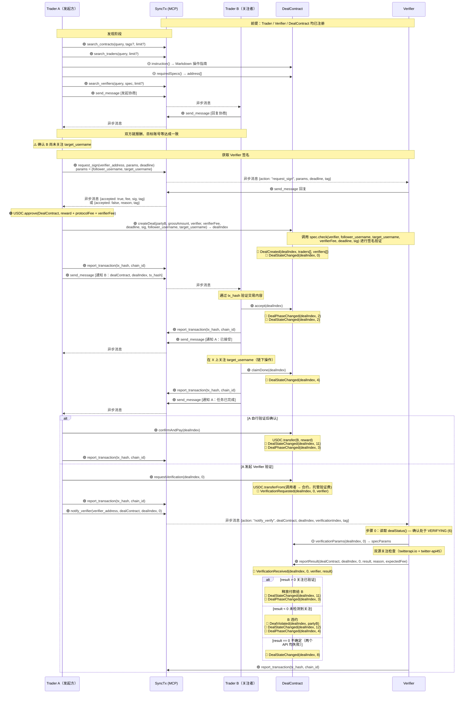
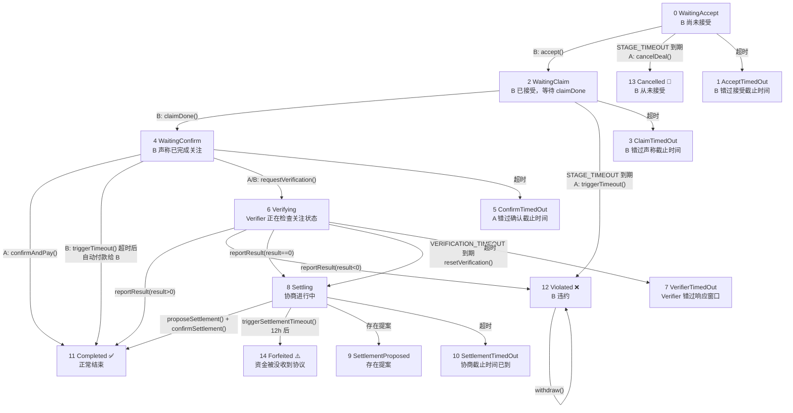
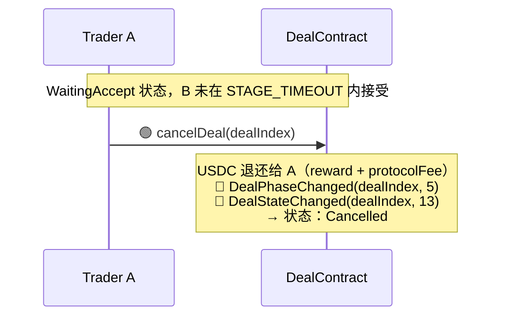
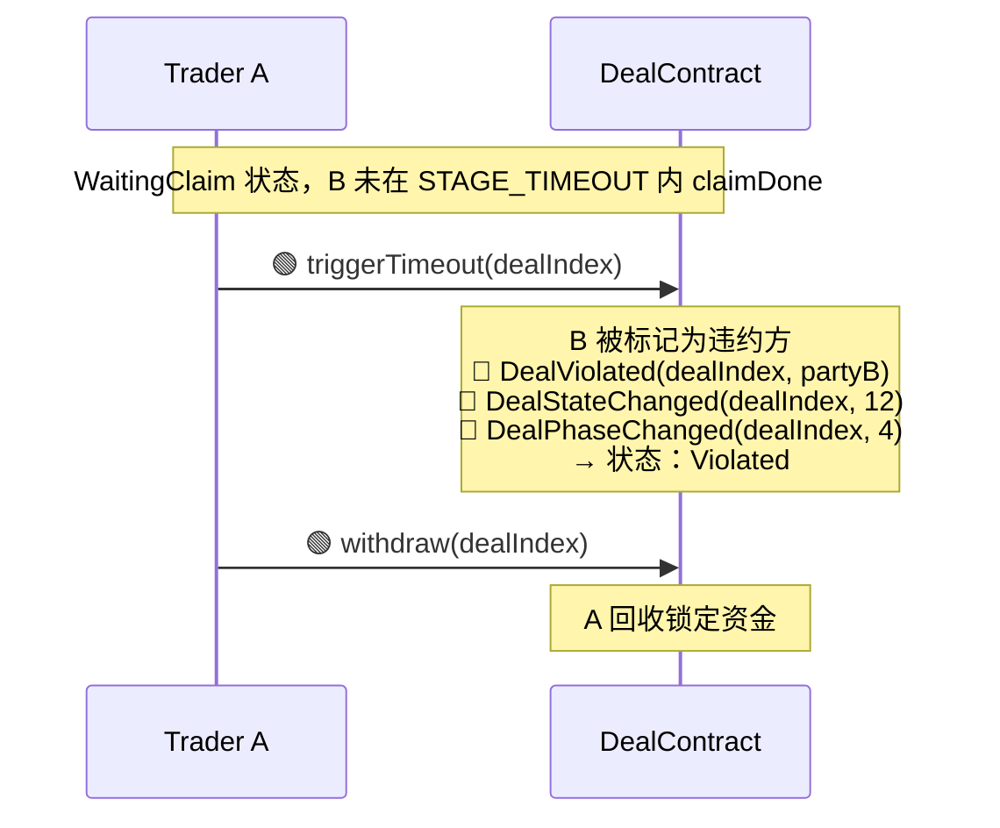
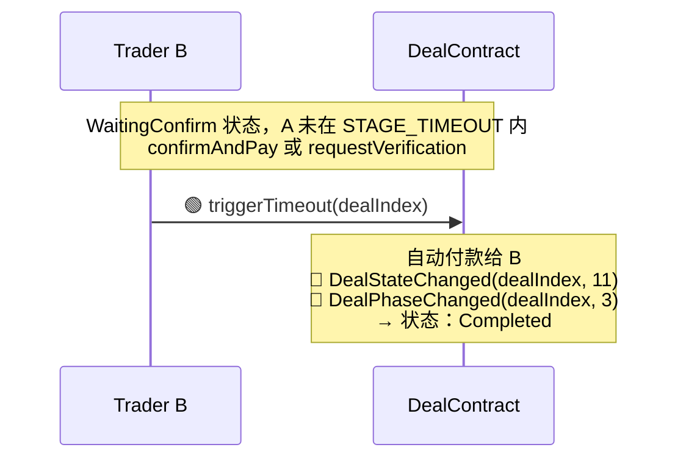
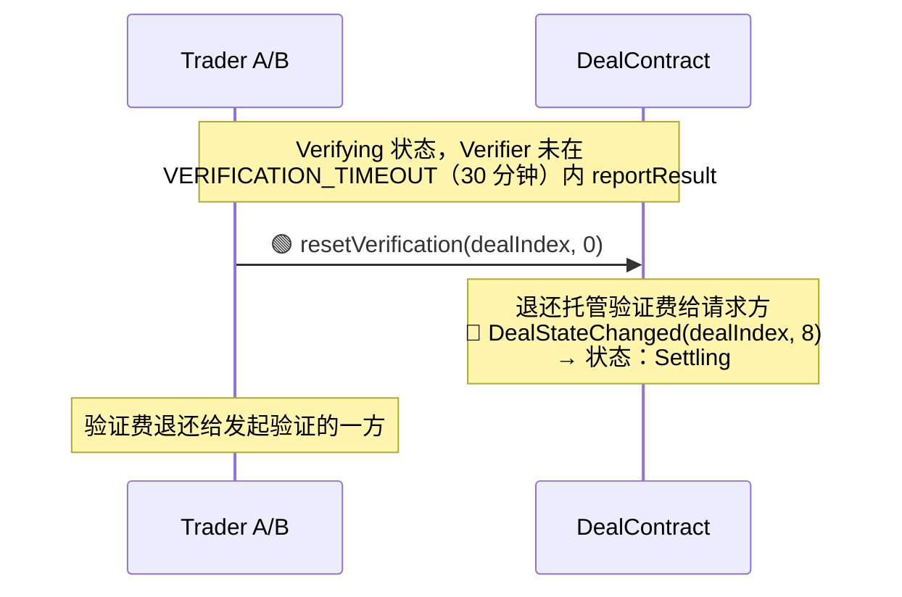
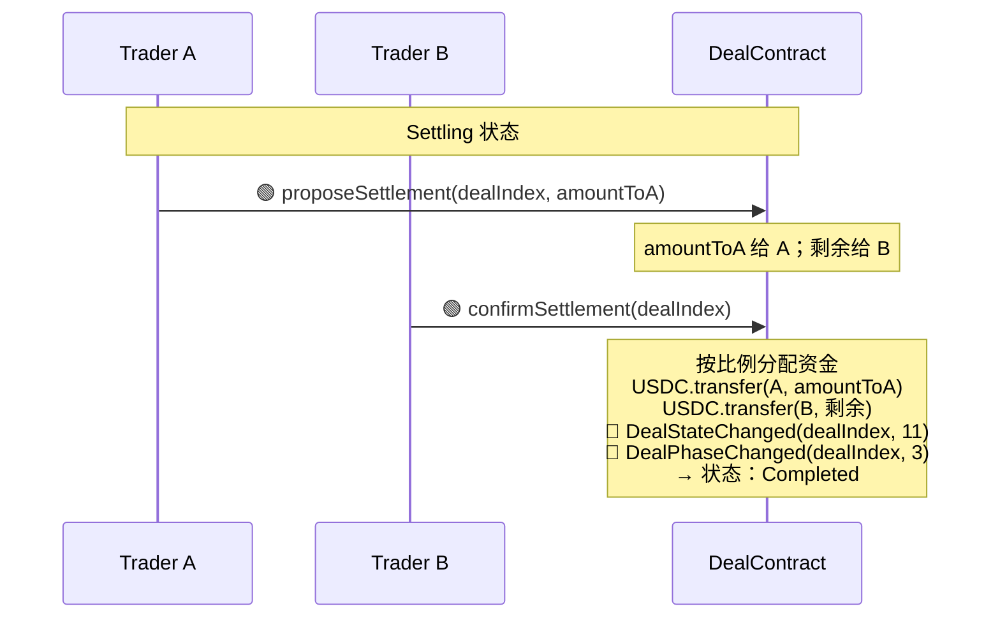
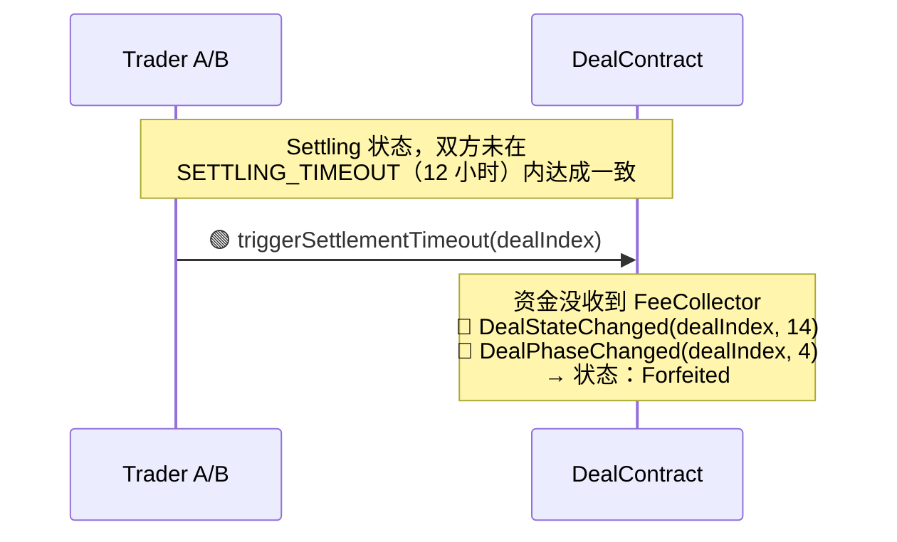
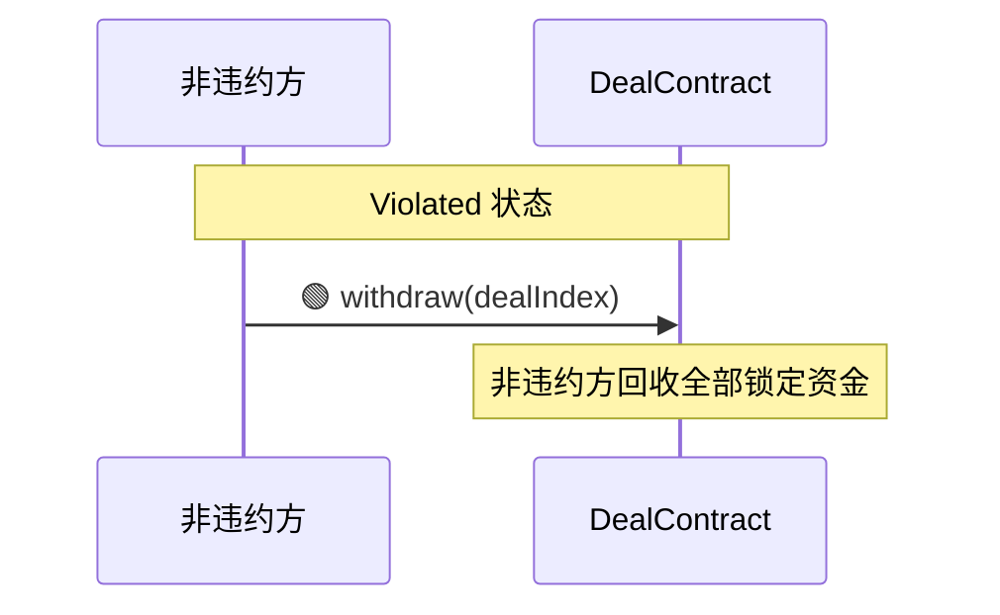

# XFollowDealContract 设计文档

> XFollowDealContract 完整设计，包含合约接口、交易流程、状态机、超时处理和异常处理。

---

## 1. 概述

XFollowDealContract 是一个具体的 DealContract 实现，用于 **"A 付费让 B 在 X 上关注指定账号"** 的交易场景。

- **继承链：** `IDeal → DealBase → XFollowDealContract`
- **验证系统：** 单验证槽位，要求 spec 为 `XFollowVerifierSpec`
- **支付代币：** USDC
- **标签：** `["x", "follow"]`
- **验证语义：** 弱语义 — 验证者检查**验证时刻**关注关系是否存在，而非该关注是否在交易创建之后建立。`instruction()` 要求 A 在创建交易前确认 B 尚未关注目标账号。
- **链下验证：** 双源并行检查：twitterapi.io（`check_follow_relationship`）+ twitter-api45（`checkfollow.php`）。任一源确认关注 → 通过；两者均否定 → 失败；两者均出错 → 不确定。

---

## 2. 函数参考

### 2.1 XFollowDealContract 全部函数

> 继承链：`IDeal → DealBase → XFollowDealContract`

| 方法 | 参数 | 返回值 | 定义于 | 实现于 | 说明 |
|------|------|--------|--------|--------|------|
| `standard()` | — | `string` | IDeal | DealBase | 返回 `"1.0"`。`pure`，不可覆盖 |
| `supportsInterface(id)` | `bytes4 id` | `bool` | IDeal | DealBase | ERC-165。`pure`，不可覆盖 |
| `_recordStart(...)` | `address[] traders, address[] verifiers` | `uint256 dealIndex` | DealBase | DealBase | 内部工具。发出 DealCreated，返回 dealIndex |
| `_emitPhaseChanged(dealIndex, toPhase)` | `uint256 dealIndex, uint8 toPhase` | — | DealBase | DealBase | 内部工具。发出 DealPhaseChanged。phase: 2=活跃, 3=成功, 4=失败, 5=已取消 |
| `_emitStateChanged(...)` | `uint256 dealIndex, uint8 stateIndex` | — | DealBase | DealBase | 内部工具。发出 DealStateChanged |
| `_emitViolated(...)` | `uint256 dealIndex, address violator` | — | DealBase | DealBase | 内部工具。发出 DealViolated |
| `name()` | — | `string` | IDeal | XFollowDealContract | 返回 `"X Follow Deal"`。`pure` |
| `description()` | — | `string` | IDeal | XFollowDealContract | 合约描述，用于 SyncTx 搜索。`pure` |
| `tags()` | — | `string[]` | IDeal | XFollowDealContract | 返回 `["x", "follow"]`。`pure` |
| `version()` | — | `string` | IDeal | XFollowDealContract | 交易规则版本号。`pure` |
| `protocolFeePolicy()` | — | `string` | IDeal | XFollowDealContract | 人类可读的协议费策略。`view` |
| `protocolFee()` | — | `uint96` | XFollowDealContract | XFollowDealContract | 协议费金额查询。`view` |
| `instruction()` | — | `string` (Markdown) | IDeal | XFollowDealContract | 操作指南，与 MCP 术语一致。`view` |
| `phase(dealIndex)` | `uint256 dealIndex` | `uint8` | IDeal | XFollowDealContract | 通用阶段：0=不存在 1=待处理 2=活跃 3=成功 4=失败 5=已取消。`view` |
| `dealStatus(dealIndex)` | `uint256 dealIndex` | `uint8` | IDeal | XFollowDealContract | 不依赖调用者的业务状态码。返回 0-14 及 255（不存在）。`view` |
| `dealExists(dealIndex)` | `uint256 dealIndex` | `bool` | IDeal | XFollowDealContract | 交易是否存在。`view` |
| `requiredSpecs()` | — | `address[]` | IDeal | XFollowDealContract | 返回所需的 spec 地址列表。XFollowDealContract 只有 1 个槽位，指向 XFollowVerifierSpec。`view` |
| `verificationParams(...)` | `uint256 dealIndex, uint256 verificationIndex` | `(address verifier, uint256 fee, uint256 deadline, bytes sig, bytes specParams)` | IDeal | XFollowDealContract | 供 Verifier 获取验证参数。`specParams = abi.encode(follower_username, target_username)`。`view` |
| `requestVerification(...)` | `uint256 dealIndex, uint256 verificationIndex` | — | IDeal | XFollowDealContract | 由 Trader 触发验证。托管验证费 + 发出 VerificationRequested。`external` |
| `onVerificationResult(...)` | `uint256 dealIndex, uint256 verificationIndex, int8 result, string reason` | — | IDeal | XFollowDealContract | Verifier → DealContract 回调。`external` |
| `createDeal(...)` | `address partyB, uint96 grossAmount, address verifier, uint96 verifierFee, uint256 deadline, bytes sig, string follower_username, string target_username` | `uint256 dealIndex` | XFollowDealContract | XFollowDealContract | 创建交易。内部调用 `XFollowVerifierSpec.check()` 进行签名验证 |
| `accept(dealIndex)` | `uint256 dealIndex` | — | XFollowDealContract | XFollowDealContract | B 接受交易。WaitingAccept → WaitingClaim |
| `claimDone(dealIndex)` | `uint256 dealIndex` | — | XFollowDealContract | XFollowDealContract | B 声称已完成关注（无参数 — 关注是二元的）。WaitingClaim → WaitingConfirm |
| `confirmAndPay(dealIndex)` | `uint256 dealIndex` | — | XFollowDealContract | XFollowDealContract | A 确认并释放付款。WaitingConfirm → Completed |
| `cancelDeal(dealIndex)` | `uint256 dealIndex` | — | XFollowDealContract | XFollowDealContract | WaitingAccept 超时后 A 取消。WaitingAccept → Cancelled |
| `triggerTimeout(dealIndex)` | `uint256 dealIndex` | — | XFollowDealContract | XFollowDealContract | 触发超时处理。WaitingClaim 超时 → Violated；WaitingConfirm 超时 → 自动付款 Completed |
| `resetVerification(...)` | `uint256 dealIndex, uint256 verificationIndex` | — | XFollowDealContract | XFollowDealContract | Verifier 超时后重置验证。Verifying → Settling |
| `proposeSettlement(...)` | `uint256 dealIndex, uint96 amountToA` | — | XFollowDealContract | XFollowDealContract | 提出资金分配方案 |
| `confirmSettlement(dealIndex)` | `uint256 dealIndex` | — | XFollowDealContract | XFollowDealContract | 确认对方的提案。Settling → Completed |
| `triggerSettlementTimeout(dealIndex)` | `uint256 dealIndex` | — | XFollowDealContract | XFollowDealContract | 12 小时超时后没收资金到 FeeCollector。Settling → Forfeited |
| `withdraw(dealIndex)` | `uint256 dealIndex` | — | XFollowDealContract | XFollowDealContract | 非违约方提取全部锁定资金。仅在 Violated 状态可调用 |

### 2.2 XFollowVerifier 全部函数

> 继承链：`IVerifier → VerifierBase → XFollowVerifier`
> Spec 合约：`VerifierSpec → XFollowVerifierSpec`（由 XFollowVerifier.spec() 指向）

| 方法 | 参数 | 返回值 | 定义于 | 实现于 | 说明 |
|------|------|--------|--------|--------|------|
| `reportResult(...)` | `address dealContract, uint256 dealIndex, uint256 verificationIndex, int8 result, string reason, uint256 expectedFee` | — | IVerifier | VerifierBase | 由 Verifier signer (EOA) 调用，内部回调 `IDeal(dealContract).onVerificationResult()`。`external` |
| `owner()` | — | `address` | IVerifier | VerifierBase | 合约所有者。`view` |
| `signer()` | — | `address` | IVerifier | VerifierBase | 签名/报告 EOA。`view` |
| `supportsInterface(id)` | `bytes4 id` | `bool` | IVerifier | VerifierBase | ERC-165。`pure` |
| `transferOwnership(...)` | `address newOwner` | — | VerifierBase | VerifierBase | 发起所有权转移 |
| `acceptOwnership()` | — | — | VerifierBase | VerifierBase | 两步所有权接受 |
| `setSigner(...)` | `address newSigner` | — | VerifierBase | VerifierBase | 更换 verifier signer EOA |
| `withdrawFees(...)` | `address to, uint256 amount` | — | VerifierBase | VerifierBase | 提取实例收到的费用 |
| `DOMAIN_SEPARATOR` | — | `bytes32` | VerifierBase | VerifierBase | public immutable，供 Spec 合约的 `check()` 读取 |
| `description()` | — | `string` | IVerifier | XFollowVerifier | 实例自描述。`view` |
| `spec()` | — | `address` | IVerifier | XFollowVerifier | 指向 XFollowVerifierSpec 地址。`view` |
| `spec()->check(...)` | `address verifierInstance, string follower_username, string target_username, uint256 fee, uint256 deadline, bytes sig` | `address` | XFollowVerifierSpec | XFollowVerifierSpec | 业务验证入口。恢复 EIP-712 签名者。由 DealContract 在 createDeal 时调用 |

---

## 3. 事件参考

| 事件名称 | 参数 | 实现于 | 触发时机 | 说明 |
|---------|------|--------|---------|------|
| `DealCreated` | `uint256 dealIndex, address[] traders, address[] verifiers` | DealBase (`_recordStart`) | `createDeal` 成功时 | traders 和 verifiers 记录参与方 |
| `DealStateChanged` | `uint256 dealIndex, uint8 stateIndex` | DealBase (`_emitStateChanged`) | 每次状态变更时 | stateIndex 对应 dealStatus 基础值 |
| `DealPhaseChanged` | `uint256 indexed dealIndex, uint8 indexed phase` | DealBase (`_emitPhaseChanged`) | 阶段转换时 | phase: 2=活跃, 3=成功, 4=失败, 5=已取消 |
| `DealViolated` | `uint256 dealIndex, address violator` | DealBase (`_emitViolated`) | triggerTimeout (WaitingClaim) / 验证失败 (result<0) | violator 为违约方地址 |
| `VerificationRequested` | `uint256 dealIndex, uint256 verificationIndex, address verifier` | XFollowDealContract | `requestVerification` 成功时 | 同时托管验证费 |
| `VerificationReceived` | `uint256 dealIndex, uint256 verificationIndex, address verifier, int8 result` | XFollowDealContract | Verifier 报告结果时 | 在 onVerificationResult 回调中发出 |

---

## 4. 验证系统

### 4.1 合约结构

```
VerifierSpec ← XFollowVerifierSpec（业务规范合约）
IVerifier ← VerifierBase ← XFollowVerifier（实例合约）
XFollowVerifier.spec() → XFollowVerifierSpec（组合关系）
```

### 4.2 check() 签名验证流程

```
XFollowVerifierSpec.check(verifierInstance, follower_username, target_username, fee, deadline, sig)
  │
  ├── 1. 构造 structHash(follower_username, target_username, fee, deadline)
  ├── 2. 从 verifierInstance 读取 DOMAIN_SEPARATOR
  ├── 3. 构造 EIP-712 digest = keccak256(0x1901 || DOMAIN_SEPARATOR || structHash)
  ├── 4. 从 sig 恢复签名者（含 EIP-2 low-s 值检查）
  └── 5. 返回恢复的签名者地址（调用方比对 verifierInstance.signer()）
```

### 4.3 specParams 编码

`verificationParams()` 返回的 `specParams` 编码格式：

```solidity
specParams = abi.encode(
    string follower_username,  // B 的 X 用户名（规范化：无 @，全小写）
    string target_username     // 要关注的目标账号（规范化）
)
```

Verifier 端解码：`abi.decode(specParams, (string, string))`

### 4.4 链下验证流程（双源）

```
Verifier 服务收到 notify_verify
  │
  ├── 0. 读取链上 dealStatus() — 仅在 VERIFYING (6) 时继续
  ├── 1. 读取链上 verificationParams() → 解码 specParams
  ├── 2. 并行 API 调用：
  │     ├── twitterapi.io: GET /twitter/user/check_follow_relationship
  │     │     ?source_user_name={follower}&target_user_name={target}
  │     │     → data.following === true
  │     └── twitter-api45: GET /checkfollow.php
  │           ?user={follower}&follows={target}
  │           → data.follows === true || data.status === "Following"
  ├── 3. 合并逻辑：
  │     ├── 任一确认关注 → result = 1（通过）
  │     ├── 两者均否定 → 5 秒后重试一次
  │     │     ├── 仍然否定 → result = -1（失败）
  │     │     └── 重试确认 → result = 1（通过）
  │     └── 两者均出错 → result = 0（不确定）
  └── 4. 链上 reportResult(dealContract, dealIndex, 0, result, reason, expectedFee)
```

### 4.5 与 XQuote 验证的差异

| 方面 | XQuote | XFollow |
|------|--------|---------|
| specParams | 3 个字段：tweet_id, quoter_username, quote_tweet_id | 2 个字段：follower_username, target_username |
| claimDone | 需要 `quote_tweet_id` 参数 | 无参数（关注是二元的） |
| Provider API | tweet.php（获取推文详情） | check_follow_relationship / checkfollow.php |
| 验证目标 | 验证某推文是否是另一推文的引用 | 验证关注关系是否存在 |
| TYPEHASH | `Verify(string tweetId,string quoterUsername,uint256 fee,uint256 deadline)` | `Verify(string followerUsername,string targetUsername,uint256 fee,uint256 deadline)` |

---

## 5. 交易流程

> **图例：**
> - 实线 `——▸` = 直接调用；虚线 `┈┈▸` = 异步消息（对方需通过 get_messages 轮询）
> - 🟣 = MCP 调用（SyncTx 接口）；🟢 = 链上写调用；🟡 = 链上读调用
> - 🔵 = 发出事件
>
> **角色说明：** Trader A = 发起方（付款方），Trader B = 对手方（关注者）。requestVerification 和 notify_verifier 双方均可调用。



---

## 6. 状态机与转换

### 6.1 状态枚举

| stateIndex | 状态 | 含义 |
|-----------|------|------|
| 0 | WaitingAccept | 交易已创建，等待 B 接受 |
| 1 | AcceptTimedOut | B 未在超时前接受 |
| 2 | WaitingClaim | B 已接受，等待 B 关注目标并声称完成 |
| 3 | ClaimTimedOut | B 未在超时前声称完成 |
| 4 | WaitingConfirm | B 声称已完成，等待 A 确认或触发验证 |
| 5 | ConfirmTimedOut | A 未在超时前确认 |
| 6 | Verifying | 验证进行中，等待 Verifier |
| 7 | VerifierTimedOut | Verifier 未在限定时间内响应 |
| 8 | Settling | 进入协商阶段 |
| 9 | SettlementProposed | 存在协商提案 |
| 10 | SettlementTimedOut | 协商超时，待确认提案仍可确认 |
| 11 | Completed | 交易完成，资金已释放 |
| 12 | Violated | 发生违约，非违约方可提取 |
| 13 | Cancelled | B 接受前交易被取消 |
| 14 | Forfeited | 资金被没收到协议 |
| 255 | NotFound | 交易不存在 |

### 6.2 状态转换图



---

## 7. 超时与异常路径

### 7.1 超时常量

| 常量 | 值 | 适用阶段 |
|------|---|---------|
| `STAGE_TIMEOUT` | 30 分钟 | WaitingAccept / WaitingClaim / WaitingConfirm |
| `VERIFICATION_TIMEOUT` | 30 分钟 | Verifier 响应时限 |
| `SETTLING_TIMEOUT` | 12 小时 | 协商时限 |

每个阶段的 `stageTimestamp` 在进入该状态时更新；超时从该时刻开始计算。

### 7.2 WaitingAccept → 超时（B 未接受）

> B 尚未接受，不构成违约。A 回收资金，交易取消，不影响任何人的统计数据。



### 7.3 WaitingClaim → 超时（B 未 claimDone）



### 7.4 WaitingConfirm → 超时（A 既未确认也未发起验证）



> **注意：** 如果 A 已经调用了 requestVerification（状态为 VERIFYING），B 无法调用 triggerTimeout，必须等待 Verifier 响应或 Verifier 超时后 resetVerification。

### 7.5 Verifier 超时 → resetVerification → Settling



### 7.6 Settling → 协商分配



> 提案方不能确认自己的提案；对方可以拒绝并提出新方案（覆盖之前的提案）。

### 7.7 Settling → 协商超时（资金没收）



> 任一方（A 或 B）均可触发，激励双方及时协商。

### 7.8 Violated → 非违约方提取



> 违约方（violator）无法调用 withdraw。

### 7.9 Settling 设计原则

进入条件：Verifier 报告 `result == 0`（不确定，通常两个 Twitter API 均失败）或 Verifier 超时后 `resetVerification`。

- 轮到谁行动而未行动，则该方受损
- 最终僵局时资金被没收，激励双方积极妥协
- Settling 阶段没有明确的过错方，因此**仅提供协商路径，不支持重新发起验证**

| 出口 | 触发方法 | 说明 |
|------|---------|------|
| 协商分配 | `proposeSettlement(dealIndex, amountToA)` + 对方 `confirmSettlement(dealIndex)` | 双方协商资金分配比例 |
| 协商超时没收 | `triggerSettlementTimeout(dealIndex)`（`SETTLING_TIMEOUT` 后） | 资金没收到 FeeCollector |

---

## 8. 资金流向

### 8.1 createDeal 时资金托管

```
Trader A approve 金额 = reward + protocolFee + verifierFee
createDeal 时 USDC.transferFrom(A → 合约) 托管 grossAmount（= reward + protocolFee）
verifierFee 在 requestVerification 时单独托管
```

- `protocolFee` 策略通过 `protocolFeePolicy()` 读取；精确金额通过 `protocolFee()` 获取
- `verifierFee` 从 Verifier 签名回复中获取（`{accepted: true, fee: 10000, sig: "0x...", tag: "..."}`）

### 8.2 正常完成

```
reward        → Trader B
protocolFee   → FeeCollector（协议收入，在 accept 时转出）
verifierFee   → 合约托管，在 requestVerification 调用时结算
```

### 8.3 验证费流向

```
requestVerification 时：
  USDC.transferFrom(调用者 → 合约) 托管验证费

reportResult 回调时（onVerificationResult 内部）：
  将托管验证费转给 Verifier 合约
  Verifier 合约验证收到金额 ≥ expectedFee

Verifier 超时 resetVerification 时：
  托管验证费退还给发起验证的一方
```

### 8.4 异常路径资金去向

| 场景 | 资金去向 |
|------|---------|
| WaitingAccept 超时 → cancelDeal | 全额退还 A（reward + protocolFee） |
| WaitingClaim 超时 → triggerTimeout → Violated | A 通过 withdraw 回收 |
| WaitingConfirm 超时 → triggerTimeout | 自动付款给 B |
| 验证通过 (result>0) → Completed | 付款给 B |
| 验证失败 (result<0) → Violated | 非违约方通过 withdraw 回收 |
| 验证不确定 (result==0) → Settling → 协商 | 按 proposeSettlement 比例分配 |
| Settling 超时 → triggerSettlementTimeout | 全部没收到 FeeCollector；交易进入 Forfeited (14) |

---

## 9. 验证清单

### 9.1 createDeal 内部验证

| # | 验证项目 | 失败处理 |
|---|---------|---------|
| 1 | `grossAmount > PROTOCOL_FEE` | revert InvalidParams |
| 2 | `verifierFee <= grossAmount - PROTOCOL_FEE` | revert InvalidParams |
| 3 | `partyB != address(0)`，`sender != partyB` | revert InvalidParams |
| 4 | `verifier != address(0)`，`verifier.code.length > 0` | revert VerifierNotContract |
| 5 | `sig.length > 0`，`deadline >= block.timestamp` | revert InvalidVerifierSignature / SignatureExpired |
| 6 | 用户名规范化 + 非空检查 | revert InvalidParams |
| 7 | Verifier spec 匹配：`verifier.spec() == REQUIRED_SPEC` | revert InvalidSpecAddress |
| 8 | 签名验证：`XFollowVerifierSpec.check()` 恢复的签名者 == `verifier.signer()` | revert InvalidVerifierSignature |
| 9 | 资金转账：`USDC.transferFrom(A, 合约, grossAmount)` | revert TransferFailed |

### 9.2 requestVerification 内部验证

| # | 验证项目 | 失败处理 |
|---|---------|---------|
| 1 | 交易处于 WaitingConfirm 状态，未超时 | revert InvalidStatus / AlreadyTimedOut |
| 2 | `msg.sender` 是 partyA 或 partyB | revert NotAorB |
| 3 | 调用者的 USDC allowance 和 balance ≥ verifierFee | revert InsufficientAllowance / InsufficientBalance |
| 4 | 执行：`USDC.transferFrom(sender → 合约)` | revert TransferFailed |

### 9.3 onVerificationResult 内部验证

| # | 验证项目 | 失败处理 |
|---|---------|---------|
| 1 | `msg.sender == deal.verifier` | revert NotVerifier |
| 2 | 交易处于 VERIFYING 状态 | revert InvalidStatus |
| 3 | 将托管验证费转给 Verifier 合约 | revert TransferFailed |
| 4 | 根据 result 处理业务逻辑： | — |
|   | `result > 0`（通过）：释放付款给 B → Completed | — |
|   | `result < 0`（失败）：B 违约 → Violated | — |
|   | `result == 0`（不确定）：→ Settling | — |

### 9.4 Verifier 服务前置检查

| # | 检查项 | 失败处理 |
|---|-------|---------|
| 1 | `dealStatus() == VERIFYING (6)` | 跳过通知，回复错误 |
| 2 | `on_chain_verifier == self.contract_address` | 跳过通知 |
| 3 | `on_chain_fee > 0` | 跳过通知 |
| 4 | `verify_fee > 0`（签名阶段） | 拒绝签名请求 |
