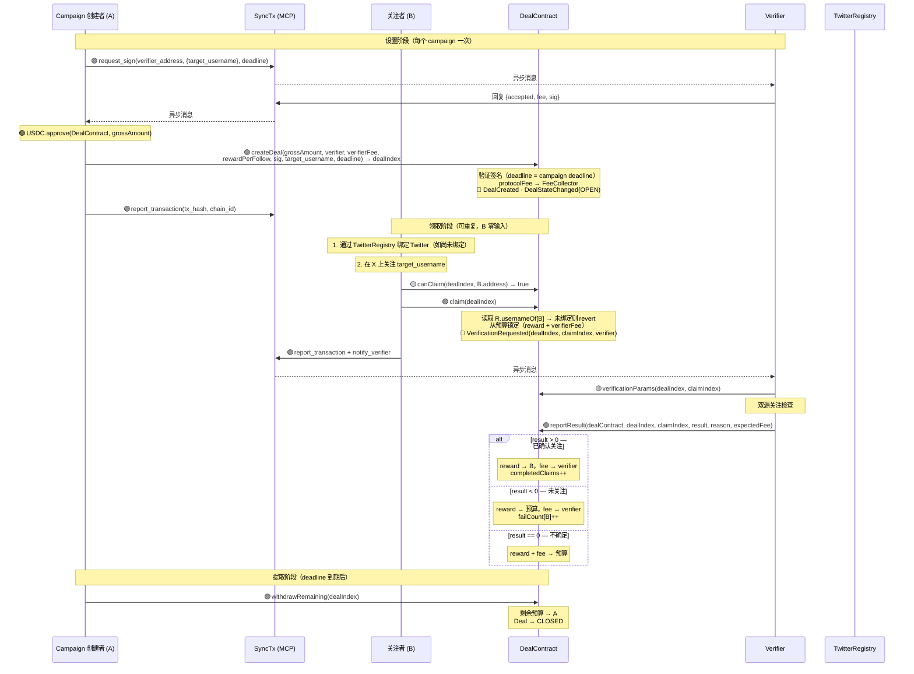
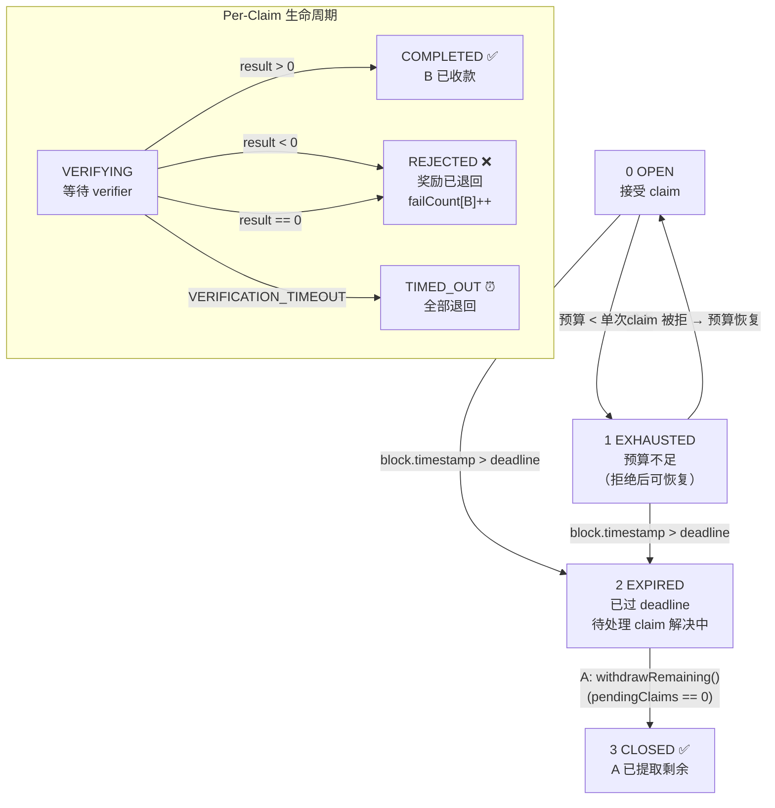
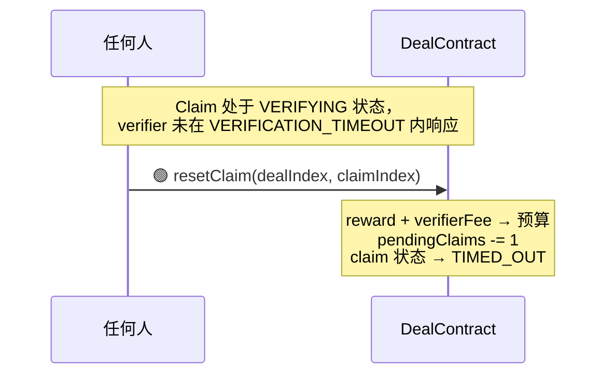
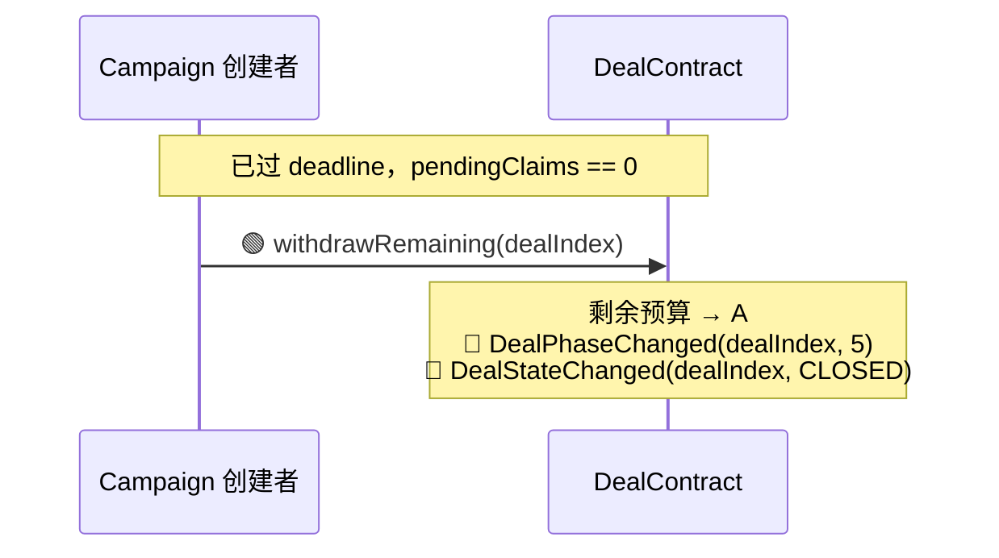
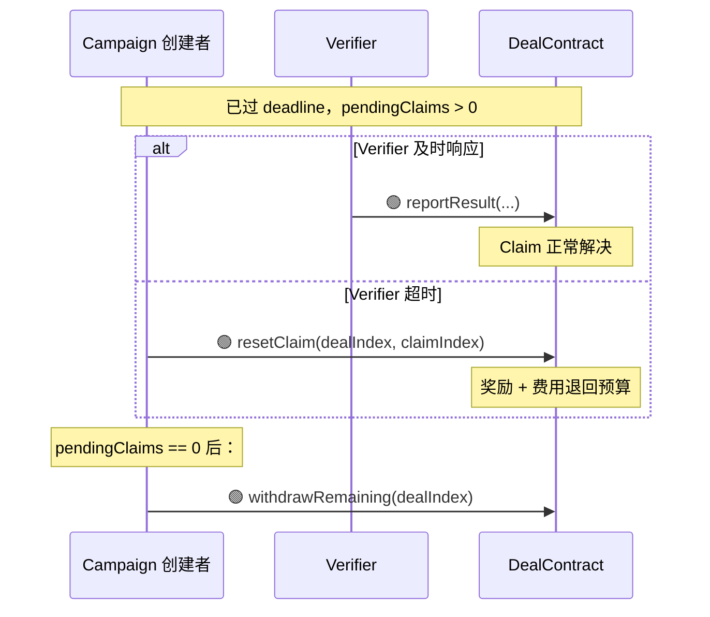

# XFollowDealContract 设计文档

> 1对多 campaign 模型：A 存入预算，任何已认证 TwitterRegistry 的用户均可关注后领取固定奖励。全自动，无需协商。

---

## 1. 概述

XFollowDealContract 是一个具体的 DealContract 实现，用于 **"A 为关注 X 上指定账号支付固定奖励"** 的 campaign 场景。

- **继承链：** `IDeal → DealBase → XFollowDealContract`
- **模型：** 1对多 — A 创建 campaign，任意数量的 B 可领取
- **验证系统：** 多 claim 单 verifier（每个 campaign），要求 `XFollowVerifierSpec`
- **支付代币：** USDC
- **标签：** `["x", "follow"]`
- **身份：** `TwitterRegistry` 绑定为强制要求 — 合约在链上读取 `usernameOf[msg.sender]`，未绑定则 revert
- **验证语义：** 验证者检查验证时刻关注关系是否存在。身份由 TwitterRegistry 保证（钱包 ↔ 用户名），消除冒领风险
- **链下验证：** 双源并行检查：twitterapi.io（`check_follow_relationship`）+ twitter-api45（`checkfollow.php`）
- **结束条件：** 预算耗尽或截止时间到达 — A 不可提前关闭
- **统一 deadline：** campaign deadline 同时用作 verifier 签名到期时间和 campaign 结束时间

---

## 2. 核心数据结构

### 2.1 Deal（Campaign）

```solidity
struct Deal {
    // 槽 1
    address partyA;              // 20 字节 — campaign 创建者
    uint48  deadline;            // 6 字节  — campaign 截止时间 = 签名 deadline
    uint8   status;              // 1 字节  — OPEN / CLOSED
    // 槽 2
    address verifier;            // 20 字节 — verifier 合约地址
    uint96  rewardPerFollow;     // 12 字节 — 每次关注的固定 USDC 奖励
    // 槽 3
    uint96  budget;              // 12 字节 — 剩余未锁定 USDC 预算
    uint96  verifierFee;         // 12 字节 — 每次验证的费用（从预算扣除）
    uint32  pendingClaims;       // 4 字节  — 等待验证的 claim 数
    uint32  completedClaims;     // 4 字节  — 已成功验证的 claim 数
    // 动态类型
    string  target_username;     // 规范化：无 @，全小写
    bytes   verifierSignature;   // EIP-712 签名（deadline = deal.deadline）
}
```

### 2.2 Claim

```solidity
struct Claim {
    // 槽 1
    address claimer;             // 20 字节 — B 的地址
    uint48  timestamp;           // 6 字节  — claim 创建时间
    uint8   status;              // 1 字节  — VERIFYING / COMPLETED / REJECTED
    // 动态类型
    string  follower_username;   // claim 时从 TwitterRegistry 读取（B 无需提供任何输入）
}
```

### 2.3 Mappings

```solidity
mapping(uint256 => Deal) deals;
mapping(uint256 => mapping(uint256 => Claim)) claims;
mapping(uint256 => mapping(address => bool)) hasClaimed;   // 防止重复领取
mapping(uint256 => mapping(address => uint8)) failCount;   // 记录每地址失败次数
mapping(uint256 => uint256) nextClaimIndex;
```

---

## 3. 函数参考

### 3.1 XFollowDealContract 函数

| 方法 | 参数 | 调用者 | 说明 |
|------|------|--------|------|
| `createDeal(...)` | `uint96 grossAmount, address verifier, uint96 verifierFee, uint96 rewardPerFollow, bytes sig, string target_username, uint48 deadline` | A | 创建 campaign。存入 `grossAmount` USDC（= protocolFee + budget）。`deadline` 同时用作 campaign 截止时间和 verifier 签名到期时间 |
| `claim(dealIndex)` | `uint256 dealIndex` | 任何 B | B 只传 `dealIndex`。合约读取 `TwitterRegistry.usernameOf[msg.sender]` — 未绑定则 revert `NotVerified`。从预算锁定（rewardPerFollow + verifierFee）。发出 VerificationRequested |
| `onVerificationResult(...)` | `uint256 dealIndex, uint256 claimIndex, int8 result, string reason` | Verifier | result>0 → 付款给 B，completedClaims++；result<0 → 奖励退回预算，标记 B 一次失败；result==0 → 全部退回预算 |
| `withdrawRemaining(dealIndex)` | `uint256 dealIndex` | A | deadline 到期 + pendingClaims==0 后，A 提取剩余预算。Deal → CLOSED |
| `resetClaim(dealIndex, claimIndex)` | `uint256 dealIndex, uint256 claimIndex` | 任何人 | VERIFICATION_TIMEOUT 后，重置超时 claim。奖励 + 费用退回预算 |

### 3.2 查询函数

| 方法 | 返回值 | 说明 |
|------|--------|------|
| `dealStatus(dealIndex)` | `uint8` | 派生状态：OPEN / EXHAUSTED / EXPIRED / CLOSED / NOT_FOUND |
| `dealInfo(dealIndex)` | `(address partyA, string target, uint96 reward, uint96 budget, uint48 deadline, uint32 completed, uint32 pending)` | Campaign 详情 |
| `claimInfo(dealIndex, claimIndex)` | `(address claimer, string username, uint8 status)` | 单个 claim 详情 |
| `canClaim(dealIndex, addr)` | `bool` | addr 是否可 claim（有 TwitterRegistry 绑定、未领取、预算充足、未过期） |
| `failures(dealIndex, addr)` | `uint8` | 该地址在此 campaign 中的失败次数 |

### 3.3 继承自 DealBase / IDeal

| 方法 | 说明 |
|------|------|
| `name()` | 返回 `"X Follow Deal"` |
| `description()` | Campaign 描述 |
| `tags()` | `["x", "follow"]` |
| `version()` | `"2.0"` |
| `instruction()` | Markdown 操作指南 |
| `requiredSpecs()` | `[XFollowVerifierSpec]` |
| `verificationParams(dealIndex, claimIndex)` | 返回指定 claim 的 verifier + specParams |

---

## 4. 验证系统

### 4.1 合约结构

```
VerifierSpec ← XFollowVerifierSpec（业务规范）
IVerifier ← VerifierBase ← XFollowVerifier（实例）
XFollowVerifier.spec() → XFollowVerifierSpec
```

### 4.2 EIP-712 签名（per-campaign，统一 deadline）

TYPEHASH：
```
Verify(string targetUsername,uint256 fee,uint256 deadline)
```

Verifier 每个 campaign 签名一次。`deadline` = campaign deadline，一个参数双重用途：
- Verifier 承诺到期时间（标准 EIP-712 deadline）
- Campaign 结束时间（此后不接受新 claim）

### 4.3 specParams（per-claim）

```solidity
specParams = abi.encode(
    string follower_username,  // claim 时从 TwitterRegistry.usernameOf[claimer] 读取
    string target_username     // campaign 目标账号（来自 deal）
)
```

B 不提供任何用户名 — 合约在链上从 TwitterRegistry 读取。

### 4.4 链下验证流程

```
Verifier 服务收到 notify_verify（claimIndex 作为 verificationIndex）
  │
  ├── 0. 读取链上 claim 状态 — 仅在 VERIFYING 时继续
  ├── 1. 读取 verificationParams(dealIndex, claimIndex) → 解码 specParams
  ├── 2. 并行 API 调用：
  │     ├── twitterapi.io: check_follow_relationship
  │     └── twitter-api45: checkfollow.php
  ├── 3. 合并逻辑：
  │     ├── 任一确认关注 → result = 1（通过）
  │     ├── 两者均否定 → 5 秒后重试 → result = -1 或 1
  │     └── 两者均出错 → result = 0（不确定）
  └── 4. reportResult(dealContract, dealIndex, claimIndex, result, reason, expectedFee)
```

---

## 5. 交易流程



---

## 6. 状态机与转换

### 6.1 Deal 状态

| 代码 | 状态 | 含义 |
|------|------|------|
| 0 | OPEN | 接受 claim（预算 ≥ rewardPerFollow + verifierFee，未过期） |
| 1 | EXHAUSTED | 预算 < rewardPerFollow + verifierFee（claim 被拒后可能恢复） |
| 2 | EXPIRED | 已过 deadline，待处理 claim 仍可解决，A 暂不可提取 |
| 3 | CLOSED | A 已提取剩余预算，所有 claim 已解决 |
| 255 | NOT_FOUND | 交易不存在 |

> EXHAUSTED 和 EXPIRED 在运行时派生（不存储）。存储状态仅有 OPEN 和 CLOSED。

### 6.2 Claim 状态

| 代码 | 状态 | 含义 |
|------|------|------|
| 0 | VERIFYING | 等待 verifier 响应 |
| 1 | COMPLETED | 关注已验证，B 已收款 |
| 2 | REJECTED | 未检测到关注，奖励退回预算，记录一次失败 |
| 3 | TIMED_OUT | Verifier 超时，奖励 + 费用退回预算 |

### 6.3 状态转换图



---

## 7. 超时与异常路径

### 7.1 超时常量

| 常量 | 值 | 说明 |
|------|---|------|
| `VERIFICATION_TIMEOUT` | 30 分钟 | 每个 claim 的 verifier 响应时限 |

无 STAGE_TIMEOUT 或 SETTLING_TIMEOUT — campaign 模型没有协商阶段。

### 7.2 Verifier 超时（单个 Claim）



### 7.3 Campaign 到期且有剩余预算



### 7.4 Campaign 到期但有待处理 Claim



### 7.5 预算耗尽 → 拒绝后恢复

当 claim 被拒绝（result < 0）时，`rewardPerFollow` 退回预算。这可能重新开放 campaign：

```
EXHAUSTED → claim 被拒 → budget += rewardPerFollow → OPEN（如果预算 ≥ 单次成本）
```

### 7.6 设计原则

| 原则 | 实现 |
|------|------|
| 不可提前关闭 | A 在 deadline 前不可提取 — 预算已承诺 |
| 无需协商 | 固定奖励，自助领取 |
| A 承担所有费用 | verifierFee 从预算扣除，非 B 承担 |
| B 零输入 | B 只调 `claim(dealIndex)` — 用户名由合约从 TwitterRegistry 链上读取 |
| 失败记录 | 失败的 claim 增加 `failCount[dealIndex][B]` — 通过 `failures()` 可查 |
| 身份强制要求 | TwitterRegistry 绑定为必须 — `claim()` 未绑定则 revert |
| 每用户仅一次 | `hasClaimed` mapping 防止重复领取 |
| 统一 deadline | campaign deadline = verifier 签名 deadline — 一个参数，无错位 |

---

## 8. 资金流向

### 8.1 Campaign 创建

```
A approve 并存入 grossAmount：
  grossAmount = protocolFee + budget
  protocolFee → FeeCollector（不可退）
  budget → 合约托管
```

### 8.2 每次 Claim 成本（从预算扣除）

```
每次 claim 锁定：rewardPerFollow + verifierFee
剩余可 claim 次数 = budget / (rewardPerFollow + verifierFee)
```

### 8.3 验证结果 → 资金分配

| 结果 | 奖励（rewardPerFollow） | Verifier 费用 | 预算变化 | B 记录 |
|------|------------------------|---------------|---------|--------|
| 通过 (result > 0) | → B | → Verifier | — | completedClaims++ |
| 失败 (result < 0) | → 预算 | → Verifier | +rewardPerFollow | failCount[B]++ |
| 不确定 (result == 0) | → 预算 | → 预算 | +rewardPerFollow + verifierFee | — |
| Verifier 超时 | → 预算 | → 预算 | +rewardPerFollow + verifierFee | — |

### 8.4 Campaign 结束

```
deadline 到期 + 所有 claim 已解决后：
  剩余预算 → A（通过 withdrawRemaining()）
```

---

## 9. 验证清单

### 9.1 createDeal 验证

| # | 检查项 | 错误 |
|---|--------|------|
| 1 | `grossAmount > protocolFee` | InvalidParams |
| 2 | `budget >= rewardPerFollow + verifierFee`（至少可 claim 1 次） | InvalidParams |
| 3 | `rewardPerFollow > 0` | InvalidParams |
| 4 | `deadline > block.timestamp` | InvalidParams |
| 5 | `verifier != address(0)`，是合约 | VerifierNotContract |
| 6 | `target_username` 规范化后非空 | InvalidParams |
| 7 | Verifier spec 匹配 + EIP-712 签名有效（deadline = campaign deadline） | InvalidVerifierSignature |
| 8 | `USDC.transferFrom(A, 合约, grossAmount)` | TransferFailed |

### 9.2 claim 验证

| # | 检查项 | 错误 |
|---|--------|------|
| 1 | Deal 存储状态为 OPEN | InvalidStatus |
| 2 | `block.timestamp <= deadline` | DealExpired |
| 3 | `budget >= rewardPerFollow + verifierFee` | BudgetExhausted |
| 4 | `!hasClaimed[dealIndex][msg.sender]` | AlreadyClaimed |
| 5 | `TwitterRegistry.usernameOf[msg.sender]` 非空 | NotVerified |
| 6 | 从预算锁定（rewardPerFollow + verifierFee） | — |

### 9.3 onVerificationResult 验证

| # | 检查项 | 错误 |
|---|--------|------|
| 1 | `msg.sender == deal.verifier` | NotVerifier |
| 2 | Claim 状态为 VERIFYING | InvalidStatus |
| 3 | 根据 result 分配资金；result<0 时增加 failCount | — |

### 9.4 withdrawRemaining 验证

| # | 检查项 | 错误 |
|---|--------|------|
| 1 | `msg.sender == deal.partyA` | NotPartyA |
| 2 | `block.timestamp > deal.deadline` | NotExpired |
| 3 | `deal.pendingClaims == 0` | PendingClaims |
| 4 | `deal.budget > 0` | NoFunds |

### 9.5 Verifier 服务前置检查

| # | 检查项 | 操作 |
|---|--------|------|
| 1 | Claim 状态为 VERIFYING | 不是则跳过 |
| 2 | Verifier 地址匹配自身 | 不是则跳过 |
| 3 | 链上费用 > 0 | 不是则跳过 |
