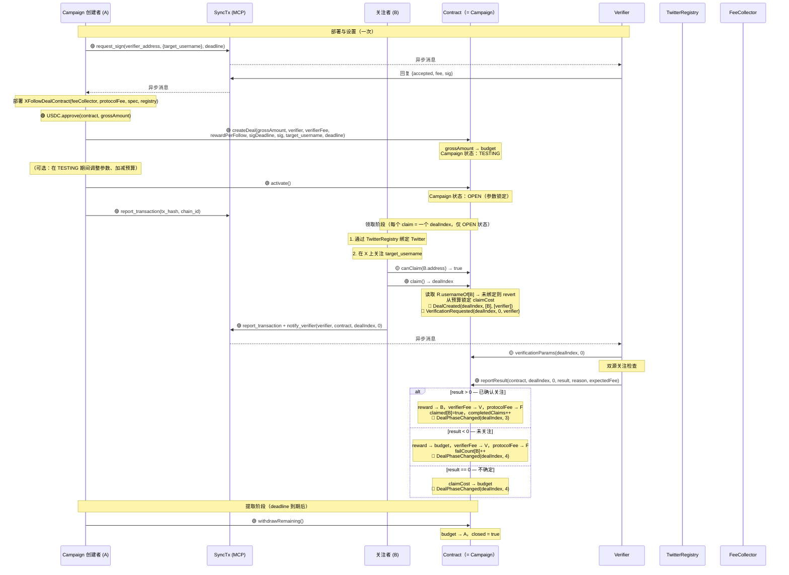
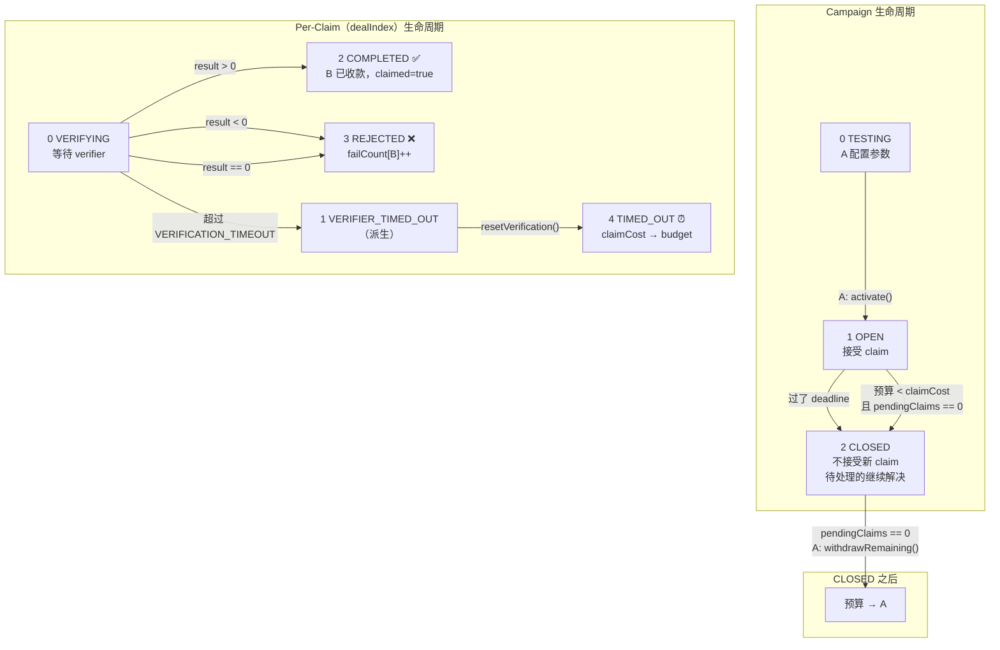
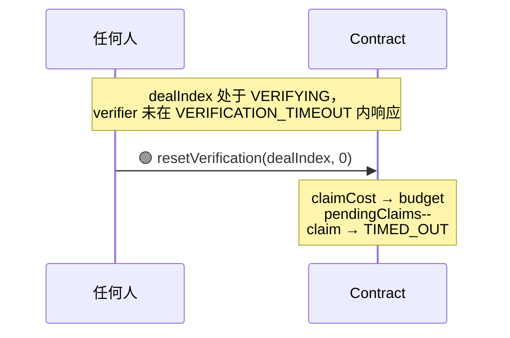
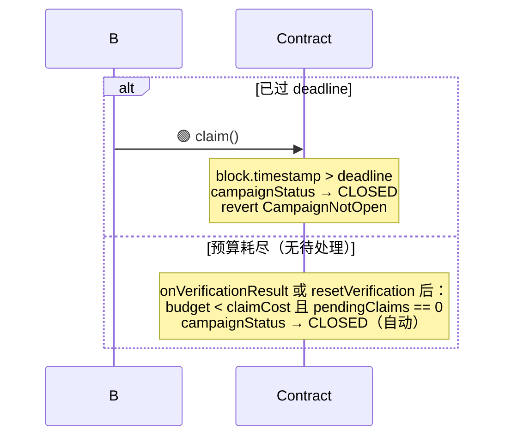
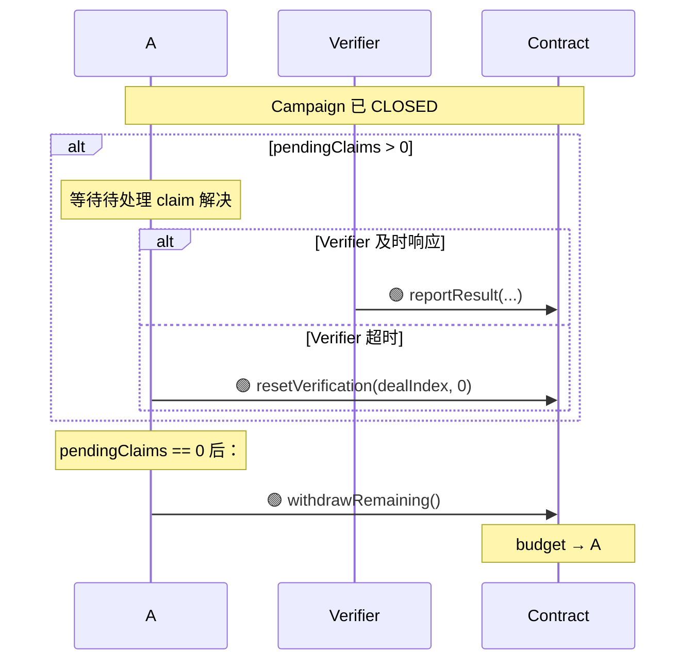

# XFollowDealContract 设计文档

> 合约即 campaign。A 部署并存入预算，任何已认证 TwitterRegistry 的用户均可关注后领取固定奖励。每个 claim 就是一个 dealIndex。全自动，无需协商。

---

## 1. 概述

XFollowDealContract 是一个具体的 DealContract 实现，用于 **"A 为关注 X 上指定账号支付固定奖励"** 的 campaign 场景。

- **继承链：** `IDeal → DealBase → XFollowDealContract`
- **模型：** 一个合约 = 一个 campaign。每个 B 的 `claim()` 创建一个新的 dealIndex
- **验证系统：** 单 verifier（每个 campaign），要求 `XFollowVerifierSpec`
- **支付代币：** USDC
- **标签：** `["x", "follow"]`
- **身份：** `TwitterRegistry` 绑定为强制要求 — 合约在链上读取 `usernameOf[msg.sender]`，未绑定则 revert
- **验证语义：** 验证者检查验证时刻关注关系是否存在。身份由 TwitterRegistry 保证（钱包 ↔ 用户名）
- **链下验证：** 双源并行检查：twitterapi.io + twitter-api45
- **生命周期：** TESTING → OPEN → CLOSED。无 PAUSED 状态
- **TESTING：** A 可修改参数（reward、fee、deadline、target、verifier），加减预算。调用 `activate()` 上线
- **OPEN → CLOSED：** 预算耗尽（且无待处理 claim）、deadline 到达，自动转为 CLOSED
- **deadline 约束：** `sigDeadline >= campaignDeadline`
- **协议费：** 按 claim 收取，每次 claim 从预算中扣除（不在创建时预收）
- **失败限制：** `MAX_FAILURES = 3` — B 在此合约中失败 3 次后被封禁

---

## 2. 核心数据结构

### 2.1 合约级存储（Campaign）

```solidity
// ===================== 不可变量 =====================

address public immutable FEE_COLLECTOR;
uint96  public immutable PROTOCOL_FEE;
address public immutable REQUIRED_SPEC;
address public immutable TWITTER_REGISTRY;

// ===================== Campaign 状态 =====================

address public partyA;               // campaign 创建者（createDeal 时设定，之后不变）
uint8   public campaignStatus;       // TESTING(0) / OPEN(1) / CLOSED(2)
address public verifier;             // verifier 合约地址
uint96  public rewardPerFollow;      // 每次关注的固定 USDC 奖励（TESTING 期间可改）
uint96  public verifierFee;          // 每次验证的费用（TESTING 期间可改）
uint48  public deadline;             // campaign 截止时间（TESTING 期间可改）
uint96  public budget;               // 剩余未锁定 USDC 预算
uint32  public pendingClaims;        // 等待验证的 claim 数
uint32  public completedClaims;      // 已成功验证的 claim 数
uint256 public signatureDeadline;    // verifier 签名到期时间（必须 >= deadline）
string  public target_username;      // 规范化（TESTING 期间可改）
bytes   public verifierSignature;    // EIP-712 签名（TESTING 期间可重签）
```

### 2.2 Per-Claim 存储（每个 claim = 一个 dealIndex）

```solidity
struct Claim {
    address claimer;             // B 的地址
    uint48  timestamp;           // claim 创建时间
    uint8   status;              // VERIFYING / COMPLETED / REJECTED / TIMED_OUT
    string  follower_username;   // claim 时从 TwitterRegistry 读取
}

mapping(uint256 => Claim) internal claims;
mapping(address => bool)  public claimed;      // 成功领取后为 true（B 已收款）
mapping(address => uint8) public failCount;    // 失败次数；>= MAX_FAILURES → 封禁
```

---

## 3. 函数参考

### 3.1 Campaign 设置与生命周期

| 方法 | 参数 | 调用者 | 说明 |
|------|------|--------|------|
| `constructor(...)` | `address feeCollector, uint96 protocolFee, address requiredSpec, address twitterRegistry` | 部署 | 设置不可变量 |
| `createDeal(...)` | `uint96 grossAmount, address verifier, uint96 verifierFee, uint96 rewardPerFollow, uint256 sigDeadline, bytes sig, string target_username, uint48 deadline` | A（仅一次） | 初始化 campaign，状态为 TESTING。`grossAmount` 存入作为 budget。仅可调用一次 |
| `updateParams(...)` | `uint96 rewardPerFollow, uint96 verifierFee, uint48 deadline, string target_username` | A | 修改 campaign 参数。仅 TESTING 状态。参数变更需重新获取 verifier 签名 |
| `addBudget(uint96 amount)` | `uint96 amount` | A | 增加 USDC 预算。仅 TESTING 状态 |
| `removeBudget(uint96 amount)` | `uint96 amount` | A | 取出 USDC 预算。仅 TESTING 状态 |
| `activate()` | — | A | TESTING → OPEN。锁定参数。要求 `budget >= claimCost()` 且 `sigDeadline >= deadline` |

### 3.2 Claim 操作（每个 claim = 一个 dealIndex）

| 方法 | 参数 | 调用者 | 说明 |
|------|------|--------|------|
| `claim()` | — | 任何 B | B 无需传参。读取 `TwitterRegistry.usernameOf[msg.sender]`。未绑定则 revert，已成功则 revert，失败 ≥ 3 次则 revert。从预算锁定 `claimCost()`。返回 `dealIndex`。发出 VerificationRequested |
| `onVerificationResult(...)` | `uint256 dealIndex, uint256 verificationIndex, int8 result, string reason` | Verifier | result>0 → 付款给 B，claimed[B]=true，completedClaims++；result<0 → 奖励退回预算，failCount[B]++；result==0 → 全部退回预算 |
| `resetVerification(...)` | `uint256 dealIndex, uint256 verificationIndex` | 任何人 | VERIFICATION_TIMEOUT 后重置超时 claim。全额 claimCost 退回预算 |

### 3.3 Campaign 结束

| 方法 | 参数 | 调用者 | 说明 |
|------|------|--------|------|
| `withdrawRemaining()` | — | A | CLOSED 且 pendingClaims==0 时，A 提取剩余预算 |

### 3.4 查询函数

| 方法 | 返回值 | 说明 |
|------|--------|------|
| `claimCost()` | `uint96` | `rewardPerFollow + verifierFee + PROTOCOL_FEE` |
| `campaignStatus()` | `uint8` | TESTING(0) / OPEN(1) / CLOSED(2) — 存储值，非派生 |
| `dealStatus(dealIndex)` | `uint8` | Per-claim 状态：VERIFYING / COMPLETED / REJECTED / TIMED_OUT / NOT_FOUND |
| `canClaim(addr)` | `bool` | addr 是否可 claim |
| `failures(addr)` | `uint8` | addr 的失败次数 |
| `remainingSlots()` | `uint256` | `budget / claimCost()` |

### 3.5 继承自 DealBase / IDeal

| 方法 | 说明 |
|------|------|
| `name()` | `"X Follow Deal"` |
| `description()` | Campaign 描述 |
| `tags()` | `["x", "follow"]` |
| `version()` | `"2.0"` |
| `instruction()` | Markdown 操作指南 |
| `requiredSpecs()` | `[XFollowVerifierSpec]` |
| `verificationParams(dealIndex, 0)` | 返回指定 claim 的 verifier + specParams |
| `requestVerification(dealIndex, 0)` | 始终 revert — 验证由 `claim()` 自动触发 |
| `phase(dealIndex)` | 见 Section 6.3 |
| `dealExists(dealIndex)` | Claim 是否存在 |

---

## 4. 验证系统

### 4.1 合约结构

```
VerifierSpec ← XFollowVerifierSpec（业务规范）
IVerifier ← VerifierBase ← XFollowVerifier（实例）
XFollowVerifier.spec() → XFollowVerifierSpec
```

### 4.2 EIP-712 签名（per-campaign）

TYPEHASH：
```
Verify(string targetUsername,uint256 fee,uint256 deadline)
```

Verifier 每个 campaign 签名一次。`createDeal` 时检查 `sigDeadline >= campaignDeadline`。

### 4.3 specParams（per-claim）

```solidity
specParams = abi.encode(
    string follower_username,  // claim 时从 TwitterRegistry.usernameOf[claimer] 读取
    string target_username     // campaign 目标账号
)
```

B 不提供任何用户名 — 合约在链上从 TwitterRegistry 读取。

### 4.4 链下验证流程

```
Verifier 服务收到 notify_verify（dealIndex = claim，verificationIndex = 0）
  │
  ├── 0. 读取链上 dealStatus(dealIndex) — 仅在 VERIFYING 时继续
  ├── 1. 读取 verificationParams(dealIndex, 0) → 解码 specParams
  ├── 2. 并行 API 调用：
  │     ├── twitterapi.io: check_follow_relationship
  │     └── twitter-api45: checkfollow.php
  ├── 3. 合并逻辑：
  │     ├── 任一确认关注 → result = 1（通过）
  │     ├── 两者均否定 → 5 秒后重试 → result = -1 或 1
  │     └── 两者均出错 → result = 0（不确定）
  └── 4. reportResult(contract, dealIndex, 0, result, reason, expectedFee)
```

---

## 5. 交易流程



---

## 6. 状态机与转换

### 6.1 Campaign 状态（`campaignStatus()`）

| 代码 | 状态 | 存储 | 含义 |
|------|------|------|------|
| 0 | TESTING | 是 | A 可修改参数、加减预算。未上线 |
| 1 | OPEN | 是 | 正式运行，接受 claim。参数锁定 |
| 2 | CLOSED | 是 | 不接受新 claim。待处理的验证继续解决 |

三个状态均为存储值，非派生。转换条件：

```
TESTING → OPEN    （A 调用 activate()）
OPEN → CLOSED     （任一条件触发时自动转换）：
  - block.timestamp > deadline
  - budget < claimCost AND pendingClaims == 0
  - claim()/onVerificationResult()/resetVerification() 作为副作用检查并设置 CLOSED
```

> 无 PAUSED 状态。TESTING 即为上线前的配置阶段。
> 无 EXHAUSTED/EXPIRED 状态。这些条件直接触发 CLOSED。

### 6.2 Per-Claim `dealStatus(dealIndex)`

> 遵循与 XQuoteDealContract 相同的存储+派生模式。存储状态在状态变更时写入。派生状态由存储状态 + 超时条件在运行时计算。`dealStatus()` 不依赖调用者 — 任何人看到的值相同。

| 代码 | 状态 | 存储/派生 | 含义 |
|------|------|---------|------|
| 0 | VERIFYING | 存储 | 等待 verifier 响应，未超时 |
| 1 | VERIFIER_TIMED_OUT | 派生（VERIFYING + 已超时） | Verifier 超期，可调用 `resetVerification()` |
| 2 | COMPLETED | 存储 | 关注已验证，B 已收款 |
| 3 | REJECTED | 存储 | 未检测到关注或不确定，奖励已退回 |
| 4 | TIMED_OUT | 存储（`resetVerification` 后） | Verifier 超时，全额 claimCost 退回预算 |
| 255 | NOT_FOUND | — | Claim 不存在 |

```solidity
function dealStatus(uint256 dealIndex) external view override returns (uint8) {
    Claim storage c = claims[dealIndex];
    if (c.claimer == address(0)) return NOT_FOUND;       // 255

    if (c.status == VERIFYING) {
        if (block.timestamp > uint256(c.timestamp) + VERIFICATION_TIMEOUT) {
            return VERIFIER_TIMED_OUT;                    // 1
        }
        return VERIFYING;                                 // 0
    }
    return c.status;  // COMPLETED(2), REJECTED(3), TIMED_OUT(4)
}
```

### 6.3 Per-Claim `phase(dealIndex)`

> 映射到 IDeal 的统一 phase：0=NotFound，1=Pending，2=Active，3=Success，4=Failed，5=Cancelled。
> Claim 跳过 Pending（创建即 Active），不可 Cancelled。

| dealStatus | phase | IDeal phase 名称 |
|------------|-------|------------------|
| NOT_FOUND (255) | 0 | NotFound |
| VERIFYING (0) | 2 | Active |
| VERIFIER_TIMED_OUT (1) | 2 | Active（仍可解决） |
| COMPLETED (2) | 3 | Success |
| REJECTED (3) | 4 | Failed |
| TIMED_OUT (4) | 4 | Failed |

```solidity
function phase(uint256 dealIndex) external view override returns (uint8) {
    Claim storage c = claims[dealIndex];
    if (c.claimer == address(0)) return 0;  // NotFound
    uint8 s = c.status;
    if (s == VERIFYING) return 2;           // Active
    if (s == COMPLETED) return 3;           // Success
    return 4;                               // Failed (REJECTED or TIMED_OUT)
}
```

### 6.4 状态转换图



### 6.5 事件发射

| 操作 | 发出的事件 |
|------|-----------|
| `activate()` | `CampaignActivated()` |
| `claim()` | `DealCreated(dealIndex, [B], [verifier])` → `DealStateChanged(dealIndex, 0)` → `DealPhaseChanged(dealIndex, 2)` → `VerificationRequested(dealIndex, 0, verifier)` |
| `onVerificationResult(result > 0)` | `VerificationReceived(dealIndex, 0, verifier, result)` → `DealStateChanged(dealIndex, 2)` → `DealPhaseChanged(dealIndex, 3)` |
| `onVerificationResult(result < 0)` | `VerificationReceived(dealIndex, 0, verifier, result)` → `DealStateChanged(dealIndex, 3)` → `DealPhaseChanged(dealIndex, 4)` |
| `onVerificationResult(result == 0)` | `VerificationReceived(dealIndex, 0, verifier, result)` → `DealStateChanged(dealIndex, 3)` → `DealPhaseChanged(dealIndex, 4)` |
| `resetVerification()` | `DealStateChanged(dealIndex, 4)` → `DealPhaseChanged(dealIndex, 4)` |

### 6.6 B 的 Claim 资格

```
campaignStatus != OPEN   → CampaignNotOpen（TESTING 或 CLOSED）
claimed[B] == true       → AlreadyClaimed（已成功领取，完成）
failCount[B] >= 3        → MaxFailures（在此合约中被封禁）
无 TwitterRegistry 绑定   → NotVerified
budget < claimCost       → 触发 CLOSED（自动转换）
有待处理的 claim          → PendingClaim（同时只能有一个）
否则                      → 可 claim
```

---

## 7. 超时与异常路径

### 7.1 常量

| 常量 | 值 | 说明 |
|------|---|------|
| `VERIFICATION_TIMEOUT` | 30 分钟 | 每个 claim 的 verifier 响应时限 |
| `MAX_FAILURES` | 3 | 每地址最大失败次数 |

### 7.2 Verifier 超时（单个 Claim）



### 7.3 Campaign 自动关闭（deadline 到达或预算耗尽）



> CLOSED 作为 `claim()`、`onVerificationResult()`、`resetVerification()` 的副作用触发。

### 7.4 CLOSED 后提取



### 7.5 预算恢复（OPEN 期间 claim 被拒）

OPEN 期间 claim 被拒时，`rewardPerFollow` 退回预算。只要 budget ≥ claimCost，campaign 保持 OPEN：

```
claim 被拒 → budget += rewardPerFollow → OPEN 继续（如果 budget ≥ claimCost）
```

如果退回后 budget < claimCost 且 pendingClaims == 0，campaign 自动关闭。

### 7.6 设计原则

| 原则 | 实现 |
|------|------|
| 合约 = campaign | 一个合约实例 = 一个 campaign，无 deal mapping |
| claim = dealIndex | 每个 B 的 claim 从 `_recordStart` 获得唯一 dealIndex |
| 三种状态 | TESTING → OPEN → CLOSED。无 PAUSED，无 EXHAUSTED/EXPIRED 作为独立状态 |
| 自动关闭 | deadline 到达或预算耗尽时自动转为 CLOSED |
| TESTING 阶段 | A 可修改所有参数。`activate()` 锁定参数 |
| A 承担所有费用 | verifierFee + protocolFee 均从预算按 claim 扣除 |
| 按 claim 收协议费 | PROTOCOL_FEE 在每次 claim 时扣除 |
| B 零输入 | `claim()` 无参数 — 用户名从 TwitterRegistry 读取 |
| 最多 3 次失败 | `failCount[B] >= 3` → 在此合约中被封禁 |
| 成功仅一次 | `claimed[B] = true` → 不可再 claim |

---

## 8. 资金流向

### 8.1 Campaign 创建

```
grossAmount → budget（全额，无预收费用）
```

### 8.2 每次 Claim 成本

```
claimCost = rewardPerFollow + verifierFee + PROTOCOL_FEE
每次 claim() 从 budget 锁定 claimCost
remainingSlots = budget / claimCost
```

### 8.3 验证结果 → 资金分配

| 结果 | 奖励 | Verifier 费用 | 协议费 | 预算变化 |
|------|------|--------------|--------|---------|
| 通过 (result > 0) | → B | → Verifier | → FeeCollector | — |
| 失败 (result < 0) | → 预算 | → Verifier | → FeeCollector | +rewardPerFollow |
| 不确定 (result == 0) | → 预算 | → 预算 | → 预算 | +claimCost |
| Verifier 超时 | → 预算 | → 预算 | → 预算 | +claimCost |

### 8.4 Campaign 结束

```
deadline 到期 + pendingClaims == 0 后：
  budget → A（通过 withdrawRemaining()）
```

---

## 9. 验证清单

### 9.1 createDeal

| # | 检查项 | 错误 |
|---|--------|------|
| 1 | 尚未初始化（仅调用一次） | AlreadyInitialized |
| 2 | `rewardPerFollow > 0` | InvalidParams |
| 3 | `deadline > block.timestamp` | InvalidParams |
| 4 | `verifier != address(0)`，是合约 | VerifierNotContract |
| 5 | `target_username` 规范化后非空 | InvalidParams |
| 6 | `sigDeadline >= deadline` | SignatureExpired |
| 7 | Verifier spec 匹配 + EIP-712 签名有效 | InvalidVerifierSignature |
| 8 | `USDC.transferFrom(A, 合约, grossAmount)` | TransferFailed |
| 9 | 设置 campaignStatus = TESTING | — |

### 9.2 activate

| # | 检查项 | 错误 |
|---|--------|------|
| 1 | `msg.sender == partyA` | NotPartyA |
| 2 | `campaignStatus == TESTING` | InvalidStatus |
| 3 | `budget >= claimCost`（至少可 claim 1 次） | InvalidParams |
| 4 | `sigDeadline >= deadline` | SignatureExpired |
| 5 | 设置 campaignStatus = OPEN | — |

### 9.3 claim

| # | 检查项 | 错误 |
|---|--------|------|
| 1 | `campaignStatus == OPEN` | CampaignNotOpen |
| 2 | `block.timestamp <= deadline`（否则自动关闭 → CLOSED） | — |
| 3 | `budget >= claimCost`（否则自动关闭 → CLOSED） | — |
| 4 | `!claimed[msg.sender]` | AlreadyClaimed |
| 5 | `failCount[msg.sender] < MAX_FAILURES` | MaxFailures |
| 6 | `TwitterRegistry.usernameOf[msg.sender]` 非空 | NotVerified |
| 7 | 无待处理的 claim | PendingClaim |
| 8 | 从预算锁定 claimCost，pendingClaims++ | — |

### 9.4 onVerificationResult

| # | 检查项 | 错误 |
|---|--------|------|
| 1 | `msg.sender == verifier` | NotVerifier |
| 2 | Claim 状态为 VERIFYING | InvalidStatus |
| 3 | 根据 result 分配资金，更新计数器 | — |

### 9.5 withdrawRemaining

| # | 检查项 | 错误 |
|---|--------|------|
| 1 | `msg.sender == partyA` | NotPartyA |
| 2 | `campaignStatus == CLOSED` | NotClosed |
| 3 | `pendingClaims == 0` | PendingClaims |
| 4 | `budget > 0` | NoFunds |
