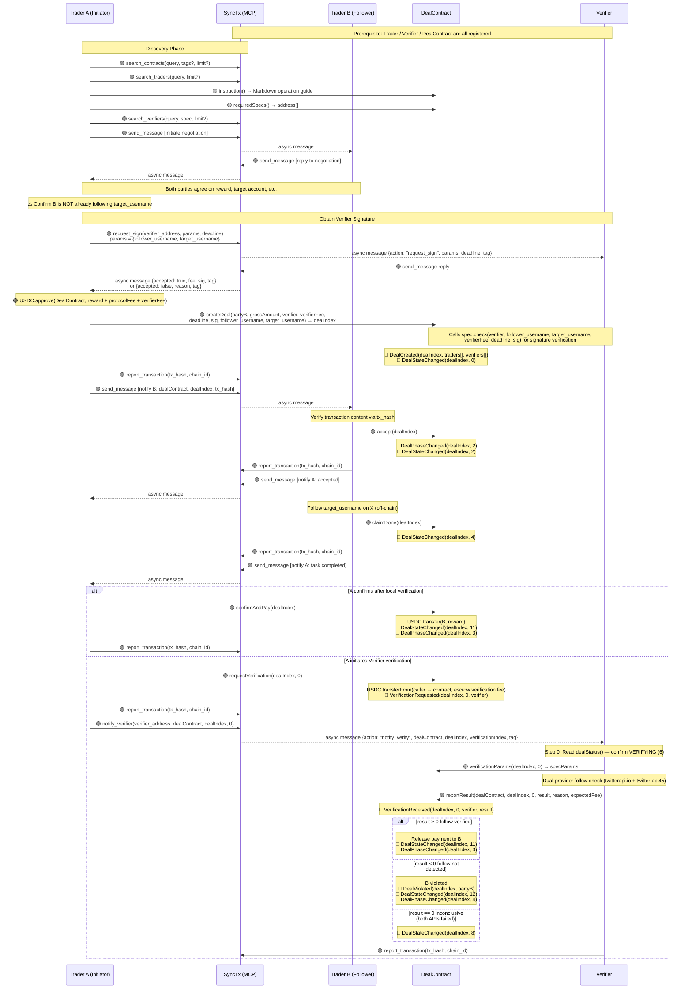
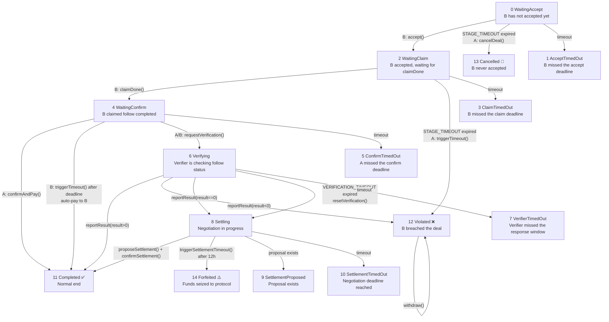
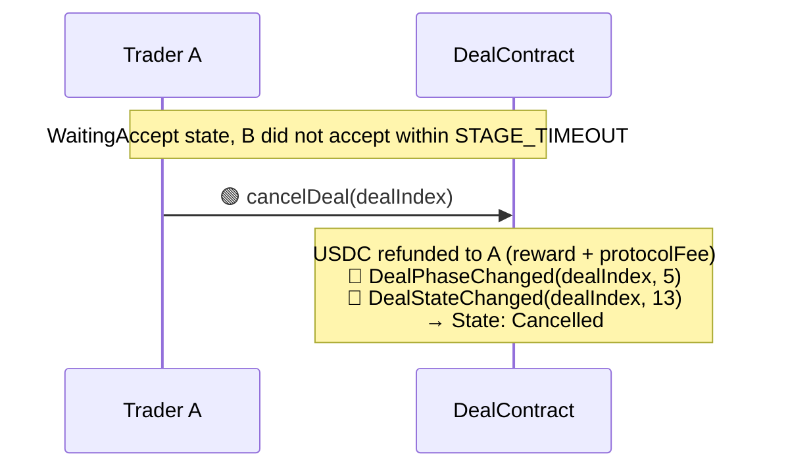
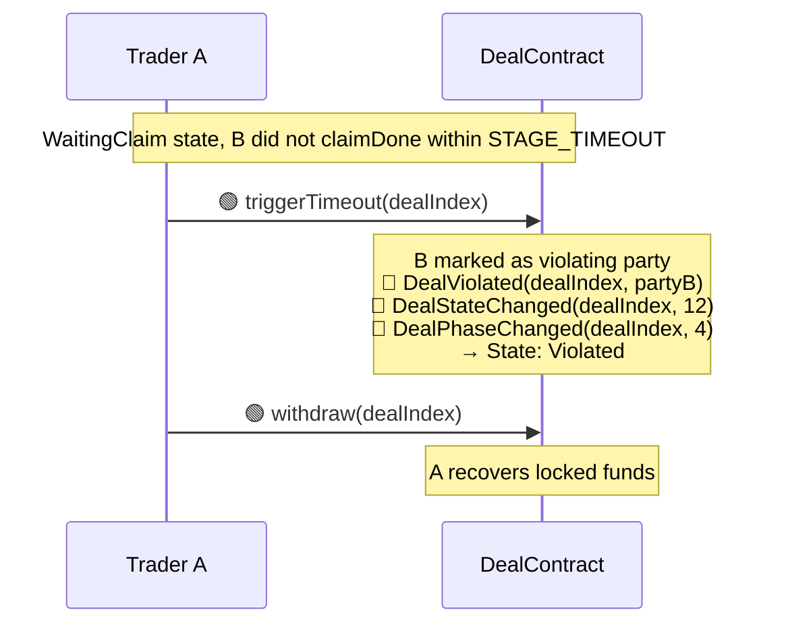
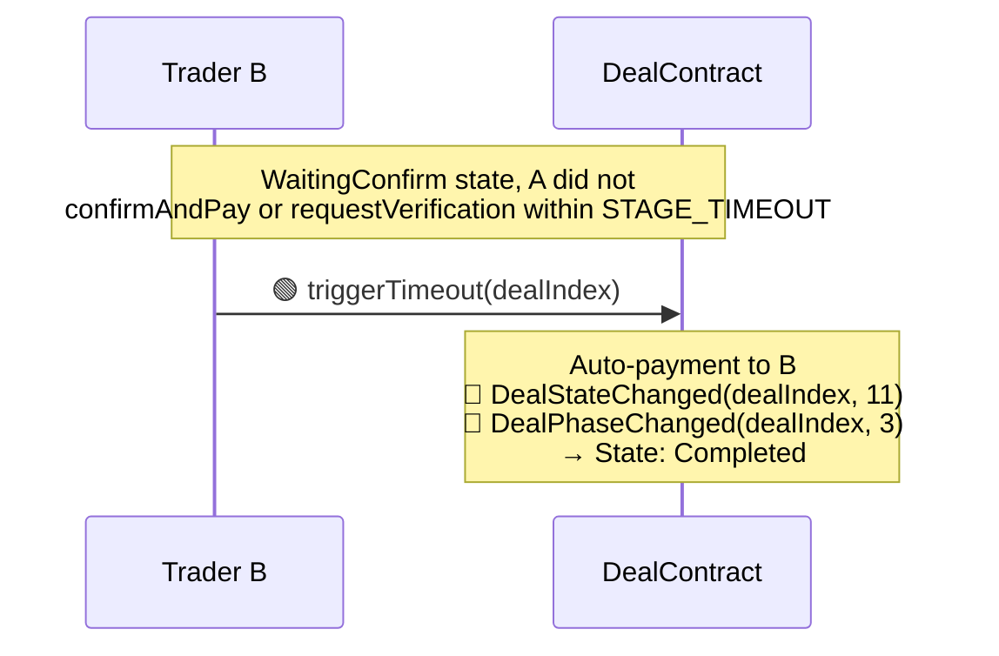
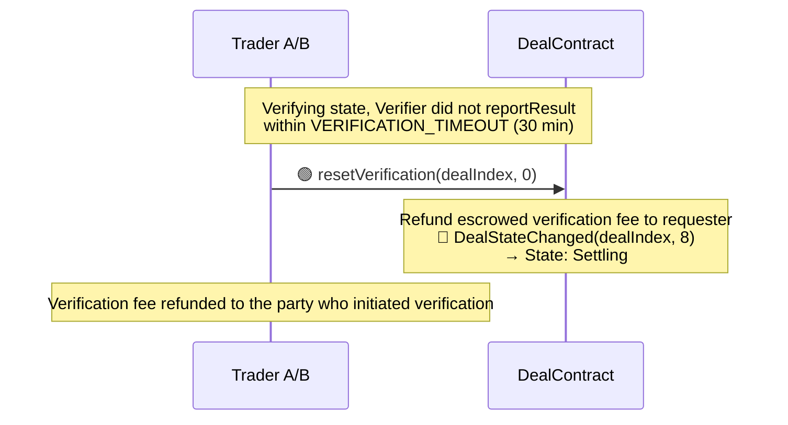
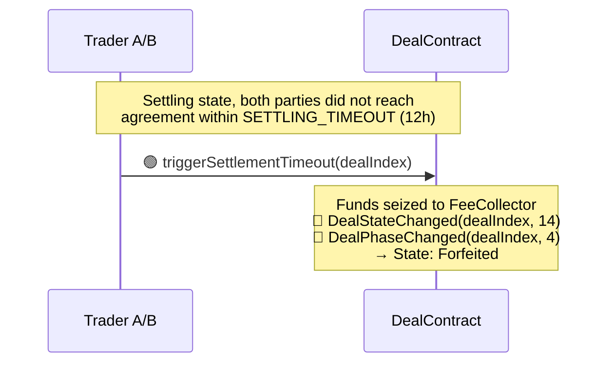
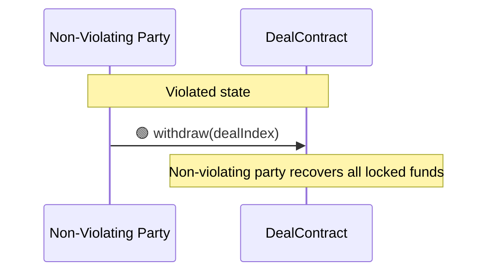

# XFollowDealContract Design Document

> Complete design of XFollowDealContract, including contract interfaces, transaction flow, state machine, timeout handling, and error handling.

---

## 1. Overview

XFollowDealContract is a concrete DealContract implementation for the **"A pays B to follow a specified account on X"** transaction scenario.

- **Inheritance:** `IDeal → DealBase → XFollowDealContract`
- **Verification system:** Single verification slot, requiring the spec to be `XFollowVerifierSpec`
- **Payment token:** USDC
- **Tags:** `["x", "follow"]`
- **Verification semantics:** Weak semantics — verifier checks whether the follow relationship exists **at verification time**, not whether it was established after the deal was created. The `instruction()` requires A to confirm B is not already following the target before creating the deal.
- **Off-chain verification:** Dual-provider parallel check via twitterapi.io (`check_follow_relationship`) + twitter-api45 (`checkfollow.php`). Any provider confirms → pass; both deny → fail; both error → inconclusive.

---

## 2. Function Reference

### 2.1 All XFollowDealContract Functions

> Inheritance chain: `IDeal → DealBase → XFollowDealContract`

| Method | Parameters | Return Value | Defined In | Implemented In | Description |
|--------|------------|--------------|------------|----------------|-------------|
| `standard()` | — | `string` | IDeal | DealBase | Returns `"1.0"`. `pure`, cannot be overridden |
| `supportsInterface(id)` | `bytes4 id` | `bool` | IDeal | DealBase | ERC-165. `pure`, cannot be overridden |
| `_recordStart(...)` | `address[] traders, address[] verifiers` | `uint256 dealIndex` | DealBase | DealBase | Internal utility. Emits DealCreated, returns dealIndex |
| `_emitPhaseChanged(dealIndex, toPhase)` | `uint256 dealIndex, uint8 toPhase` | — | DealBase | DealBase | Internal utility. Emits DealPhaseChanged. phase: 2=Active, 3=Success, 4=Failed, 5=Cancelled |
| `_emitStateChanged(...)` | `uint256 dealIndex, uint8 stateIndex` | — | DealBase | DealBase | Internal utility. Emits DealStateChanged |
| `_emitViolated(...)` | `uint256 dealIndex, address violator` | — | DealBase | DealBase | Internal utility. Emits DealViolated |
| `name()` | — | `string` | IDeal | XFollowDealContract | Returns `"X Follow Deal"`. `pure` |
| `description()` | — | `string` | IDeal | XFollowDealContract | Contract description, used for SyncTx search. `pure` |
| `tags()` | — | `string[]` | IDeal | XFollowDealContract | Returns `["x", "follow"]`. `pure` |
| `version()` | — | `string` | IDeal | XFollowDealContract | Deal rule version number. `pure` |
| `protocolFeePolicy()` | — | `string` | IDeal | XFollowDealContract | Human-readable protocol fee policy. `view` |
| `protocolFee()` | — | `uint96` | XFollowDealContract | XFollowDealContract | Convenience helper for the exact fee amount. `view` |
| `instruction()` | — | `string` (Markdown) | IDeal | XFollowDealContract | Operation guide, consistent with MCP terminology. `view` |
| `phase(dealIndex)` | `uint256 dealIndex` | `uint8` | IDeal | XFollowDealContract | General phase: 0=NotFound 1=Pending 2=Active 3=Success 4=Failed 5=Cancelled. `view` |
| `dealStatus(dealIndex)` | `uint256 dealIndex` | `uint8` | IDeal | XFollowDealContract | Caller-independent business status. Returns 0-14 plus 255 for NotFound. `view` |
| `dealExists(dealIndex)` | `uint256 dealIndex` | `bool` | IDeal | XFollowDealContract | Whether the deal exists. `view` |
| `requiredSpecs()` | — | `address[]` | IDeal | XFollowDealContract | Returns the list of spec addresses. XFollowDealContract has only 1 slot, pointing to XFollowVerifierSpec. `view` |
| `verificationParams(...)` | `uint256 dealIndex, uint256 verificationIndex` | `(address verifier, uint256 fee, uint256 deadline, bytes sig, bytes specParams)` | IDeal | XFollowDealContract | Called by the Verifier to obtain verification parameters. `specParams = abi.encode(follower_username, target_username)`. `view` |
| `requestVerification(...)` | `uint256 dealIndex, uint256 verificationIndex` | — | IDeal | XFollowDealContract | Triggered by a Trader to initiate verification. Escrows verification fee + emits VerificationRequested. `external` |
| `onVerificationResult(...)` | `uint256 dealIndex, uint256 verificationIndex, int8 result, string reason` | — | IDeal | XFollowDealContract | Verifier → DealContract callback. `external` |
| `createDeal(...)` | `address partyB, uint96 grossAmount, address verifier, uint96 verifierFee, uint256 deadline, bytes sig, string follower_username, string target_username` | `uint256 dealIndex` | XFollowDealContract | XFollowDealContract | Creates a deal. Internally calls `XFollowVerifierSpec.check()` for signature verification |
| `accept(dealIndex)` | `uint256 dealIndex` | — | XFollowDealContract | XFollowDealContract | Trader B accepts the deal. WaitingAccept → WaitingClaim |
| `claimDone(dealIndex)` | `uint256 dealIndex` | — | XFollowDealContract | XFollowDealContract | Trader B claims task completion (no parameters — follow is binary). WaitingClaim → WaitingConfirm |
| `confirmAndPay(dealIndex)` | `uint256 dealIndex` | — | XFollowDealContract | XFollowDealContract | Trader A confirms and releases payment. WaitingConfirm → Completed |
| `cancelDeal(dealIndex)` | `uint256 dealIndex` | — | XFollowDealContract | XFollowDealContract | A cancels after timeout in WaitingAccept stage. WaitingAccept → Cancelled |
| `triggerTimeout(dealIndex)` | `uint256 dealIndex` | — | XFollowDealContract | XFollowDealContract | Triggers timeout handling. WaitingClaim timeout → Violated; WaitingConfirm timeout → auto-payment Completed |
| `resetVerification(...)` | `uint256 dealIndex, uint256 verificationIndex` | — | XFollowDealContract | XFollowDealContract | Resets verification after Verifier timeout. Verifying → Settling |
| `proposeSettlement(...)` | `uint256 dealIndex, uint96 amountToA` | — | XFollowDealContract | XFollowDealContract | Proposes a fund distribution plan |
| `confirmSettlement(dealIndex)` | `uint256 dealIndex` | — | XFollowDealContract | XFollowDealContract | Confirms the counterparty's proposal. Settling → Completed |
| `triggerSettlementTimeout(dealIndex)` | `uint256 dealIndex` | — | XFollowDealContract | XFollowDealContract | After 12h timeout, seize funds to FeeCollector. Settling → Forfeited |
| `withdraw(dealIndex)` | `uint256 dealIndex` | — | XFollowDealContract | XFollowDealContract | Non-violating party withdraws all locked funds. Only callable in Violated state |

### 2.2 All XFollowVerifier Functions

> Inheritance chain: `IVerifier → VerifierBase → XFollowVerifier`
> Spec contract: `VerifierSpec → XFollowVerifierSpec` (pointed to by XFollowVerifier.spec())

| Method | Parameters | Return Value | Defined In | Implemented In | Description |
|--------|------------|--------------|------------|----------------|-------------|
| `reportResult(...)` | `address dealContract, uint256 dealIndex, uint256 verificationIndex, int8 result, string reason, uint256 expectedFee` | — | IVerifier | VerifierBase | Called by the Verifier signer (EOA), internally calls back `IDeal(dealContract).onVerificationResult()`. `external` |
| `owner()` | — | `address` | IVerifier | VerifierBase | Contract owner. `view` |
| `signer()` | — | `address` | IVerifier | VerifierBase | Signing / reporting EOA. `view` |
| `supportsInterface(id)` | `bytes4 id` | `bool` | IVerifier | VerifierBase | ERC-165. `pure` |
| `transferOwnership(...)` | `address newOwner` | — | VerifierBase | VerifierBase | Instance ownership management |
| `acceptOwnership()` | — | — | VerifierBase | VerifierBase | Two-step ownership acceptance |
| `setSigner(...)` | `address newSigner` | — | VerifierBase | VerifierBase | Change verifier signer EOA |
| `withdrawFees(...)` | `address to, uint256 amount` | — | VerifierBase | VerifierBase | Withdraw fees received by the instance |
| `DOMAIN_SEPARATOR` | — | `bytes32` | VerifierBase | VerifierBase | Public immutable, read by the Spec contract's `check()` |
| `description()` | — | `string` | IVerifier | XFollowVerifier | Instance self-description. `view` |
| `spec()` | — | `address` | IVerifier | XFollowVerifier | Points to XFollowVerifierSpec address. `view` |
| `spec()->check(...)` | `address verifierInstance, string follower_username, string target_username, uint256 fee, uint256 deadline, bytes sig` | `address` | XFollowVerifierSpec | XFollowVerifierSpec | Business validation entry point. Recovers EIP-712 signer. Called by DealContract during createDeal |

---

## 3. Event Reference

| Event Name | Parameters | Implemented In | Trigger Timing | Description |
|------------|------------|----------------|----------------|-------------|
| `DealCreated` | `uint256 dealIndex, address[] traders, address[] verifiers` | DealBase (`_recordStart`) | When `createDeal` succeeds | traders and verifiers record the participants |
| `DealStateChanged` | `uint256 dealIndex, uint8 stateIndex` | DealBase (`_emitStateChanged`) | On every state change | stateIndex corresponds to the base dealStatus value |
| `DealPhaseChanged` | `uint256 indexed dealIndex, uint8 indexed phase` | DealBase (`_emitPhaseChanged`) | On phase transitions | phase: 2=Active, 3=Success, 4=Failed, 5=Cancelled |
| `DealViolated` | `uint256 dealIndex, address violator` | DealBase (`_emitViolated`) | triggerTimeout (WaitingClaim) / verification failure (result<0) | violator is the violating party address |
| `VerificationRequested` | `uint256 dealIndex, uint256 verificationIndex, address verifier` | XFollowDealContract | When `requestVerification` succeeds | Also escrows verification fee |
| `VerificationReceived` | `uint256 dealIndex, uint256 verificationIndex, address verifier, int8 result` | XFollowDealContract | When Verifier reports result | Emitted in onVerificationResult callback |

---

## 4. Verification System

### 4.1 Contract Structure

```
VerifierSpec ← XFollowVerifierSpec (business specification contract)
IVerifier ← VerifierBase ← XFollowVerifier (instance contract)
XFollowVerifier.spec() → XFollowVerifierSpec (composition relationship)
```

### 4.2 check() Signature Verification Flow

```
XFollowVerifierSpec.check(verifierInstance, follower_username, target_username, fee, deadline, sig)
  │
  ├── 1. Construct structHash(follower_username, target_username, fee, deadline)
  ├── 2. Read DOMAIN_SEPARATOR from verifierInstance
  ├── 3. Construct EIP-712 digest = keccak256(0x1901 || DOMAIN_SEPARATOR || structHash)
  ├── 4. Recover signer from sig (with EIP-2 low-s value check)
  └── 5. Return recovered signer address (caller compares with verifierInstance.signer())
```

### 4.3 specParams Encoding

The `specParams` encoding format returned by `verificationParams()`:

```solidity
specParams = abi.encode(
    string follower_username,  // B's X username (canonicalized: no @, lowercase)
    string target_username     // Target account to follow (canonicalized)
)
```

Verifier-side decoding: `abi.decode(specParams, (string, string))`

### 4.4 Off-chain Verification Flow (Dual Provider)

```
Verifier Service receives notify_verify
  │
  ├── 0. Read on-chain dealStatus() — only proceed if VERIFYING (6)
  ├── 1. Read on-chain verificationParams() → decode specParams
  ├── 2. Parallel API calls:
  │     ├── twitterapi.io: GET /twitter/user/check_follow_relationship
  │     │     ?source_user_name={follower}&target_user_name={target}
  │     │     → data.following === true
  │     └── twitter-api45: GET /checkfollow.php
  │           ?user={follower}&follows={target}
  │           → data.follows === true || data.status === "Following"
  ├── 3. Merge logic:
  │     ├── ANY confirms follow → result = 1 (pass)
  │     ├── Both deny → retry once after 5s
  │     │     ├── Still denied → result = -1 (fail)
  │     │     └── Confirmed on retry → result = 1 (pass)
  │     └── Both error → result = 0 (inconclusive)
  └── 4. On-chain reportResult(dealContract, dealIndex, 0, result, reason, expectedFee)
```

### 4.5 Differences from XQuote Verification

| Aspect | XQuote | XFollow |
|--------|--------|---------|
| specParams | 3 fields: tweet_id, quoter_username, quote_tweet_id | 2 fields: follower_username, target_username |
| claimDone | Requires `quote_tweet_id` parameter | No parameters (follow is binary) |
| Provider APIs | tweet.php (get tweet details) | check_follow_relationship / checkfollow.php |
| Verification target | Verify a specific tweet is a quote of another | Verify a follow relationship exists |
| TYPEHASH | `Verify(string tweetId,string quoterUsername,uint256 fee,uint256 deadline)` | `Verify(string followerUsername,string targetUsername,uint256 fee,uint256 deadline)` |

---

## 5. Transaction Flow

> **Legend:**
> - Solid line `——▸` = direct call; dashed line `┈┈▸` = async message (counterparty must poll via get_messages)
> - 🟣 = MCP call (SyncTx interface); 🟢 = on-chain write call; 🟡 = on-chain read call
> - 🔵 = emit Event
>
> **Role description:** Trader A = initiator (paying party), Trader B = counterparty (follower). requestVerification and notify_verifier can be called by either party.



---

## 6. State Machine and Transitions

### 6.1 State Enum

| stateIndex | State | Meaning |
|-----------|-------|---------|
| 0 | WaitingAccept | Deal created, waiting for B to accept |
| 1 | AcceptTimedOut | B failed to accept before timeout |
| 2 | WaitingClaim | B accepted, waiting for B to follow the target and claim done |
| 3 | ClaimTimedOut | B failed to claim before timeout |
| 4 | WaitingConfirm | B claims completion, waiting for A to confirm or trigger verification |
| 5 | ConfirmTimedOut | A failed to confirm before timeout |
| 6 | Verifying | Verification in progress, waiting for Verifier |
| 7 | VerifierTimedOut | Verifier failed to respond in time |
| 8 | Settling | Entered settlement negotiation phase |
| 9 | SettlementProposed | A settlement proposal exists |
| 10 | SettlementTimedOut | Settlement timed out, pending proposals can still be confirmed |
| 11 | Completed | Deal completed, funds released |
| 12 | Violated | Violation occurred, non-violating party may withdraw |
| 13 | Cancelled | Deal cancelled before B accepted |
| 14 | Forfeited | Funds seized to protocol |
| 255 | NotFound | Deal does not exist |

### 6.2 State Transition Diagram



---

## 7. Timeouts and Abnormal Paths

### 7.1 Timeout Constants

| Constant | Value | Applicable Stage |
|----------|-------|------------------|
| `STAGE_TIMEOUT` | 30 minutes | WaitingAccept / WaitingClaim / WaitingConfirm |
| `VERIFICATION_TIMEOUT` | 30 minutes | Verifier response time limit |
| `SETTLING_TIMEOUT` | 12 hours | Negotiation time limit |

The `stageTimestamp` for each stage is updated upon entering that state; timeout is counted from that moment.

### 7.2 WaitingAccept → Timeout (B did not accept)

> B has not accepted yet, so it does not constitute a violation. A recovers funds, deal is cancelled, no statistics are affected for anyone.



### 7.3 WaitingClaim → Timeout (B did not claimDone)



### 7.4 WaitingConfirm → Timeout (A neither confirmed nor initiated verification)



> **Note:** If A has already called requestVerification (state is VERIFYING), B cannot call triggerTimeout and must wait for the Verifier to respond or for Verifier timeout followed by resetVerification.

### 7.5 Verifier Timeout → resetVerification → Settling



### 7.6 Settling → Negotiated Distribution

```mermaid
sequenceDiagram
    participant A as Trader A
    participant B as Trader B
    participant D as DealContract

    Note over A,D: Settling state
    A->>D: 🟢 proposeSettlement(dealIndex, amountToA)
    Note over D: amountToA goes to A; remainder goes to B
    B->>D: 🟢 confirmSettlement(dealIndex)
    Note over D: Proportional fund distribution<br/>USDC.transfer(A, amountToA)<br/>USDC.transfer(B, remainder)<br/>🔵 DealStateChanged(dealIndex, 11)<br/>🔵 DealPhaseChanged(dealIndex, 3)<br/>→ State: Completed
```

> The proposer cannot confirm their own proposal; the counterparty can reject and propose a new plan (overwriting the previous proposal).

### 7.7 Settling → Negotiation Timeout (Funds Seized)



> Either party (A or B) can trigger this, incentivizing timely negotiation.

### 7.8 Violated → Non-Violating Party Withdrawal



> The violating party (violator) cannot call withdraw.

### 7.9 Settling Design Principles

Entry conditions: Verifier reports `result == 0` (inconclusive, typically both Twitter APIs failed) or Verifier timeout followed by `resetVerification`.

- Whoever's turn it is to act and fails to do so gets penalized
- In the final deadlock, funds are seized, encouraging both parties to actively compromise
- In the Settling stage there is no clearly at-fault party, therefore **only a negotiation path is provided, re-initiating verification is not supported**

| Exit | Trigger Method | Description |
|------|---------------|-------------|
| Negotiated distribution | `proposeSettlement(dealIndex, amountToA)` + counterparty `confirmSettlement(dealIndex)` | Both parties negotiate fund distribution ratio |
| Negotiation timeout seizure | `triggerSettlementTimeout(dealIndex)` (after `SETTLING_TIMEOUT`) | Funds seized to FeeCollector |

---

## 8. Fund Flow

### 8.1 Fund Escrow at createDeal

```
Trader A approve amount = reward + protocolFee + verifierFee
At createDeal, USDC.transferFrom(A → contract) escrows grossAmount (= reward + protocolFee)
verifierFee is escrowed separately at requestVerification time
```

- `protocolFee` policy is read via `protocolFeePolicy()`; the exact amount is available from `protocolFee()`
- `verifierFee` is obtained from the Verifier's signature reply (`{accepted: true, fee: 10000, sig: "0x...", tag: "..."}`)

### 8.2 Normal Completion

```
reward        → Trader B
protocolFee   → FeeCollector (protocol revenue, transferred at accept)
verifierFee   → Contract escrow, settled when requestVerification is called
```

### 8.3 Verification Fee Flow

```
At requestVerification:
  USDC.transferFrom(caller → contract) escrows verification fee

At reportResult callback (inside onVerificationResult):
  Transfer escrowed verification fee to Verifier contract
  Verifier contract verifies received amount ≥ expectedFee

At Verifier timeout resetVerification:
  Escrowed verification fee refunded to the party who initiated verification
```

### 8.4 Abnormal Path Fund Destinations

| Scenario | Fund Destination |
|----------|-----------------|
| WaitingAccept timeout → cancelDeal | Full refund to A (reward + protocolFee) |
| WaitingClaim timeout → triggerTimeout → Violated | A recovers via withdraw |
| WaitingConfirm timeout → triggerTimeout | Auto-payment to B |
| Verification passed (result>0) → Completed | Payment to B |
| Verification failed (result<0) → Violated | Non-violating party recovers via withdraw |
| Verification inconclusive (result==0) → Settling → negotiation | Distributed per proposeSettlement ratio |
| Settling timeout → triggerSettlementTimeout | All seized to FeeCollector; deal enters Forfeited (14) |

---

## 9. Validation Checklist

### 9.1 Internal Validations in createDeal

| # | Validation Item | Failure Handling |
|---|-----------------|------------------|
| 1 | `grossAmount > PROTOCOL_FEE` | revert InvalidParams |
| 2 | `verifierFee <= grossAmount - PROTOCOL_FEE` | revert InvalidParams |
| 3 | `partyB != address(0)`, `sender != partyB` | revert InvalidParams |
| 4 | `verifier != address(0)`, `verifier.code.length > 0` | revert VerifierNotContract |
| 5 | `sig.length > 0`, `deadline >= block.timestamp` | revert InvalidVerifierSignature / SignatureExpired |
| 6 | Username canonicalization + non-empty check | revert InvalidParams |
| 7 | Verifier spec match: `verifier.spec() == REQUIRED_SPEC` | revert InvalidSpecAddress |
| 8 | Signature verification: `XFollowVerifierSpec.check()` recovered signer == `verifier.signer()` | revert InvalidVerifierSignature |
| 9 | Fund transfer: `USDC.transferFrom(A, contract, grossAmount)` | revert TransferFailed |

### 9.2 Internal Validations in requestVerification

| # | Validation Item | Failure Handling |
|---|-----------------|------------------|
| 1 | Deal is in WaitingConfirm state, not timed out | revert InvalidStatus / AlreadyTimedOut |
| 2 | `msg.sender` is partyA or partyB | revert NotAorB |
| 3 | Caller's USDC allowance and balance ≥ verifierFee | revert InsufficientAllowance / InsufficientBalance |
| 4 | Execute: `USDC.transferFrom(sender → contract)` | revert TransferFailed |

### 9.3 Internal Validations in onVerificationResult

| # | Validation Item | Failure Handling |
|---|-----------------|------------------|
| 1 | `msg.sender == deal.verifier` | revert NotVerifier |
| 2 | Deal is in VERIFYING state | revert InvalidStatus |
| 3 | Transfer escrowed verification fee to Verifier contract | revert TransferFailed |
| 4 | Handle business logic based on result: | — |
|   | `result > 0` (pass): release payment to B → Completed | — |
|   | `result < 0` (fail): B violated → Violated | — |
|   | `result == 0` (inconclusive): → Settling | — |

### 9.4 Verifier Service Pre-flight Checks

| # | Check | Failure Handling |
|---|-------|------------------|
| 1 | `dealStatus() == VERIFYING (6)` | Skip notification, reply error |
| 2 | `on_chain_verifier == self.contract_address` | Skip notification |
| 3 | `on_chain_fee > 0` | Skip notification |
| 4 | `verify_fee > 0` (at sign time) | Reject signature request |
