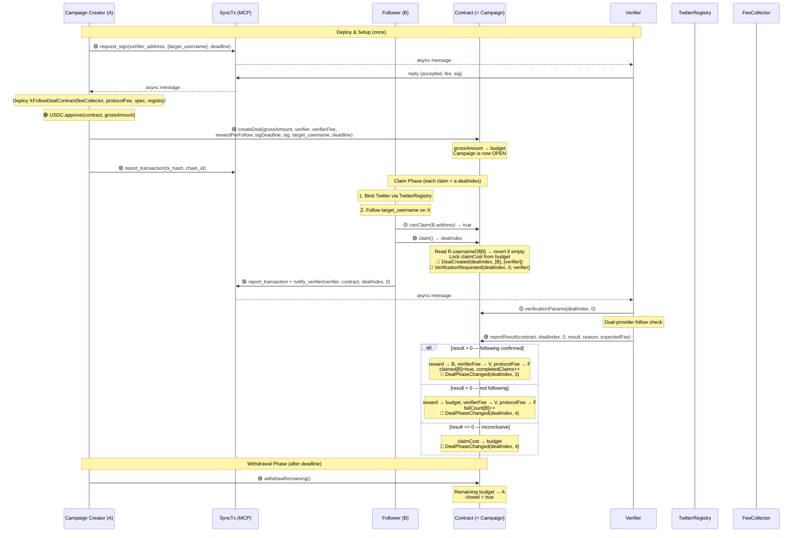
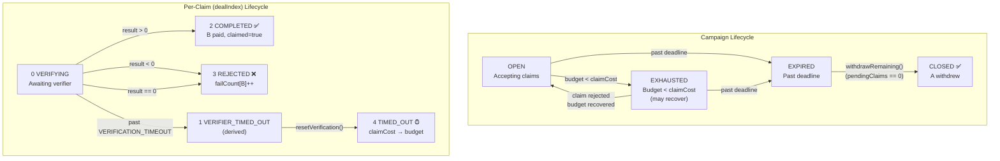
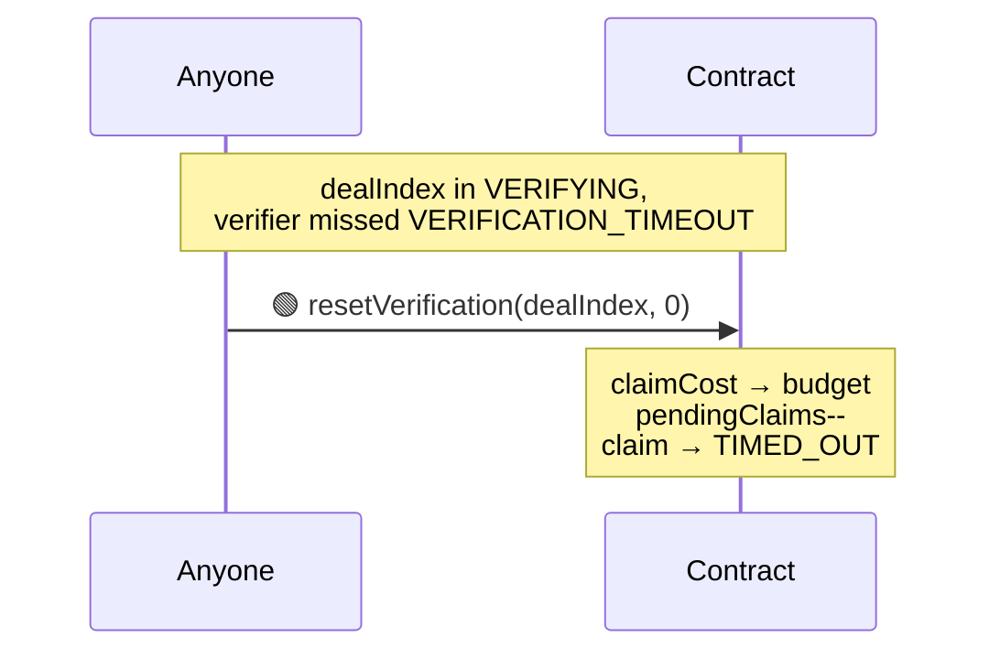
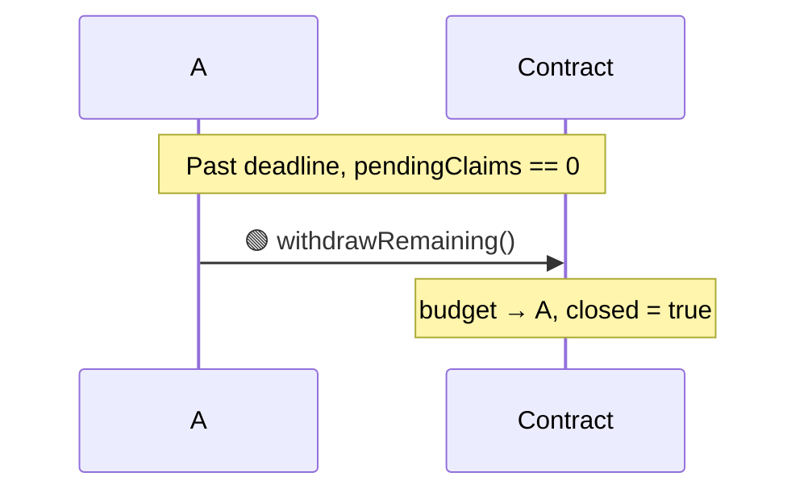
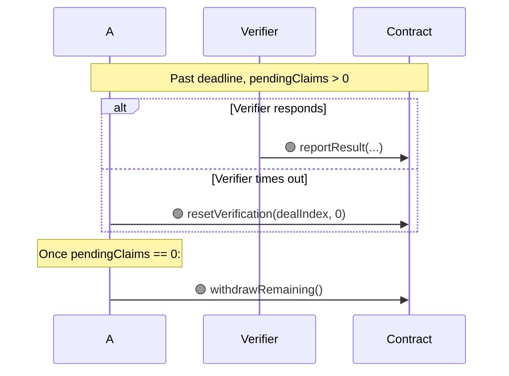

# XFollowDealContract Design Document

> The contract IS the campaign. A deploys and deposits a budget, any TwitterRegistry-verified user can follow and claim a fixed reward. Each claim is a dealIndex. Fully automated, no negotiation needed.

---

## 1. Overview

XFollowDealContract is a concrete DealContract implementation for the **"A pays a fixed reward per follow to a specified account on X"** campaign scenario.

- **Inheritance:** `IDeal → DealBase → XFollowDealContract`
- **Model:** One contract = one campaign. Each B's `claim()` creates a new dealIndex
- **Verification system:** Single verifier per campaign, requiring `XFollowVerifierSpec`
- **Payment token:** USDC
- **Tags:** `["x", "follow"]`
- **Identity:** `TwitterRegistry` binding is mandatory — contract reads `usernameOf[msg.sender]` on-chain, reverts if unbound
- **Verification semantics:** Verifier checks whether the follow relationship exists at verification time. Identity is guaranteed by TwitterRegistry (wallet ↔ username)
- **Off-chain verification:** Dual-provider parallel check via twitterapi.io + twitter-api45
- **End conditions:** Budget exhausted OR deadline reached — A cannot close early
- **Deadline constraint:** `sigDeadline >= campaignDeadline`
- **Protocol fee:** Per-claim, deducted from budget (not at creation)
- **Failure limit:** `MAX_FAILURES = 3` — B banned from this contract after 3 failed claims

---

## 2. Core Data Structures

### 2.1 Contract-Level Storage (Campaign)

```solidity
// ===================== Immutable =====================

address public immutable FEE_COLLECTOR;
uint96  public immutable PROTOCOL_FEE;
address public immutable REQUIRED_SPEC;
address public immutable TWITTER_REGISTRY;

// ===================== Campaign State =====================

address public partyA;               // campaign creator
address public verifier;             // verifier contract address
uint96  public rewardPerFollow;      // fixed USDC reward per follow
uint96  public verifierFee;          // fee per verification (from budget)
uint48  public deadline;             // campaign end time (Unix seconds)
uint96  public budget;               // remaining unlocked USDC budget
uint32  public pendingClaims;        // claims awaiting verification
uint32  public completedClaims;      // successfully verified claims
uint256 public signatureDeadline;    // verifier signature expiry (must be >= deadline)
string  public target_username;      // canonicalized: no @, lowercase
bytes   public verifierSignature;    // EIP-712 signature
bool    public closed;               // true after A withdraws remaining
```

### 2.2 Per-Claim Storage (each claim = a dealIndex)

```solidity
struct Claim {
    address claimer;             // B's address
    uint48  timestamp;           // claim creation time
    uint8   status;              // VERIFYING / COMPLETED / REJECTED / TIMED_OUT
    string  follower_username;   // read from TwitterRegistry at claim time
}

mapping(uint256 => Claim) internal claims;
mapping(address => bool)  public claimed;      // true after successful claim
mapping(address => uint8) public failCount;    // failed attempts; >= MAX_FAILURES → banned
```

---

## 3. Function Reference

### 3.1 Campaign Setup

| Method | Parameters | Caller | Description |
|--------|------------|--------|-------------|
| `constructor(...)` | `address feeCollector, uint96 protocolFee, address requiredSpec, address twitterRegistry` | Deploy | Set immutables |
| `createDeal(...)` | `uint96 grossAmount, address verifier, uint96 verifierFee, uint96 rewardPerFollow, uint256 sigDeadline, bytes sig, string target_username, uint48 deadline` | A (once) | Initialize campaign. `grossAmount` deposited entirely as budget. Requires `sigDeadline >= deadline` and `budget >= claimCost()`. Can only be called once |

### 3.2 Claim Operations (each claim = a dealIndex)

| Method | Parameters | Caller | Description |
|--------|------------|--------|-------------|
| `claim()` | — | Any B | B calls with no args. Reads `TwitterRegistry.usernameOf[msg.sender]`. Reverts if unbound, already paid, or failed ≥ 3 times. Locks `claimCost()` from budget. Returns `dealIndex`. Emits VerificationRequested |
| `onVerificationResult(...)` | `uint256 dealIndex, uint256 verificationIndex, int8 result, string reason` | Verifier | result>0 → pay B, claimed[B]=true, completedClaims++; result<0 → reward to budget, failCount[B]++; result==0 → all to budget |
| `resetVerification(...)` | `uint256 dealIndex, uint256 verificationIndex` | Anyone | After VERIFICATION_TIMEOUT, reset timed-out claim. Full claimCost returns to budget |

### 3.3 Campaign End

| Method | Parameters | Caller | Description |
|--------|------------|--------|-------------|
| `withdrawRemaining()` | — | A | After deadline + pendingClaims==0, A withdraws remaining budget. Sets closed=true |

### 3.4 Query Functions

| Method | Return | Description |
|--------|--------|-------------|
| `claimCost()` | `uint96` | `rewardPerFollow + verifierFee + PROTOCOL_FEE` |
| `campaignStatus()` | `uint8` | OPEN / EXHAUSTED / EXPIRED / CLOSED |
| `dealStatus(dealIndex)` | `uint8` | Per-claim status: VERIFYING / COMPLETED / REJECTED / TIMED_OUT / NOT_FOUND |
| `canClaim(addr)` | `bool` | Whether addr can claim now |
| `failures(addr)` | `uint8` | Failed claim count for addr |
| `remainingSlots()` | `uint256` | `budget / claimCost()` |

### 3.5 Inherited from DealBase / IDeal

| Method | Description |
|--------|-------------|
| `name()` | `"X Follow Deal"` |
| `description()` | Campaign description |
| `tags()` | `["x", "follow"]` |
| `version()` | `"2.0"` |
| `instruction()` | Markdown operation guide |
| `requiredSpecs()` | `[XFollowVerifierSpec]` |
| `verificationParams(dealIndex, 0)` | Returns verifier + specParams for a claim |
| `requestVerification(dealIndex, 0)` | Always reverts — verification is auto-triggered by `claim()` |
| `phase(dealIndex)` | See Section 6.3 |
| `dealExists(dealIndex)` | Whether a claim exists |

---

## 4. Verification System

### 4.1 Contract Structure

```
VerifierSpec ← XFollowVerifierSpec (business specification)
IVerifier ← VerifierBase ← XFollowVerifier (instance)
XFollowVerifier.spec() → XFollowVerifierSpec
```

### 4.2 EIP-712 Signature (per-campaign)

TYPEHASH:
```
Verify(string targetUsername,uint256 fee,uint256 deadline)
```

Verifier signs once per campaign. `createDeal` checks `sigDeadline >= campaignDeadline`.

### 4.3 specParams (per-claim)

```solidity
specParams = abi.encode(
    string follower_username,  // read from TwitterRegistry.usernameOf[claimer]
    string target_username     // campaign target
)
```

B provides nothing — contract reads username from TwitterRegistry on-chain.

### 4.4 Off-chain Verification Flow

```
Verifier Service receives notify_verify (dealIndex = claim, verificationIndex = 0)
  │
  ├── 0. Read on-chain dealStatus(dealIndex) — only proceed if VERIFYING
  ├── 1. Read verificationParams(dealIndex, 0) → decode specParams
  ├── 2. Parallel API calls:
  │     ├── twitterapi.io: check_follow_relationship
  │     └── twitter-api45: checkfollow.php
  ├── 3. Merge logic:
  │     ├── ANY confirms follow → result = 1 (pass)
  │     ├── Both deny → retry once after 5s → result = -1 or 1
  │     └── Both error → result = 0 (inconclusive)
  └── 4. reportResult(dealContract, dealIndex, 0, result, reason, expectedFee)
```

---

## 5. Transaction Flow



---

## 6. State Machine

### 6.1 Campaign Status (`campaignStatus()`)

| Code | Status | Meaning |
|------|--------|---------|
| 0 | OPEN | Accepting claims (budget ≥ claimCost, not past deadline) |
| 1 | EXHAUSTED | Budget < claimCost (may recover if claims are rejected) |
| 2 | EXPIRED | Past deadline, pending claims may still resolve |
| 3 | CLOSED | A has withdrawn remaining budget |

> EXHAUSTED and EXPIRED are derived at runtime. Stored flag is only `closed`.

### 6.2 Per-Claim `dealStatus(dealIndex)`

> Follows the same stored + derived pattern as XQuoteDealContract. Stored status is written on state changes. Derived status is computed at runtime from stored status + timeout conditions. `dealStatus()` is caller-independent — anyone sees the same value.

| Code | Status | Stored/Derived | Meaning |
|------|--------|---------------|---------|
| 0 | VERIFYING | Stored | Awaiting verifier response, not timed out |
| 1 | VERIFIER_TIMED_OUT | Derived (VERIFYING + past timeout) | Verifier missed deadline, eligible for `resetVerification()` |
| 2 | COMPLETED | Stored | Follow verified, B paid |
| 3 | REJECTED | Stored | Follow not detected or inconclusive, reward returned |
| 4 | TIMED_OUT | Stored (after `resetVerification`) | Verifier timed out, full claimCost returned to budget |
| 255 | NOT_FOUND | — | Claim does not exist |

```solidity
function dealStatus(uint256 dealIndex) external view override returns (uint8) {
    Claim storage c = claims[dealIndex];
    if (c.claimer == address(0)) return NOT_FOUND;       // 255

    if (c.status == VERIFYING) {
        if (block.timestamp > uint256(c.timestamp) + VERIFICATION_TIMEOUT) {
            return VERIFIER_TIMED_OUT;                    // 1
        }
        return VERIFYING;                                 // 0
    }
    return c.status;  // COMPLETED(2), REJECTED(3), TIMED_OUT(4)
}
```

### 6.3 Per-Claim `phase(dealIndex)`

> Maps to IDeal's unified phase: 0=NotFound, 1=Pending, 2=Active, 3=Success, 4=Failed, 5=Cancelled.
> Claims skip Pending (created directly as Active) and cannot be Cancelled.

| dealStatus | phase | IDeal phase name |
|------------|-------|------------------|
| NOT_FOUND (255) | 0 | NotFound |
| VERIFYING (0) | 2 | Active |
| VERIFIER_TIMED_OUT (1) | 2 | Active (still resolvable) |
| COMPLETED (2) | 3 | Success |
| REJECTED (3) | 4 | Failed |
| TIMED_OUT (4) | 4 | Failed |

```solidity
function phase(uint256 dealIndex) external view override returns (uint8) {
    Claim storage c = claims[dealIndex];
    if (c.claimer == address(0)) return 0;  // NotFound
    uint8 s = c.status;
    if (s == VERIFYING) return 2;           // Active
    if (s == COMPLETED) return 3;           // Success
    return 4;                               // Failed (REJECTED or TIMED_OUT)
}
```

### 6.4 State Transition Diagram



### 6.5 Event Emissions

| Action | Events Emitted |
|--------|---------------|
| `claim()` | `DealCreated(dealIndex, [B], [verifier])` → `DealStateChanged(dealIndex, 0)` → `DealPhaseChanged(dealIndex, 2)` → `VerificationRequested(dealIndex, 0, verifier)` |
| `onVerificationResult(result > 0)` | `VerificationReceived(dealIndex, 0, verifier, result)` → `DealStateChanged(dealIndex, 2)` → `DealPhaseChanged(dealIndex, 3)` |
| `onVerificationResult(result < 0)` | `VerificationReceived(dealIndex, 0, verifier, result)` → `DealStateChanged(dealIndex, 3)` → `DealPhaseChanged(dealIndex, 4)` |
| `onVerificationResult(result == 0)` | `VerificationReceived(dealIndex, 0, verifier, result)` → `DealStateChanged(dealIndex, 3)` → `DealPhaseChanged(dealIndex, 4)` |
| `resetVerification()` | `DealStateChanged(dealIndex, 4)` → `DealPhaseChanged(dealIndex, 4)` |

### 6.6 B's Claim Eligibility

```
claimed[B] == true       → AlreadyClaimed (got paid, done)
failCount[B] >= 3        → MaxFailures (banned from this contract)
no TwitterRegistry bind  → NotVerified
budget < claimCost       → BudgetExhausted
past deadline            → CampaignExpired
has pending claim        → already in VERIFYING (only one at a time)
otherwise                → eligible
```

---

## 7. Timeouts and Abnormal Paths

### 7.1 Constants

| Constant | Value | Description |
|----------|-------|-------------|
| `VERIFICATION_TIMEOUT` | 30 minutes | Per-claim verifier response limit |
| `MAX_FAILURES` | 3 | Max failed claims per address |

### 7.2 Verifier Timeout on a Claim



### 7.3 Campaign Expires with Remaining Budget



### 7.4 Campaign Expires with Pending Claims



### 7.5 Budget Recovery on Rejection

```
EXHAUSTED → claim rejected → budget += rewardPerFollow → OPEN (if budget ≥ claimCost)
```

### 7.6 Design Principles

| Principle | Implementation |
|-----------|----------------|
| Contract = campaign | One contract instance per campaign, no deal mapping |
| Claim = dealIndex | Each B's claim gets a unique dealIndex from `_recordStart` |
| No early close | A cannot withdraw before deadline |
| A pays all fees | verifierFee + protocolFee from budget per claim |
| Per-claim protocol fee | PROTOCOL_FEE charged from budget each claim |
| B provides nothing | `claim()` takes no args — username from TwitterRegistry |
| Max 3 failures | `failCount[B] >= 3` → banned from this contract |
| One success per user | `claimed[B] = true` → no more claims |

---

## 8. Fund Flow

### 8.1 Campaign Creation

```
grossAmount → budget (entire amount, no upfront fee)
```

### 8.2 Per-Claim Cost

```
claimCost = rewardPerFollow + verifierFee + PROTOCOL_FEE
Each claim() locks claimCost from budget
remainingSlots = budget / claimCost
```

### 8.3 Verification Result → Fund Distribution

| Result | Reward | Verifier Fee | Protocol Fee | Budget Change |
|--------|--------|--------------|--------------|---------------|
| Pass (result > 0) | → B | → Verifier | → FeeCollector | — |
| Fail (result < 0) | → budget | → Verifier | → FeeCollector | +rewardPerFollow |
| Inconclusive (result == 0) | → budget | → budget | → budget | +claimCost |
| Verifier timeout | → budget | → budget | → budget | +claimCost |

### 8.4 Campaign End

```
After deadline + pendingClaims == 0:
  budget → A via withdrawRemaining()
```

---

## 9. Validation Checklist

### 9.1 createDeal

| # | Check | Error |
|---|-------|-------|
| 1 | Not already initialized (called once) | AlreadyInitialized |
| 2 | `grossAmount >= claimCost` (at least 1 claim) | InvalidParams |
| 3 | `rewardPerFollow > 0` | InvalidParams |
| 4 | `deadline > block.timestamp` | InvalidParams |
| 5 | `verifier != address(0)`, is contract | VerifierNotContract |
| 6 | `target_username` non-empty after canonicalization | InvalidParams |
| 7 | `sigDeadline >= deadline` | SignatureExpired |
| 8 | Verifier spec match + EIP-712 signature valid | InvalidVerifierSignature |
| 9 | `USDC.transferFrom(A, contract, grossAmount)` | TransferFailed |

### 9.2 claim

| # | Check | Error |
|---|-------|-------|
| 1 | Campaign not closed, not past deadline | CampaignExpired |
| 2 | `budget >= claimCost` | BudgetExhausted |
| 3 | `!claimed[msg.sender]` | AlreadyClaimed |
| 4 | `failCount[msg.sender] < MAX_FAILURES` | MaxFailures |
| 5 | `TwitterRegistry.usernameOf[msg.sender]` non-empty | NotVerified |
| 6 | No pending claim for msg.sender | PendingClaim |
| 7 | Lock claimCost from budget, pendingClaims++ | — |

### 9.3 onVerificationResult

| # | Check | Error |
|---|-------|-------|
| 1 | `msg.sender == verifier` | NotVerifier |
| 2 | Claim status is VERIFYING | InvalidStatus |
| 3 | Distribute funds, update counters | — |

### 9.4 withdrawRemaining

| # | Check | Error |
|---|-------|-------|
| 1 | `msg.sender == partyA` | NotPartyA |
| 2 | `block.timestamp > deadline` | NotExpired |
| 3 | `pendingClaims == 0` | PendingClaims |
| 4 | `budget > 0` | NoFunds |
| 5 | `!closed` | AlreadyClosed |
