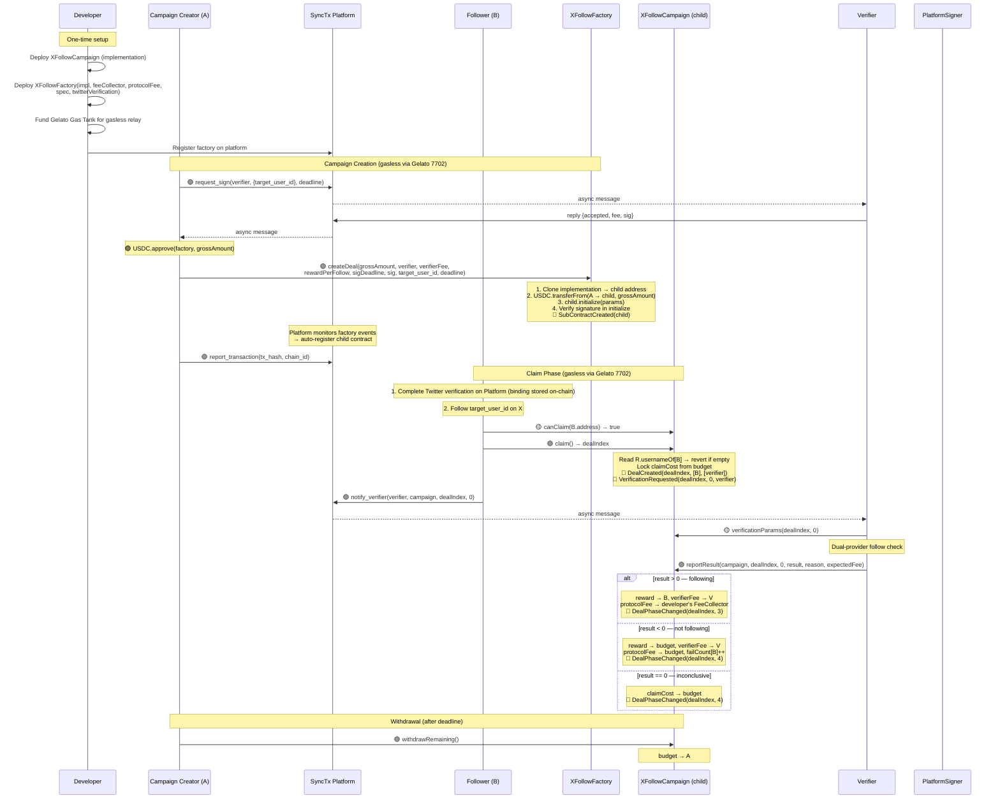
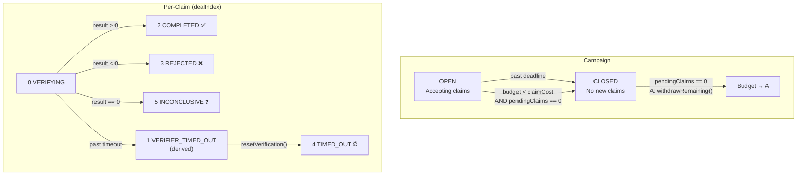

# X Follow Campaign — Factory + Clone Design

> Developer deploys a factory, A creates campaigns via the factory, B claims follow rewards in child contracts. Gasless experience is provided externally via Gelato 7702 Turbo (not at the contract level). Three-party incentive model: developer profits from per-claim protocol fee, A gets followers without understanding contracts, B earns by following without paying gas.

---

## 1. Overview

### 1.1 Three-Party Model

| Role | What they do | Incentive |
|------|-------------|-----------|
| **Developer** | Deploy factory + implementation, set protocolFee, fund Gelato Gas Tank | Earn protocolFee per claim |
| **A (Campaign Creator)** | Call factory.createDeal() with budget, get followers | No need to deploy contracts or pay gas |
| **B (Follower)** | Follow target on X, call claim() on child contract | Earn fixed USDC reward, zero gas cost |

### 1.2 Architecture

```
XFollowFactory (developer deploys once)
  │  ├── implementation: XFollowCampaign (logic contract)
  │  ├── protocolFee, feeCollector (→ developer)
  │  ├── requiredSpec, platformSigner (shared config)
  │  └── Gasless via Gelato 7702 Turbo (developer funds Gelato Gas Tank)
  │
  ├── createDeal() → Clones.clone(impl) + initialize()
  │     └── XFollowCampaign (child 1, A₁'s campaign)
  │           ├── claim() → B₁ gets dealIndex 0
  │           ├── claim() → B₂ gets dealIndex 1
  │           └── withdrawRemaining()
  │
  ├── createDeal() → clone + initialize
  │     └── XFollowCampaign (child 2, A₂'s campaign)
  └── ...
```

### 1.3 Key Points

- **Inheritance:** both `XFollowFactory` and `XFollowCampaign` are full `IDeal → DealBase` contracts; factory is the parent entry/index, child is the executable campaign
- **Clone pattern:** EIP-1167 minimal proxy. All children share implementation bytecode, each has own storage
- **Gasless:** Handled externally via Gelato 7702 Turbo relay. Contracts use plain direct calls (no BySig functions). Gas sponsored by developer's Gelato Gas Tank
- **Lifecycle:** `createDeal()` → child enters OPEN immediately (no TESTING phase)
- **Auto-registration:** Factory emits `SubContractCreated(address subContract)` → platform monitors factory events → auto-discovers and registers child contracts
- **Identity:** Twitter Verification (platformSigner verification) mandatory for B
- **Protocol fee:** Per-claim, from campaign budget → developer's feeCollector
- **Failure limit:** `MAX_FAILURES = 3` per address per campaign
- **ReentrancyGuard:** `claim()`, `onVerificationResult()`, `resetVerification()`, `withdrawRemaining()` all have `nonReentrant` modifier (custom reentrancy guard using `_lock` pattern)

---

## 2. Contract Structure

### 2.1 XFollowFactory

```solidity
contract XFollowFactory is DealBase {

    // ===================== Immutable =====================

    address public immutable implementation;     // XFollowCampaign logic contract
    address public immutable FEE_COLLECTOR;      // developer's fee receiver
    uint96  public immutable PROTOCOL_FEE;       // per-claim fee (e.g. 10000 = 0.01 USDC)
    address public immutable REQUIRED_SPEC;      // XFollowVerifierSpec address
    address public immutable TWITTER_VERIFICATION; // TwitterVerification contract; may be 0 on non-OP chains (off-chain binding mode)
    address public immutable FEE_TOKEN;          // USDC address

    // ===================== Events =====================

    /// @dev Protocol-level event defined in IDeal. Platform monitors this to auto-register child contracts.
    event SubContractCreated(address indexed subContract);

    // ===================== Functions =====================

    /// @notice A creates a campaign. Clone + initialize in one tx.
    function createDeal(
        uint96  grossAmount,
        address verifier,
        uint96  verifierFee,
        uint96  rewardPerFollow,
        uint256 sigDeadline,
        bytes calldata sig,
        uint64  target_user_id,
        uint48  deadline
    ) external returns (uint256 dealIndex);
}
```

### 2.2 XFollowCampaign (Child Contract / Implementation)

```solidity
contract XFollowCampaign is DealBase, ERC2771Mixin {

    // ===================== Set by initialize() =====================

    address public factory;              // parent factory
    address public sponsor;              // campaign sponsor
    address public verifier;
    uint96  public rewardPerFollow;
    uint96  public verifierFee;
    uint48  public deadline;
    uint96  public budget;               // remaining unlocked budget
    uint32  public pendingClaims;
    uint32  public completedClaims;
    uint256 public signatureDeadline;
    uint64  public target_user_id;
    bytes   public verifierSignature;
    bool    public closed;               // true = CLOSED
    uint32  public verifierTimeoutCount;

    // ===================== Passed from factory, stored in campaign =====================

    // FEE_COLLECTOR, PROTOCOL_FEE, REQUIRED_SPEC, PLATFORM_SIGNER, feeToken
    // passed from factory during initialize() and stored in campaign storage

    // ===================== Per-Claim =====================

    struct Claim {
        address claimer;
        uint48  timestamp;
        uint8   status;              // VERIFYING(0) / COMPLETED(2) / REJECTED(3) / TIMED_OUT(4) / INCONCLUSIVE(5)
        string  follower_username;
    }

    mapping(uint256 => Claim) internal claims;
    mapping(address => bool)  public claimed;
    mapping(address => uint8) public failCount;
}
```

---

## 3. Function Reference

### 3.1 XFollowFactory Functions

| Method | Caller | Description |
|--------|--------|-------------|
| `constructor(impl, feeCollector, protocolFee, spec, twitterVerification)` | Developer | Deploy factory with all shared config |
| `createDeal(grossAmount, verifier, verifierFee, rewardPerFollow, sigDeadline, sig, target_user_id, deadline)` | A | Clone impl → initialize with params → transfer USDC to child → emit SubContractCreated. Returns child address |

### 3.2 XFollowCampaign Functions

| Method | Caller | Description |
|--------|--------|-------------|
| `initialize(...)` | Factory only | Set campaign params and enter OPEN immediately. Can only be called once, only by factory |
| `claim()` | Any B | Verify Twitter binding: OP chain hard-reverts via `isBound(msg.sender)`; other chains (`twitterVerification == 0`) skip the check and rely on verifier off-chain lookup. Lock claimCost from budget. Emit VerificationRequested. Return dealIndex |
| `onVerificationResult(dealIndex, 0, result, reason)` | Verifier | result>0 → pay B; result<0 → reward to budget, failCount++; result==0 → all to budget |
| `resetVerification(dealIndex, 0)` | Anyone | After VERIFICATION_TIMEOUT. Full claimCost returns to budget. verifierTimeoutCount++, emit VerifierTimeout event |
| `withdrawRemaining()` | A | Only when CLOSED + pendingClaims==0. Budget → A |

### 3.3 Query Functions

| Method | Return | Description |
|--------|--------|-------------|
| `claimCost()` | `uint96` | rewardPerFollow + verifierFee + PROTOCOL_FEE |
| `campaignStatus()` | `uint8` | OPEN(0) / CLOSED(1) — derived from `closed` flag + deadline + budget |
| `dealStatus(dealIndex)` | `uint8` | Per-claim: VERIFYING(0) / VERIFIER_TIMED_OUT(1) / COMPLETED(2) / REJECTED(3) / TIMED_OUT(4) / INCONCLUSIVE(5) / NOT_FOUND(255) |
| `canClaim(addr)` | `bool` | Whether addr can claim |
| `failures(addr)` | `uint8` | Failed count |
| `remainingSlots()` | `uint256` | budget / claimCost |

### 3.4 IDeal Interface

| Method | Description |
|--------|-------------|
| `name()` | `"X Follow Campaign"` |
| `description()` | Campaign description |
| `tags()` | `["x", "follow"]` |
| `version()` | `"5.0"` |
| `instruction()` | Markdown guide for A and B |
| `requiredSpecs()` | `[REQUIRED_SPEC]` (read from factory) |
| `verificationParams(dealIndex, 0)` | specParams = abi.encode(uint64 target_user_id). Follower identity resolved off-chain via Platform API |
| `requestVerification(dealIndex, 0)` | Always reverts — auto-triggered by claim() |
| `phase(dealIndex)` | 0=NotFound, 2=Active, 3=Success, 4=Failed |
| `dealExists(dealIndex)` | Whether claim exists |

---

## 4. Verification System

### 4.1 EIP-712 Signature (per-campaign)

TYPEHASH:
```
Verify(uint64 targetUserId,uint256 fee,uint256 deadline)
```

A requests signature from verifier before calling `createDeal()`. Factory passes the signature to the child's `initialize()`, which validates it.

Constraint: `sigDeadline >= campaignDeadline`.

### 4.2 specParams (per-claim)

```solidity
specParams = abi.encode(
    // follower_user_id removed — resolved off-chain via Platform API
    uint64 target_user_id      // from campaign config
)
```

### 4.3 Off-chain Verification Flow

```
Verifier receives notify_verify (dealIndex = claim, verificationIndex = 0)
  │
  ├── 0. Read dealStatus(dealIndex) — only proceed if VERIFYING (0)
  ├── 1. Read verificationParams(dealIndex, 0) → decode specParams
  ├── 2. Dual-provider follow check (twitterapi.io + twitter-api45)
  ├── 3. Merge: ANY follow → 1, not following → retry → -1 or 1, both error → 0
  ├── 4. Re-read dealStatus(dealIndex) — still must be VERIFYING (0)
  └── 5. reportResult(campaign, dealIndex, 0, result, reason, expectedFee)
```

---

## 5. Transaction Flow



---

## 6. State Machine

### 6.1 Campaign Status

| Code | Status | Meaning |
|------|--------|---------|
| 0 | OPEN | Accepting claims (not past deadline, budget ≥ claimCost) |
| 1 | CLOSED | No new claims. Pending verifications continue |

> No TESTING state — `createDeal()` initializes directly to OPEN.
> CLOSED auto-triggered on deadline or budget exhaustion (as side-effect).

### 6.2 Per-Claim `dealStatus(dealIndex)`

| Code | Status | Stored/Derived | Meaning |
|------|--------|---------------|---------|
| 0 | VERIFYING | Stored | Awaiting verifier |
| 1 | VERIFIER_TIMED_OUT | Derived | Past VERIFICATION_TIMEOUT. `reportResult()` is no longer accepted; use `resetVerification()` |
| 2 | COMPLETED | Stored | B paid |
| 3 | REJECTED | Stored | Not following, reward returned |
| 4 | TIMED_OUT | Stored | After resetVerification, claimCost returned |
| 5 | INCONCLUSIVE | Stored | Inconclusive result, full refund |
| 255 | NOT_FOUND | — | Claim does not exist |

### 6.3 Per-Claim `phase(dealIndex)`

| dealStatus | phase | Name |
|------------|-------|------|
| NOT_FOUND | 0 | NotFound |
| VERIFYING / VERIFIER_TIMED_OUT | 2 | Active |
| COMPLETED | 3 | Success |
| REJECTED / TIMED_OUT / INCONCLUSIVE | 4 | Failed |

### 6.4 State Transition Diagram



### 6.5 Events

| Action | Events |
|--------|--------|
| `createDeal()` | `SubContractCreated(child)` (factory, protocol-level) |
| `claim()` | `DealCreated` → `DealStatusChanged(0)` → `DealPhaseChanged(2)` → `VerificationRequested` |
| `onVerificationResult(>0)` | `VerificationReceived` → `DealStatusChanged(2)` → `DealPhaseChanged(3)` |
| `onVerificationResult(<0)` | `VerificationReceived` → `DealStatusChanged(3)` → `DealPhaseChanged(4)` |
| `onVerificationResult(==0)` | `VerificationReceived` → `DealStatusChanged(5)` → `DealPhaseChanged(4)` |
| `resetVerification()` | `DealStatusChanged(4)` → `DealPhaseChanged(4)` |

### 6.6 Claim Eligibility

```
campaign CLOSED          → CampaignNotOpen
claimed[B]               → AlreadyClaimed
failCount[B] >= 3        → MaxFailures
not bound (isBound check fails, OP mode only) → NotBound
budget < claimCost       → auto-close → CLOSED
has pending claim        → PendingClaim
otherwise                → eligible
```

---

## 7. Gasless Architecture

### 7.1 Setup

```
Developer deploys:
  1. XFollowCampaign implementation (plain direct calls, no BySig functions)
  2. XFollowFactory(impl, feeCollector, protocolFee, spec, twitterVerification)
  3. Fund Gelato Gas Tank (gas budget for Gelato 7702 Turbo relay)

Gasless is handled entirely outside the contract layer via Gelato 7702 Turbo.
Contracts expose only standard functions; Gelato relays transactions on behalf of users.
```

### 7.2 Who Pays Gas

| Action | Tx Sender | Gas Paid By |
|--------|-----------|-------------|
| A: createDeal | Gelato 7702 relay | Developer's Gelato Gas Tank |
| B: claim | Gelato 7702 relay | Developer's Gelato Gas Tank |
| B: notify_verifier | Platform MCP call | No gas (off-chain) |
| Verifier: reportResult | Verifier signer EOA | Verifier (has own gas) |
| A: withdrawRemaining | Gelato 7702 relay | Developer's Gelato Gas Tank |

### 7.3 Economic Model

```
Developer revenue per claim = PROTOCOL_FEE
Developer cost per claim     = gas for B's claim() relay + gas for A's amortized creation cost
Net margin                   = PROTOCOL_FEE - gas costs
```

Developer sets PROTOCOL_FEE high enough to cover gas + profit margin.

---

## 8. Fund Flow

### 8.1 Campaign Creation

```
A approves USDC to factory.
Factory: USDC.transferFrom(A → child, grossAmount)
child.initialize(): budget = grossAmount
No upfront protocol fee — charged per claim.
```

### 8.2 Per-Claim Cost

```
claimCost = rewardPerFollow + verifierFee + PROTOCOL_FEE
Each claim() locks claimCost from budget.
```

### 8.3 Verification Result → Fund Distribution

| Result | Reward | Verifier Fee | Protocol Fee | Budget Change |
|--------|--------|--------------|--------------|---------------|
| Pass (>0) | → B | → Verifier | → FeeCollector | — |
| Fail (<0) | → budget | → Verifier | → budget | +rewardPerFollow + protocolFee |
| Inconclusive (0) | → budget | → budget | → budget | +claimCost |
| Timeout | → budget | → budget | → budget | +claimCost |

### 8.4 Campaign End

```
After deadline + pendingClaims == 0:
  budget → A via withdrawRemaining()
```

---

## 9. Validation Checklist

### 9.1 Factory.createDeal

| # | Check | Error |
|---|-------|-------|
| 1 | `rewardPerFollow > 0` | InvalidParams |
| 2 | `deadline > block.timestamp` | InvalidParams |
| 3 | `verifier != address(0)`, is contract | VerifierNotContract |
| 4 | `target_user_id > 0` | InvalidParams |
| 5 | `grossAmount >= claimCost` (at least 1 claim) | InvalidParams |
| 6 | Clone implementation → child | — |
| 7 | `USDC.transferFrom(A → child, grossAmount)` | TransferFailed |
| 8 | `child.initialize(params)` | — |
| 9 | Emit `SubContractCreated(child)` | — |

### 9.2 Campaign.initialize

| # | Check | Error |
|---|-------|-------|
| 1 | Caller is factory | NotFactory |
| 2 | Not already initialized | AlreadyInitialized |
| 3 | `sigDeadline >= deadline` | SignatureExpired |
| 4 | Verifier spec match + EIP-712 signature valid | InvalidVerifierSignature |
| 5 | Set all params, budget = grossAmount, status = OPEN | — |

### 9.3 Campaign.claim

| # | Check | Error |
|---|-------|-------|
| 1 | Not closed, not past deadline | CampaignNotOpen |
| 2 | `budget >= claimCost` | auto-close |
| 3 | `!claimed[sender]` | AlreadyClaimed |
| 4 | `failCount[sender] < MAX_FAILURES` | MaxFailures |
| 5 | Twitter binding valid: `twitterVerification.isBound(msg.sender)` (skipped when `twitterVerification == 0`) | NotBound |
| 6 | No pending claim | PendingClaim |
| 7 | Lock claimCost, pendingClaims++ | — |

### 9.4 Campaign.onVerificationResult

| # | Check | Error |
|---|-------|-------|
| 1 | `msg.sender == verifier` | NotVerifier |
| 2 | Claim status == VERIFYING | InvalidStatus |
| 3 | Distribute funds, update counters, auto-close check | — |

### 9.5 Campaign.withdrawRemaining

| # | Check | Error |
|---|-------|-------|
| 1 | `sender == sponsor` | NotSponsor |
| 2 | Campaign is CLOSED | NotClosed |
| 3 | `pendingClaims == 0` | PendingClaims |
| 4 | `budget > 0` | NoFunds |

---

## 10. Constants

| Constant | Value | Location | Description |
|----------|-------|----------|-------------|
| `VERIFICATION_TIMEOUT` | 30 minutes | Campaign | Per-claim verifier response limit |
| `MAX_FAILURES` | 3 | Campaign | Max failed claims per address |
| `MIN_PROTOCOL_FEE` | 10,000 (0.01 USDC) | Factory | Minimum protocol fee at deployment |

---

## 11. Multi-chain Deployment Modes

The contract supports two deployment modes, selected at factory construction via `twitterVerification_`:

### OP chain (on-chain binding)
- `twitterVerification_` is set to the deployed `TwitterVerification` proxy address.
- `XFollowCampaign.claim()` hard-reverts with `NotBound` if the caller has no active Twitter binding.
- `canClaim(addr)` reflects the binding dimension accurately — safe for UI preflight.

### Other chains (off-chain binding)
- `twitterVerification_` is set to `address(0)` at factory construction.
- `XFollowCampaign.claim()` skips the on-chain `isBound` check; anyone can submit a claim.
- The verifier performs the binding lookup off-chain via Platform API `POST /binding/verify` (tri-state):
  - `ok`  → proceed to follow verification, report pass (`1`) or fail (`-1`)
  - `not_bound` → report fail (`-1`) deterministically
  - `error` → report inconclusive (`0`), budget fully refunded
- `canClaim(addr)` cannot evaluate the binding dimension; UI/agent should query Platform API (`GET /binding/:address/status`) separately before prompting `claim()`.

See `docs/twitter-binding-privacy.md` for the overarching privacy design; see `synctx-tools/x-verifier/src/verify/x-follow.ts` for the verifier-side tri-state implementation.
