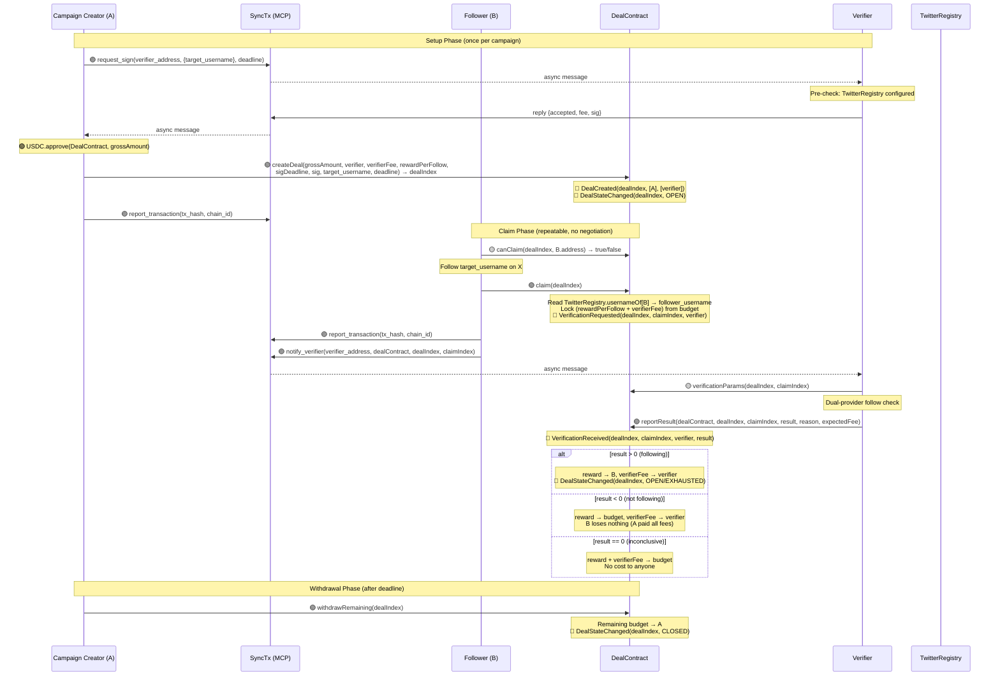
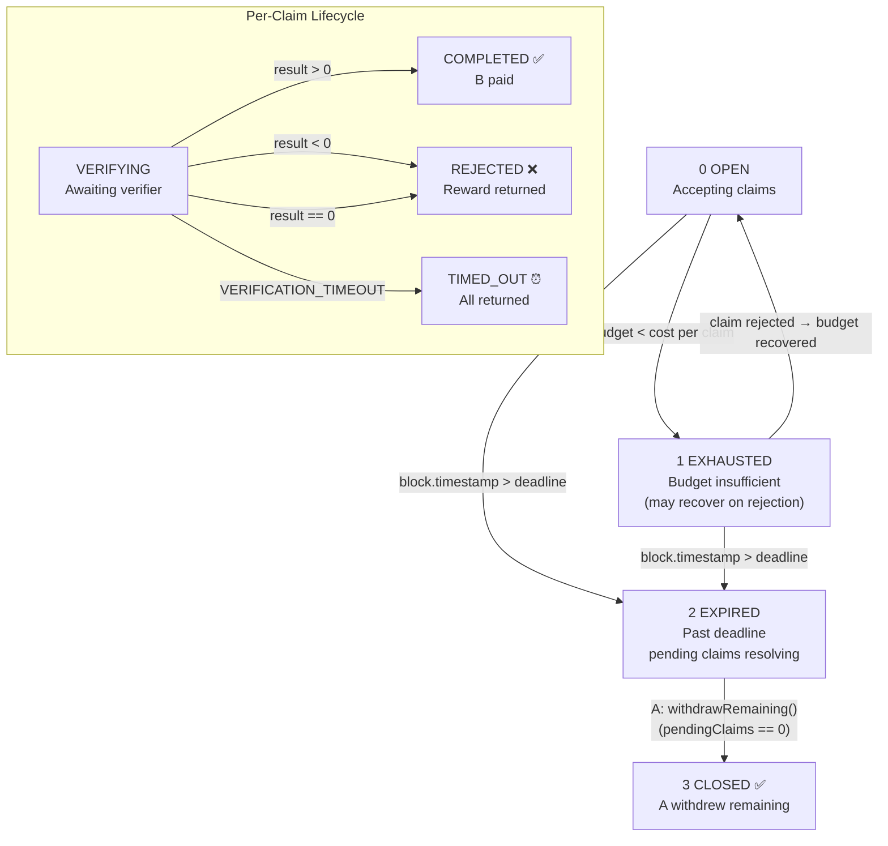
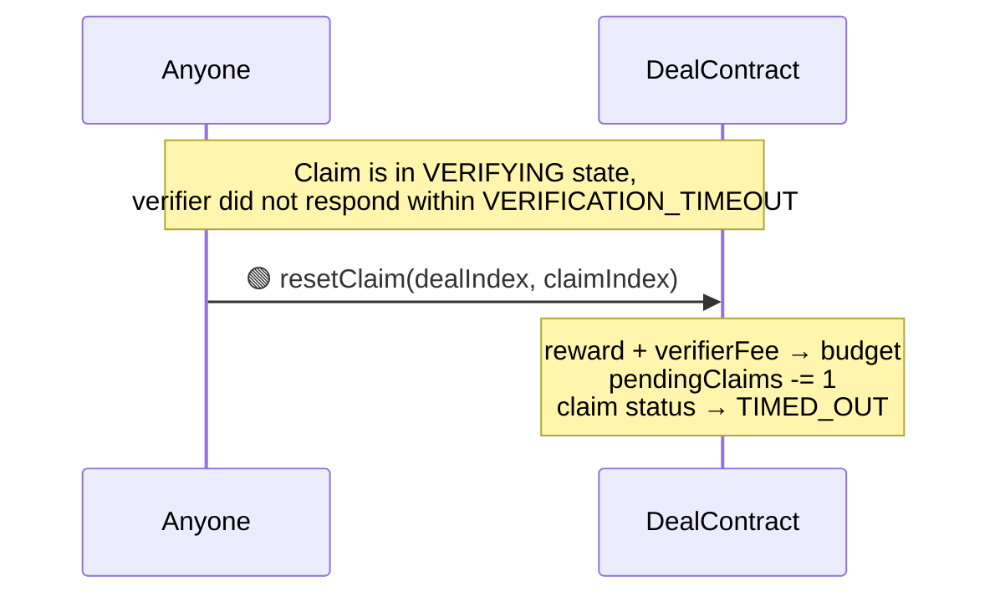
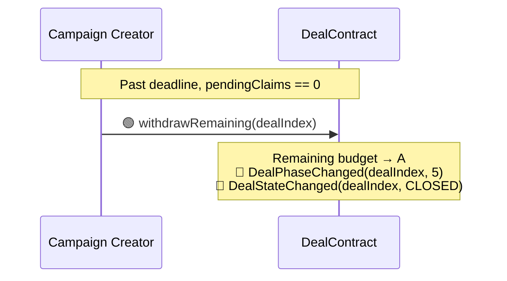
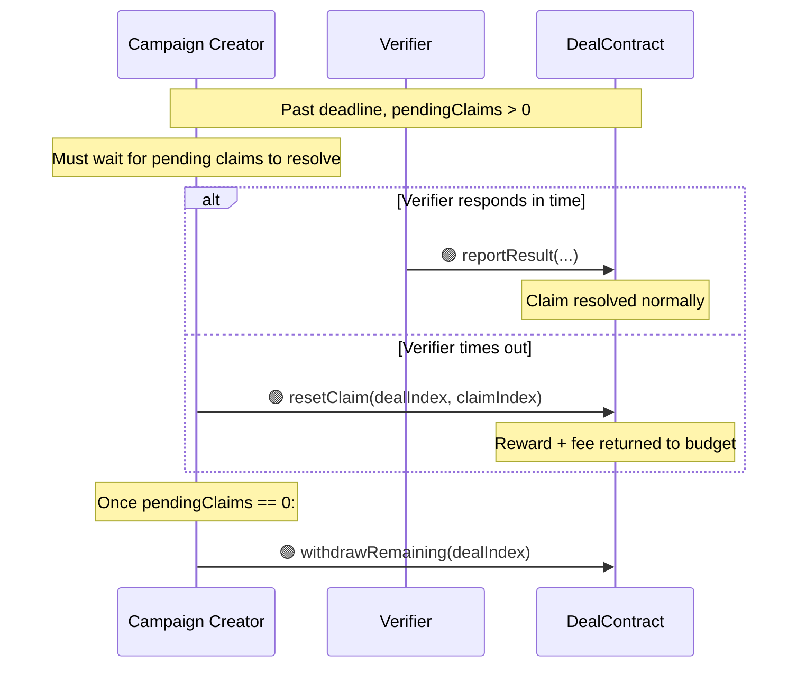

# XFollowDealContract Design Document

> 1-to-many campaign model: A deposits a budget, any TwitterRegistry-verified user can follow and claim a fixed reward. Fully automated, no negotiation needed.

---

## 1. Overview

XFollowDealContract is a concrete DealContract implementation for the **"A pays a fixed reward per follow to a specified account on X"** campaign scenario.

- **Inheritance:** `IDeal → DealBase → XFollowDealContract`
- **Model:** 1-to-many — A creates a campaign, any number of Bs can claim
- **Verification system:** Multi-claim, single verifier per campaign, requiring `XFollowVerifierSpec`
- **Payment token:** USDC
- **Tags:** `["x", "follow"]`
- **Identity:** `TwitterRegistry` binding is mandatory — B's wallet must be bound to a Twitter username
- **Verification semantics:** Verifier checks whether the follow relationship exists at verification time. Identity is guaranteed by TwitterRegistry (wallet ↔ username), eliminating impersonation risk
- **Off-chain verification:** Dual-provider parallel check via twitterapi.io (`check_follow_relationship`) + twitter-api45 (`checkfollow.php`)
- **End conditions:** Budget exhausted OR deadline reached — A cannot close early

---

## 2. Core Data Structures

### 2.1 Deal (Campaign)

```solidity
struct Deal {
    // Slot 1
    address partyA;              // 20 bytes — campaign creator
    uint48  deadline;            // 6 bytes  — campaign end time (Unix seconds)
    uint8   status;              // 1 byte   — OPEN / CLOSED
    // Slot 2
    address verifier;            // 20 bytes — verifier contract address
    uint96  rewardPerFollow;     // 12 bytes — fixed USDC reward per follow
    // Slot 3
    uint96  budget;              // 12 bytes — remaining unlocked USDC budget
    uint96  verifierFee;         // 12 bytes — fee per verification (paid from budget)
    uint32  pendingClaims;       // 4 bytes  — claims awaiting verification
    uint32  completedClaims;     // 4 bytes  — successfully verified claims
    // Slot 4
    uint256 signatureDeadline;
    // Dynamic
    string  target_username;     // canonicalized: no @, lowercase
    bytes   verifierSignature;   // EIP-712 signature
}
```

### 2.2 Claim

```solidity
struct Claim {
    // Slot 1
    address claimer;             // 20 bytes — B's address
    uint48  timestamp;           // 6 bytes  — claim creation time
    uint8   status;              // 1 byte   — VERIFYING / COMPLETED / REJECTED
    // Dynamic
    string  follower_username;   // read from TwitterRegistry at claim time
}
```

### 2.3 Mappings

```solidity
mapping(uint256 => Deal) deals;
mapping(uint256 => mapping(uint256 => Claim)) claims;
mapping(uint256 => mapping(address => bool)) hasClaimed;  // prevent double-claiming
mapping(uint256 => uint256) nextClaimIndex;
```

---

## 3. Function Reference

### 3.1 XFollowDealContract Functions

| Method | Parameters | Caller | Description |
|--------|------------|--------|-------------|
| `createDeal(...)` | `uint96 grossAmount, address verifier, uint96 verifierFee, uint96 rewardPerFollow, uint256 sigDeadline, bytes sig, string target_username, uint48 deadline` | A | Create campaign. Deposit `grossAmount` USDC (= protocolFee + budget). Budget must be ≥ 1 × (rewardPerFollow + verifierFee) |
| `claim(dealIndex)` | `uint256 dealIndex` | Any verified B | Claim a follow reward. Reads B's username from TwitterRegistry. Locks (rewardPerFollow + verifierFee) from budget. Auto-triggers verification |
| `onVerificationResult(...)` | `uint256 dealIndex, uint256 claimIndex, int8 result, string reason` | Verifier | Callback: result>0 → pay B; result<0 → return reward to budget; result==0 → return all to budget |
| `withdrawRemaining(dealIndex)` | `uint256 dealIndex` | A | After deadline + no pending claims, A withdraws remaining budget. Deal → CLOSED |
| `resetClaim(dealIndex, claimIndex)` | `uint256 dealIndex, uint256 claimIndex` | Anyone | After VERIFICATION_TIMEOUT, reset timed-out claim. Reward + fee return to budget |

### 3.2 Query Functions

| Method | Return | Description |
|--------|--------|-------------|
| `dealStatus(dealIndex)` | `uint8` | Derived status: OPEN / EXHAUSTED / EXPIRED / CLOSED / NOT_FOUND |
| `dealInfo(dealIndex)` | `(address partyA, string target, uint96 reward, uint96 budget, uint48 deadline, uint32 completed, uint32 pending)` | Campaign details for UI |
| `claimInfo(dealIndex, claimIndex)` | `(address claimer, string username, uint8 status)` | Individual claim details |
| `canClaim(dealIndex, addr)` | `bool` | Whether addr can claim (verified, not claimed, budget available, not expired) |

### 3.3 Inherited from DealBase / IDeal

| Method | Description |
|--------|-------------|
| `name()` | Returns `"X Follow Deal"` |
| `description()` | Campaign description |
| `tags()` | `["x", "follow"]` |
| `version()` | `"2.0"` |
| `instruction()` | Markdown operation guide |
| `requiredSpecs()` | `[XFollowVerifierSpec]` |
| `verificationParams(dealIndex, claimIndex)` | Returns verifier + specParams for a specific claim |

---

## 4. Verification System

### 4.1 Contract Structure

```
VerifierSpec ← XFollowVerifierSpec (business specification)
IVerifier ← VerifierBase ← XFollowVerifier (instance)
XFollowVerifier.spec() → XFollowVerifierSpec
```

### 4.2 EIP-712 Signature (per-campaign)

TYPEHASH:
```
Verify(string targetUsername,uint256 fee,uint256 deadline)
```

The verifier signs once per campaign (not per claim). This commits the verifier to:
- Verify follows to `target_username`
- At `fee` per verification
- Until `deadline`

### 4.3 specParams (per-claim)

```solidity
specParams = abi.encode(
    string follower_username,  // B's username (from TwitterRegistry)
    string target_username     // campaign target
)
```

### 4.4 Off-chain Verification Flow

```
Verifier Service receives notify_verify (with claimIndex as verificationIndex)
  │
  ├── 0. Read on-chain claim status — only proceed if VERIFYING
  ├── 1. Read verificationParams(dealIndex, claimIndex) → decode specParams
  ├── 2. Parallel API calls:
  │     ├── twitterapi.io: check_follow_relationship
  │     └── twitter-api45: checkfollow.php
  ├── 3. Merge logic:
  │     ├── ANY confirms follow → result = 1 (pass)
  │     ├── Both deny → retry once after 5s → result = -1 or 1
  │     └── Both error → result = 0 (inconclusive)
  └── 4. reportResult(dealContract, dealIndex, claimIndex, result, reason, expectedFee)
```

---

## 5. Transaction Flow



---

## 6. State Machine

### 6.1 Deal Status

| Code | Status | Meaning |
|------|--------|---------|
| 0 | OPEN | Accepting claims (budget ≥ rewardPerFollow + verifierFee, not past deadline) |
| 1 | EXHAUSTED | Budget < rewardPerFollow + verifierFee (may recover if claims are rejected) |
| 2 | EXPIRED | Past deadline, pending claims may still resolve, A cannot withdraw yet |
| 3 | CLOSED | A has withdrawn remaining budget, all claims resolved |
| 255 | NOT_FOUND | Deal does not exist |

> EXHAUSTED and EXPIRED are derived at runtime (not stored). Stored status is only OPEN or CLOSED.

### 6.2 Claim Status

| Code | Status | Meaning |
|------|--------|---------|
| 0 | VERIFYING | Awaiting verifier response |
| 1 | COMPLETED | Follow verified, B paid |
| 2 | REJECTED | Follow not detected, reward returned to budget |
| 3 | TIMED_OUT | Verifier timed out, reward + fee returned to budget |

### 6.3 State Transition Diagram



---

## 7. Timeouts and Abnormal Paths

### 7.1 Timeout Constants

| Constant | Value | Description |
|----------|-------|-------------|
| `VERIFICATION_TIMEOUT` | 30 minutes | Per-claim verifier response time limit |

No STAGE_TIMEOUT or SETTLING_TIMEOUT — the campaign model has no negotiation phases.

### 7.2 Verifier Timeout on a Claim



> Anyone can call resetClaim after timeout — no permissions needed.

### 7.3 Campaign Expires with Remaining Budget



> A can only withdraw when `pendingClaims == 0` and `block.timestamp > deadline`.

### 7.4 Campaign Expires with Pending Claims



### 7.5 Budget Exhausted → Recovery on Rejection

When a claim is rejected (result < 0), `rewardPerFollow` returns to the budget. This may re-open the campaign for new claims:

```
EXHAUSTED → claim rejected → budget += rewardPerFollow → OPEN (if budget ≥ cost per claim)
```

### 7.6 Design Principles

| Principle | Implementation |
|-----------|----------------|
| No early close | A cannot withdraw before deadline — committed budget |
| No negotiation | Fixed reward, self-service claim |
| A pays all fees | verifierFee deducted from budget, not from B |
| No penalty for B | Failed claims return reward to budget; B pays nothing |
| Identity required | TwitterRegistry binding mandatory — prevents sybil/impersonation |
| One claim per user | `hasClaimed` mapping prevents double claims |

---

## 8. Fund Flow

### 8.1 Campaign Creation

```
A approves and deposits grossAmount:
  grossAmount = protocolFee + budget
  protocolFee → FeeCollector (non-refundable)
  budget → contract escrow
```

### 8.2 Per-Claim Cost (from budget)

```
Each claim locks: rewardPerFollow + verifierFee
Remaining claimable follows = budget / (rewardPerFollow + verifierFee)
```

### 8.3 Verification Result → Fund Distribution

| Result | Reward (rewardPerFollow) | Verifier Fee | Budget Change |
|--------|--------------------------|--------------|---------------|
| Pass (result > 0) | → B | → Verifier | — |
| Fail (result < 0) | → budget | → Verifier | +rewardPerFollow |
| Inconclusive (result == 0) | → budget | → budget | +rewardPerFollow + verifierFee |
| Verifier timeout | → budget | → budget | +rewardPerFollow + verifierFee |

### 8.4 Campaign End

```
After deadline + all claims resolved:
  remaining budget → A via withdrawRemaining()
```

---

## 9. Validation Checklist

### 9.1 createDeal Validations

| # | Check | Error |
|---|-------|-------|
| 1 | `grossAmount > protocolFee` | InvalidParams |
| 2 | `budget >= rewardPerFollow + verifierFee` (at least 1 claim possible) | InvalidParams |
| 3 | `rewardPerFollow > 0` | InvalidParams |
| 4 | `deadline > block.timestamp` | InvalidParams |
| 5 | `verifier != address(0)`, is contract | VerifierNotContract |
| 6 | `target_username` non-empty after canonicalization | InvalidParams |
| 7 | Verifier spec match + EIP-712 signature valid | InvalidVerifierSignature |
| 8 | `USDC.transferFrom(A, contract, grossAmount)` | TransferFailed |

### 9.2 claim Validations

| # | Check | Error |
|---|-------|-------|
| 1 | Deal status is OPEN | InvalidStatus |
| 2 | `block.timestamp <= deadline` | DealExpired |
| 3 | `budget >= rewardPerFollow + verifierFee` | BudgetExhausted |
| 4 | `!hasClaimed[dealIndex][msg.sender]` | AlreadyClaimed |
| 5 | `TwitterRegistry.usernameOf[msg.sender]` is non-empty | NotVerified |
| 6 | Lock (rewardPerFollow + verifierFee) from budget | — |

### 9.3 onVerificationResult Validations

| # | Check | Error |
|---|-------|-------|
| 1 | `msg.sender == deal.verifier` | NotVerifier |
| 2 | Claim status is VERIFYING | InvalidStatus |
| 3 | Distribute funds based on result | — |

### 9.4 withdrawRemaining Validations

| # | Check | Error |
|---|-------|-------|
| 1 | `msg.sender == deal.partyA` | NotPartyA |
| 2 | `block.timestamp > deal.deadline` | NotExpired |
| 3 | `deal.pendingClaims == 0` | PendingClaims |
| 4 | `deal.budget > 0` | NoFunds |

### 9.5 Verifier Service Pre-flight Checks

| # | Check | Action |
|---|-------|--------|
| 1 | Claim status is VERIFYING | Skip if not |
| 2 | Verifier address matches self | Skip if not |
| 3 | On-chain fee > 0 | Skip if not |
| 4 | TwitterRegistry configured (at sign time) | Reject sign request if not |
