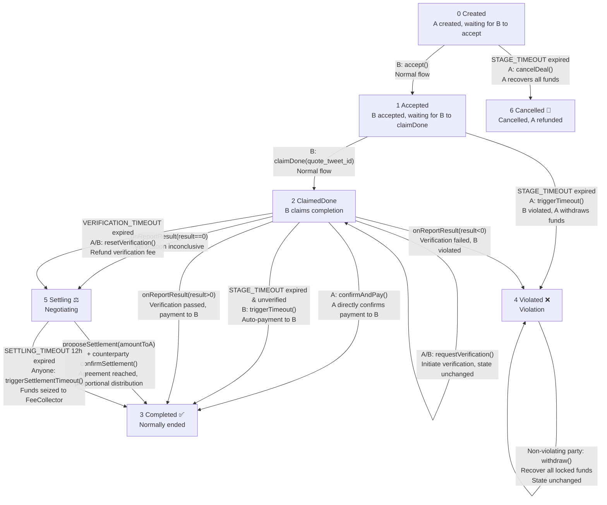
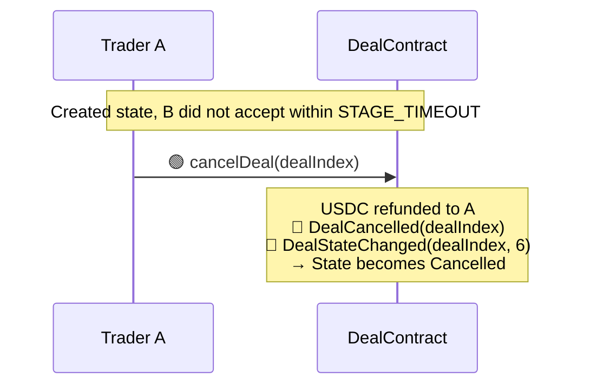
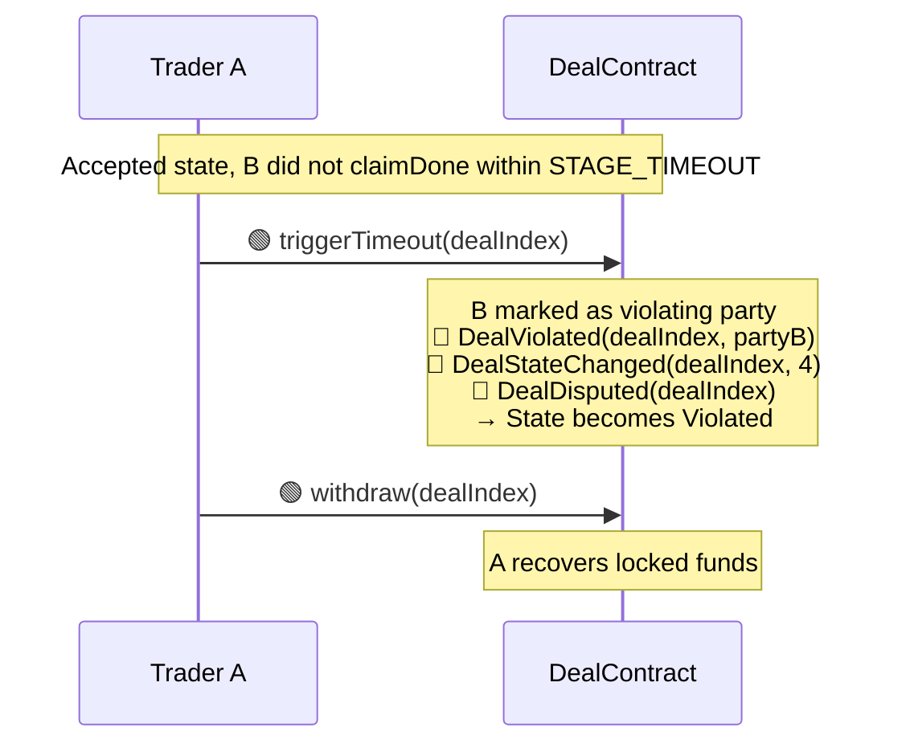
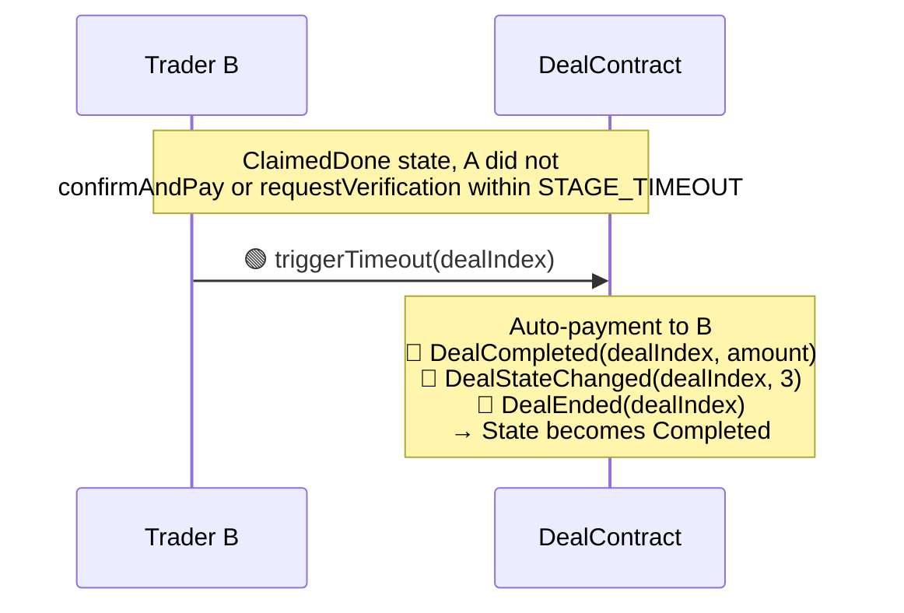
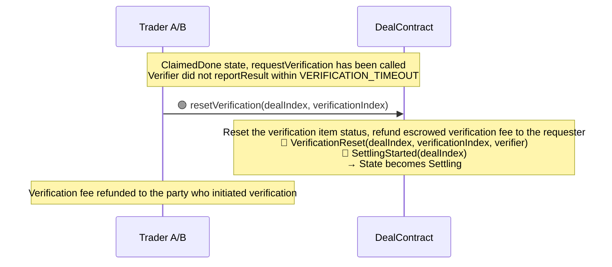
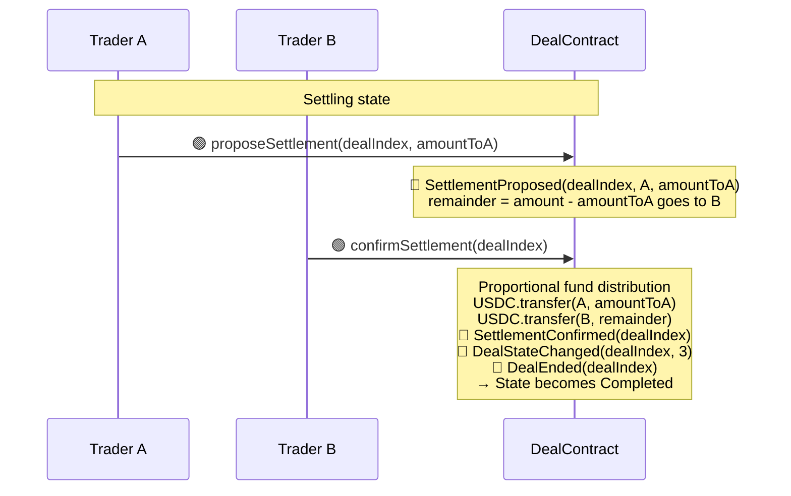
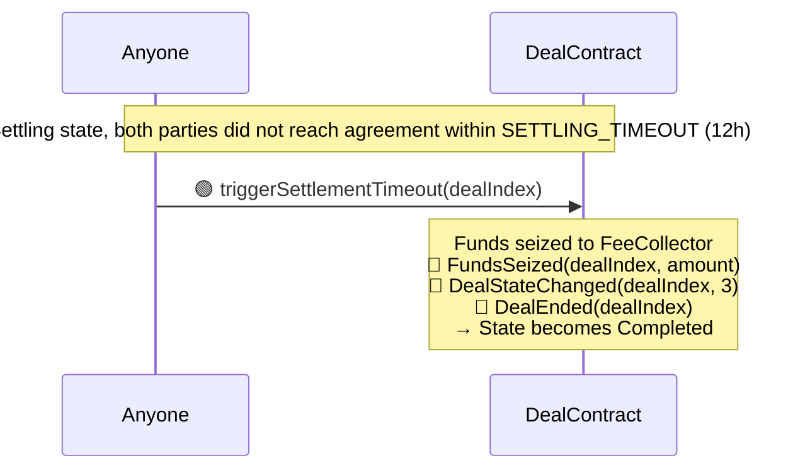
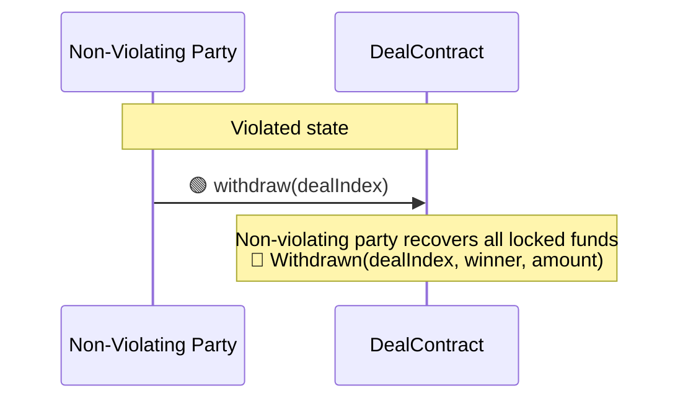

# XQuoteDealContract Design Document

> Complete design of XQuoteDealContract extracted from the core architecture document, including contract interfaces, transaction flow, state machine, timeout handling, and error handling.

---

## 1. Overview

XQuoteDealContract is a concrete DealContract implementation for the **"A pays B to quote a specified tweet"** transaction scenario.

- **Inheritance:** `IDealContract → DealContractBase → XQuoteDealContract`
- **Verification system:** Single verification slot, requiring the spec to be `XQuoteVerifierSpec`
- **Payment token:** USDC
- **Tags:** `["x", "quote"]`

---

## 2. Function Reference

### 2.1 All XQuoteDealContract Functions

> Inheritance chain: `IDealContract → DealContractBase → XQuoteDealContract`

| Method | Parameters | Return Value | Defined In | Implemented In | Description |
|--------|------------|--------------|------------|----------------|-------------|
| `interfaceVersion()` | — | `string` | IDealContract | DealContractBase | Returns `"1.0"`. `pure`, cannot be overridden |
| `supportsInterface(id)` | `bytes4 id` | `bool` | IDealContract | DealContractBase | ERC-165. `pure`, cannot be overridden |
| `startCount()` | — | `uint256` | IDealContract | DealContractBase | Total number of deals created. Private storage, subclasses cannot tamper. `view` |
| `activatedCount()` | — | `uint256` | IDealContract | DealContractBase | Number of activated deals. `view` |
| `endCount()` | — | `uint256` | IDealContract | DealContractBase | Number of normally ended deals. `view` |
| `disputeCount()` | — | `uint256` | IDealContract | DealContractBase | Number of disputed deals. `view` |
| `_recordStart(...)` | `address[] traders, address[] verifiers` | `uint256 dealIndex` | DealContractBase | DealContractBase | Internal utility. Emits DealCreated, startCount++ |
| `_recordActivated(dealIndex)` | `uint256 dealIndex` | — | DealContractBase | DealContractBase | Internal utility. Emits DealActivated, activatedCount++ |
| `_recordEnd(dealIndex)` | `uint256 dealIndex` | — | DealContractBase | DealContractBase | Internal utility. Emits DealEnded, endCount++ |
| `_recordDispute(dealIndex)` | `uint256 dealIndex` | — | DealContractBase | DealContractBase | Internal utility. Emits DealDisputed, disputeCount++ |
| `_recordCancelled(dealIndex)` | `uint256 dealIndex` | — | DealContractBase | DealContractBase | Internal utility. Emits DealCancelled, does not affect any counters |
| `_emitStateChanged(...)` | `uint256 dealIndex, uint8 stateIndex` | — | DealContractBase | DealContractBase | Internal utility. Emits DealStateChanged |
| `_emitViolated(...)` | `uint256 dealIndex, address violator` | — | DealContractBase | DealContractBase | Internal utility. Emits DealViolated |
| `contractName()` | — | `string` | IDealContract | XQuoteDealContract | Returns `"XQuoteDealContract"`. `pure` |
| `description()` | — | `string` | IDealContract | XQuoteDealContract | Contract description, used for SyncTx search. `pure` |
| `getTags()` | — | `string[]` | IDealContract | XQuoteDealContract | Returns `["x", "quote"]`. `pure` |
| `dealVersion()` | — | `string` | IDealContract | XQuoteDealContract | Deal rule version number. `pure` |
| `protocolFee()` | — | `uint256` | IDealContract | XQuoteDealContract | Protocol fee. `view` |
| `instruction()` | — | `string` (Markdown) | IDealContract | XQuoteDealContract | Operation guide, consistent with MCP terminology. `view` |
| `status(dealIndex)` | `uint256 dealIndex` | `uint8` | IDealContract | XQuoteDealContract | General status: 0=NotFound 1=Active 2=Success 3=Failed 4=Refunding 5=Cancelled. `view` |
| `dealStatus(dealIndex)` | `uint256 dealIndex` | `uint8` | IDealContract | XQuoteDealContract | Business status (State enum value). `view` |
| `dealExists(dealIndex)` | `uint256 dealIndex` | `bool` | IDealContract | XQuoteDealContract | Whether the deal exists. `view` |
| `getRequiredSpecs()` | — | `address[]` | IDealContract | XQuoteDealContract | Returns the list of spec addresses required for each verification slot. XQuoteDealContract has only 1 slot, pointing to the XQuoteVerifierSpec address. `view` |
| `getVerificationParams(...)` | `uint256 dealIndex, uint256 verificationIndex` | `(address verifier, uint256 fee, uint256 deadline, bytes sig, bytes specParams)` | IDealContract | XQuoteDealContract | Called by the Verifier after receiving notification to obtain verification parameters. `specParams = abi.encode(tweet_id, quoter_username, quote_tweet_id)`. `view` |
| `requestVerification(...)` | `uint256 dealIndex, uint256 verificationIndex` | — | IDealContract | XQuoteDealContract | Triggered by a Trader to initiate verification. Escrows verification fee + emits VerifyRequest. `external` |
| `onReportResult(...)` | `uint256 dealIndex, uint256 verificationIndex, int8 result, string reason` | — | IDealContract | XQuoteDealContract | Verifier → DealContract callback. DealContractBase reverts by default, subclasses must override. `external` |
| `createDeal(...)` | `address partyB, uint256 grossAmount, address verifier, uint256 verifierFee, uint256 deadline, bytes sig, string tweet_id, string quoter_username` | `uint256 dealIndex` | XQuoteDealContract | XQuoteDealContract | Creates a deal. Internally calls `XQuoteVerifierSpec.check()` for signature verification and escrows USDC. Business parameters are passed as flat arguments |
| `accept(dealIndex)` | `uint256 dealIndex` | — | XQuoteDealContract | XQuoteDealContract | Trader B accepts the deal. Created → Accepted |
| `claimDone(...)` | `uint256 dealIndex, string quote_tweet_id` | — | XQuoteDealContract | XQuoteDealContract | Trader B claims task completion and submits the quote tweet ID. Accepted → ClaimedDone |
| `confirmAndPay(dealIndex)` | `uint256 dealIndex` | — | XQuoteDealContract | XQuoteDealContract | Trader A confirms completion and releases payment. ClaimedDone → Completed |
| `cancelDeal(dealIndex)` | `uint256 dealIndex` | — | XQuoteDealContract | XQuoteDealContract | A cancels after timeout in Created stage, refunding all funds. Created → Cancelled |
| `triggerTimeout(dealIndex)` | `uint256 dealIndex` | — | XQuoteDealContract | XQuoteDealContract | Triggers timeout handling. Accepted timeout → Violated; ClaimedDone timeout (unverified) → auto-payment Completed |
| `resetVerification(...)` | `uint256 dealIndex, uint256 verificationIndex` | — | XQuoteDealContract | XQuoteDealContract | Resets verification after Verifier timeout, refunding escrowed verification fee. ClaimedDone → Settling |
| `proposeSettlement(...)` | `uint256 dealIndex, uint256 amountToA` | — | XQuoteDealContract | XQuoteDealContract | Proposes a fund distribution plan. The proposer cannot confirm their own proposal; the counterparty can overwrite the previous proposal |
| `confirmSettlement(dealIndex)` | `uint256 dealIndex` | — | XQuoteDealContract | XQuoteDealContract | Confirms the counterparty's distribution plan and executes fund distribution. Settling → Completed |
| `triggerSettlementTimeout(dealIndex)` | `uint256 dealIndex` | — | XQuoteDealContract | XQuoteDealContract | After 12h negotiation timeout, anyone can call to seize funds to FeeCollector. Settling → Completed |
| `withdraw(dealIndex)` | `uint256 dealIndex` | — | XQuoteDealContract | XQuoteDealContract | The non-violating party withdraws all locked funds. Only callable in Violated state; the violating party cannot call |

### 2.2 All XQuoteVerifier Functions

> Inheritance chain: `IVerifier → VerifierBase → XQuoteVerifier`
> Spec contract: `IVerifierSpec → XQuoteVerifierSpec` (pointed to by XQuoteVerifier.spec())

| Method | Parameters | Return Value | Defined In | Implemented In | Description |
|--------|------------|--------------|------------|----------------|-------------|
| `reportResult(...)` | `address dealContract, uint256 dealIndex, uint256 verificationIndex, int8 result, string reason` | — | IVerifier | VerifierBase | Called by the Verifier owner (EOA), internally calls back `IDealContract(dealContract).onReportResult()`. `external` |
| `owner()` | — | `address` | IVerifier | VerifierBase | Contract owner. `view` |
| `supportsInterface(id)` | `bytes4 id` | `bool` | IVerifier | VerifierBase | ERC-165. `pure` |
| `transferOwnership(...)` | `address newOwner` | — | VerifierBase | VerifierBase | Instance ownership management |
| `withdrawFees(...)` | `address to, uint256 amount` | — | VerifierBase | VerifierBase | Withdraw fees received by the instance |
| `DOMAIN_SEPARATOR` | — | `bytes32` | VerifierBase | VerifierBase | public immutable, read by the Spec contract's `check()` |
| `description()` | — | `string` | IVerifier | XQuoteVerifier | Instance self-description. `view` |
| `spec()` | — | `address` | IVerifier | XQuoteVerifier | Points to the business specification contract XQuoteVerifierSpec address. `view` |
| `spec()->name()` | — | `string` | IVerifierSpec | XQuoteVerifierSpec | Returns `"XQuoteVerifierSpec"`. Called indirectly via spec() |
| `spec()->version()` | — | `string` | IVerifierSpec | XQuoteVerifierSpec | Returns `"1.0"`. Called indirectly via spec() |
| `spec()->description()` | — | `string` | IVerifierSpec | XQuoteVerifierSpec | Specification description: includes parameter definitions, check semantics, and specParams abi.encode format. Called indirectly via spec() |
| `spec()->check(...)` | `address verifierInstance, string tweet_id, string quoter_username, uint256 fee, uint256 deadline, bytes sig` | — | XQuoteVerifierSpec | XQuoteVerifierSpec | Business validation entry point. Reads DOMAIN_SEPARATOR and owner from the instance to complete EIP-712 signature verification. Reverts: SignatureExpired / InvalidSignature / InvalidVerifierSign. Called by DealContract internally during createDeal |

---

## 3. Event Reference

| Event Name | Parameters | Implemented In | Trigger Timing | Description |
|------------|------------|----------------|----------------|-------------|
| `DealCreated` | `uint256 dealIndex, address[] traders, address[] verifiers` | DealContractBase (`_recordStart`) | When `createDeal` succeeds | startCount++. traders and verifiers record the participants |
| `DealStateChanged` | `uint256 dealIndex, uint8 stateIndex` | DealContractBase (`_emitStateChanged`) | On every state change | stateIndex corresponds to the State enum value. SyncTx uses this + instruction() to infer who needs to act |
| `DealActivated` | `uint256 dealIndex` | DealContractBase (`_recordActivated`) | When `accept` succeeds | activatedCount++. All participants have confirmed |
| `DealCancelled` | `uint256 dealIndex` | DealContractBase (`_recordCancelled`) | On `cancelDeal` (Created timeout cancellation) | Does not affect any counters. B has not accepted yet, so it does not constitute a violation |
| `DealViolated` | `uint256 dealIndex, address violator` | DealContractBase (`_emitViolated`) | triggerTimeout (Accepted stage) / verification failure (result<0) | violator is the address of the violating party |
| `DealDisputed` | `uint256 dealIndex` | DealContractBase (`_recordDispute`) | On violation (triggerTimeout / verification failure), after DealViolated | disputeCount++ |
| `DealEnded` | `uint256 dealIndex` | DealContractBase (`_recordEnd`) | On normal completion (confirmAndPay / verification passed / timeout auto-payment / negotiated distribution / negotiation timeout seizure) | endCount++ |
| `VerifyRequest` | `uint256 dealIndex, uint256 verificationIndex, address verifier` | XQuoteDealContract (`requestVerification`) | When `requestVerification` succeeds | Also transfers verification fee to contract escrow. Verifier calls getVerificationParams after receiving notification |
| `VerificationReceived` | `uint256 dealIndex, uint256 verificationIndex, address verifier, int8 result` | XQuoteDealContract (`onReportResult`) | When Verifier reports result | Emitted in the onReportResult callback |
| `DealCompleted` | `uint256 dealIndex, uint256 amount` | XQuoteDealContract | confirmAndPay / verification passed (result>0) / ClaimedDone timeout auto-payment | Normal payment completion |
| `VerificationReset` | `uint256 dealIndex, uint256 verificationIndex, address verifier` | XQuoteDealContract | On `resetVerification` (Verifier timeout) | Refunds escrowed verification fee to the initiator |
| `SettlingStarted` | `uint256 dealIndex` | XQuoteDealContract | Verification inconclusive (result==0) / resetVerification | Enters Settling state |
| `SettlementProposed` | `uint256 dealIndex, address proposer, uint256 amountToA` | XQuoteDealContract | On `proposeSettlement` | remainder = amount - amountToA goes to B |
| `SettlementConfirmed` | `uint256 dealIndex` | XQuoteDealContract | On `confirmSettlement` | Emitted after proportional fund distribution |
| `FundsSeized` | `uint256 dealIndex, uint256 amount` | XQuoteDealContract | On `triggerSettlementTimeout` (negotiation timeout 12h) | Funds seized to FeeCollector |
| `Withdrawn` | `uint256 dealIndex, address winner, uint256 amount` | XQuoteDealContract | On `withdraw` (Violated state) | Non-violating party recovers all locked funds |

---

## 4. Verification System

### 4.1 Contract Structure

```
IVerifierSpec ← XQuoteVerifierSpec (business specification contract)
IVerifier ← VerifierBase ← XQuoteVerifier (instance contract)
XQuoteVerifier.spec() → XQuoteVerifierSpec (composition relationship)
```

### 4.2 Responsibility Division

| Contract | Responsibility |
|----------|---------------|
| **XQuoteVerifierSpec** | Business specification contract. Fixed `name/version/description`. Defines and implements `check()`: receives the instance contract address and business parameters, constructs structHash, calls back to the instance's DOMAIN_SEPARATOR and owner to complete EIP-712 signature verification |
| **VerifierBase** | Abstract base class. Provides `DOMAIN_SEPARATOR` (public immutable), `owner`, `reportResult` callback, fee withdrawal, ownership management |
| **XQuoteVerifier** | Instance contract. Inherits VerifierBase, composes XQuoteVerifierSpec. Exposes `spec()` and `description()`. **Does not implement `check()`** |

### 4.3 check() Signature Verification Flow

```
XQuoteVerifierSpec.check(verifierInstance, tweet_id, quoter_username, fee, deadline, sig)
  │
  ├── 1. Construct structHash(tweet_id, quoter_username, fee, deadline)
  ├── 2. Read DOMAIN_SEPARATOR from verifierInstance
  ├── 3. Construct EIP-712 digest = keccak256(0x1901 || DOMAIN_SEPARATOR || structHash)
  ├── 4. Recover signer from sig (with EIP-2 low-s value check)
  └── 5. Verify signer == verifierInstance.owner()
       ├── Failure → revert SignatureExpired / InvalidSignature / InvalidVerifierSign
       └── Success → passed
```

### 4.4 specParams Encoding

The `specParams` encoding format returned by `getVerificationParams()`:

```solidity
specParams = abi.encode(
    string tweet_id,          // Original tweet ID
    string quoter_username,   // Quoter's username
    string quote_tweet_id     // Quote tweet ID submitted by B
)
```

Verifier-side decoding: `abi.decode(specParams, (string, string, string))`

### 4.5 Invocation Rules

- First validate `spec()`, then call the business specification contract; instance-related methods should always call the actual verifier instance contract
- Specification metadata (name/version/description) must be read from `spec()->`, not directly from the instance contract's methods of the same name
- `description()` has different meanings on the instance contract and the specification contract: the instance's is a self-description, the specification's is a spec description

---

## 5. Transaction Flow

> **Legend:**
> - Solid line `——▸` = direct call; dashed line `┈┈▸` = async message (counterparty must poll via get_messages)
> - 🟣 = MCP call (SyncTx interface); 🟢 = on-chain write call; 🟡 = on-chain read call
> - 🔵 = emit Event
>
> **Role description:** Trader A = initiator (paying party), Trader B = counterparty (executing party). requestVerification and notify_verifier can be called by either party.

```mermaid
sequenceDiagram
    participant A as Trader A (Initiator)
    participant P as SyncTx (MCP)
    participant B as Trader B (Counterparty)
    participant D as DealContract
    participant V as Verifier

    Note over P,V: Prerequisite: Trader / Verifier / DealContract are all registered (see "Registration Sub-flow")

    Note over A,P: Discovery Phase
    A->>P: 🟣 search_contracts(query, tags?, limit?) → json⁶
    A->>P: 🟣 search_traders(query, limit?) → json⁷
    Note over A,D: After selecting the DealContract
    A->>D: 🟡 instruction() → Markdown operation guide
    A->>D: 🟡 getRequiredSpecs() → address[] spec addresses required for each verification slot
    Note over A,P: Find and determine the verifier needed for each slot via spec
    A->>P: 🟣 search_verifiers(query, spec, limit?) → json⁸

    A->>P: 🟣 send_message [initiate negotiation]
    P-->>B: async message
    B->>P: 🟣 send_message [reply to negotiation]
    P-->>A: async message
    Note over A,B: Both parties agree on reward, deadline, etc.

    Note over A,V: Obtain Verifier Signature
    A->>P: 🟣 request_sign(verifier_address, params, deadline)<br/>params = {tweet_id, quoter_username}
    P-->>V: async message {action: "request_sign", params, deadline}
    V->>P: 🟣 send_message reply
    P-->>A: async message {accepted: true, fee, sig}<br/>or {accepted: false, reason}

    Note over A,D: In this example traders = [A, B], verificationIndex = 0
    Note over A: 🟢 USDC.approve(DealContract, reward + protocolFee + verifierFee)
    A->>D: 🟢 createDeal(partyB, grossAmount, verifier, verifierFee, deadline, sig, tweet_id, quoter_username) → dealIndex
    Note over D,V: Calls spec.check(verifier, business params, verifierFee, deadline, sig) for signature verification<br/>Business params taken from createDeal flat arguments; failure reverts: SignatureExpired / InvalidSignature / InvalidVerifierSign
    Note over D: 🔵 DealCreated(dealIndex, traders[], verifiers[])<br/>🔵 DealStateChanged(dealIndex, 0)
    A->>P: 🟣 report_transaction(tx_hash, chain_id)
    A->>P: 🟣 send_message [notify B: dealContract, dealIndex, tx_hash]
    P-->>B: async message

    Note over B: Verify transaction content via tx_hash:<br/>1. Get receipt, parse DealCreated event to confirm dealIndex<br/>2. Parse tx calldata, decode createDeal params with DealContract ABI<br/>3. Compare each field against negotiated terms (partyB, amount, verifier, etc.)
    B->>D: 🟢 accept(dealIndex)
    Note over D: 🔵 DealActivated(dealIndex)<br/>🔵 DealStateChanged(dealIndex, 1)
    B->>P: 🟣 report_transaction(tx_hash, chain_id)
    B->>P: 🟣 send_message [notify A: accepted]
    P-->>A: async message

    Note over B: Execute task obligation (off-chain)

    B->>D: 🟢 claimDone(dealIndex, quote_tweet_id)
    Note over D: 🔵 DealStateChanged(dealIndex, 2)
    B->>P: 🟣 report_transaction(tx_hash, chain_id)
    B->>P: 🟣 send_message [notify A: task completed]
    P-->>A: async message

    alt A confirms after local verification
        A->>D: 🟢 confirmAndPay(dealIndex)
        Note over D: USDC.transfer(B, reward)<br/>🔵 DealCompleted(dealIndex, amount)<br/>🔵 DealStateChanged(dealIndex, 3)<br/>🔵 DealEnded(dealIndex)
        A->>P: 🟣 report_transaction(tx_hash, chain_id)

    else A initiates Verifier verification
        A->>D: 🟢 requestVerification(dealIndex, verificationIndex)
        Note over D: USDC.transferFrom(caller → contract, escrow verification fee)<br/>🔵 VerifyRequest(dealIndex, verificationIndex, verifier)
        A->>P: 🟣 report_transaction(tx_hash, chain_id)

        A->>P: 🟣 notify_verifier(verifier_address, dealContract, dealIndex, verificationIndex)
        P-->>V: async message json⁹

        V->>D: 🟡 Call getVerificationParams(dealIndex, verificationIndex) to get verification parameters
        Note over V: Execute off-chain verification using on-chain parameters

        V->>D: 🟢 reportResult(dealContract, dealIndex, verificationIndex, result, reason, expectedFee)
        Note over V,D: Verifier owner (EOA) calls VerifierContract.reportResult()<br/>VerifierContract internally calls back IDealContract(dealContract).onReportResult()<br/>onReportResult transfers escrowed verification fee to Verifier<br/>VerifierContract verifies received amount ≥ expectedFee
        Note over D: onReportResult callback<br/>🔵 VerificationReceived(dealIndex, verificationIndex, verifier, result)

        alt result > 0 verification passed
            Note over D: Release payment to B<br/>🔵 DealCompleted(dealIndex, amount)<br/>🔵 DealStateChanged(dealIndex, 3)<br/>🔵 DealEnded(dealIndex)
        else result < 0 verification failed
            Note over D: B violated<br/>🔵 DealViolated(dealIndex, partyB)<br/>🔵 DealStateChanged(dealIndex, 4)<br/>🔵 DealDisputed(dealIndex)
        else result == 0 inconclusive
            Note over D: 🔵 DealStateChanged(dealIndex, 5)
        end
        V->>P: 🟣 report_transaction(tx_hash, chain_id)
    end
```

---

## 6. State Machine and Transitions

### 6.1 State Enum

| stateIndex | State | Meaning |
|-----------|-------|---------|
| 0 | Created | A has created the deal and deposited funds, waiting for B to accept |
| 1 | Accepted | B has accepted, waiting for B to execute the task and claimDone |
| 2 | ClaimedDone | B claims completion, waiting for A to confirm or initiate verification |
| 3 | Completed | Normally ended, payment released |
| 4 | Violated | Violation (failed to fulfill obligation after accepting) |
| 5 | Settling | Inconclusive, both parties negotiating |
| 6 | Cancelled | B did not accept, A recovered funds, deal cancelled |

> stateIndex is defined by each DealContract's business implementation; different contracts may have different numbering and meanings.

### 6.2 State Transition Diagram



---

## 7. Timeouts and Abnormal Paths

### 7.1 Timeout Constants

| Constant | Value | Applicable Stage |
|----------|-------|------------------|
| `STAGE_TIMEOUT` | 30 minutes | Created / Accepted / ClaimedDone |
| `VERIFICATION_TIMEOUT` | 30 minutes | Verifier response time limit |
| `SETTLING_TIMEOUT` | 12 hours | Negotiation time limit |

The `stageTimestamp` for each stage is updated upon entering that state; timeout is counted from that moment.

### 7.2 Created → Timeout (B did not accept)

> B has not accepted yet, so it does not constitute a violation. A recovers funds, deal is cancelled, no statistics are affected for anyone.



### 7.3 Accepted → Timeout (B did not claimDone)



### 7.4 ClaimedDone → Timeout (A neither confirmed nor initiated verification)



> **Note:** If A has already called requestVerification (verificationRequested = true), B cannot call triggerTimeout and must wait for the Verifier to respond or for Verifier timeout followed by resetVerification.

### 7.5 Verifier Timeout → resetVerification → Settling



### 7.6 Settling → Negotiated Distribution



> The proposer cannot confirm their own proposal; the counterparty can reject and propose a new plan (overwriting the previous proposal).

### 7.7 Settling → Negotiation Timeout (Funds Seized)



> Anyone can trigger this (no permission restrictions), incentivizing timely negotiation.

### 7.8 Violated → Non-Violating Party Withdrawal



> The violating party (violator) cannot call withdraw.

### 7.9 Settling Design Principles

Entry conditions: Verifier reports `result == 0` (inconclusive) or Verifier timeout followed by `resetVerification`.

- Whoever's turn it is to act and fails to do so gets penalized
- In the final deadlock, funds are seized, encouraging both parties to actively compromise
- In the Settling stage there is no clearly at-fault party (Verifier inconclusive or Verifier timeout are not A/B's responsibility), therefore **only a negotiation path is provided, re-initiating verification is not supported**

| Exit | Trigger Method | Description |
|------|---------------|-------------|
| Negotiated distribution | One party calls `proposeSettlement(dealIndex, amountToA)` + counterparty calls `confirmSettlement(dealIndex)` | Both parties negotiate fund distribution ratio; once agreed, each withdraws their share |
| Negotiation timeout seizure | Anyone calls `triggerSettlementTimeout(dealIndex)` (after `SETTLING_TIMEOUT`) | Both parties failed to reach agreement within the time limit; funds seized to FeeCollector |

---

## 8. Fund Flow

### 8.1 Fund Escrow at createDeal

```
Trader A approve amount = reward + protocolFee + verifierFee
At createDeal, USDC.transferFrom(A → contract) escrows all funds
```

- `protocolFee` is read via the `protocolFee()` view function
- `verifierFee` is obtained from the Verifier's signature reply (`{accepted: true, fee: 2000000, sig: "0x..."}`)

### 8.2 Normal Completion (confirmAndPay / Verification Passed / ClaimedDone Timeout Auto-Payment)

```
reward        → Trader B
protocolFee   → FeeCollector (protocol revenue)
verifierFee   → Contract escrow, settled when requestVerification is called
```

### 8.3 Verification Fee Flow

```
At requestVerification:
  USDC.transferFrom(caller → contract) escrows verification fee

At reportResult callback (inside onReportResult):
  Transfer escrowed verification fee to Verifier contract
  Verifier contract verifies received amount ≥ expectedFee

At Verifier timeout resetVerification:
  Escrowed verification fee refunded to the party who initiated verification
```

### 8.4 Abnormal Path Fund Destinations

| Scenario | Fund Destination |
|----------|-----------------|
| Created timeout → cancelDeal | Full refund to A |
| Accepted timeout → triggerTimeout → Violated | A recovers via withdraw |
| ClaimedDone timeout (unverified) → triggerTimeout | Auto-payment to B |
| Verification failed (result<0) → Violated | Non-violating party recovers via withdraw |
| Verification inconclusive (result==0) → Settling → negotiation | Distributed per proposeSettlement ratio |
| Settling timeout → triggerSettlementTimeout | All seized to FeeCollector |

---

## 9. Validation Checklist

### 9.1 Internal Validations in createDeal

| # | Validation Item | Failure Handling |
|---|-----------------|------------------|
| 1 | Verifier spec match: `verifier.spec() == getRequiredSpecs()[0]` (i.e., XQuoteVerifierSpec) | revert |
| 2 | Signature verification: calls `XQuoteVerifierSpec.check(verifier, tweet_id, quoter_username, verifierFee, deadline, sig)` | revert SignatureExpired / InvalidSignature / InvalidVerifierSign |
| 3 | Fund transfer: `USDC.transferFrom(A, contract, grossAmount)` | revert (insufficient allowance or balance) |
| 4 | Recording and events: `_recordStart([A, B], [verifier])` → emits DealCreated + DealStateChanged(0) | — |

### 9.2 Internal Validations in requestVerification

| # | Validation Item | Failure Handling |
|---|-----------------|------------------|
| 1 | Deal is in a state that allows triggering verification (ClaimedDone) | revert |
| 2 | `msg.sender` is one of the deal's traders | revert |
| 3 | Caller's USDC allowance and balance ≥ the fee agreed upon in the verifier's signature | revert |
| 4 | Execute: `USDC.transferFrom(msg.sender → contract)` escrow verification fee, emit `VerifyRequest(dealIndex, verificationIndex, verifier)` | — |

### 9.3 Internal Validations in onReportResult

| # | Validation Item | Failure Handling |
|---|-----------------|------------------|
| 1 | Caller validation: `msg.sender` must be the VerifierContract corresponding to that verificationIndex | revert |
| 2 | Emit `VerificationReceived(dealIndex, verificationIndex, msg.sender, result)` | — |
| 3 | Transfer escrowed verification fee to Verifier contract | — |
| 4 | Handle business logic based on result: | — |
|   | `result > 0` (passed): release payment to B → DealCompleted → DealStateChanged(3) → `_recordEnd` → DealEnded | — |
|   | `result < 0` (failed): `_emitViolated(dealIndex, partyB)` → DealStateChanged(4) → `_recordDispute` → DealDisputed | — |
|   | `result == 0` (inconclusive): SettlingStarted → DealStateChanged(5) → enter Settling | — |
