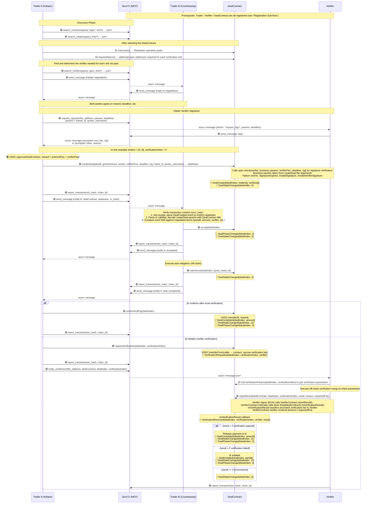
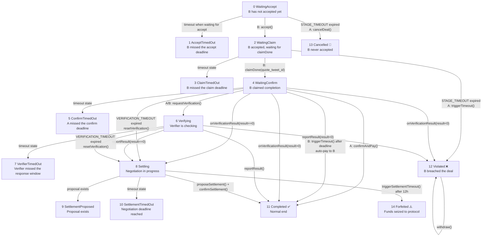
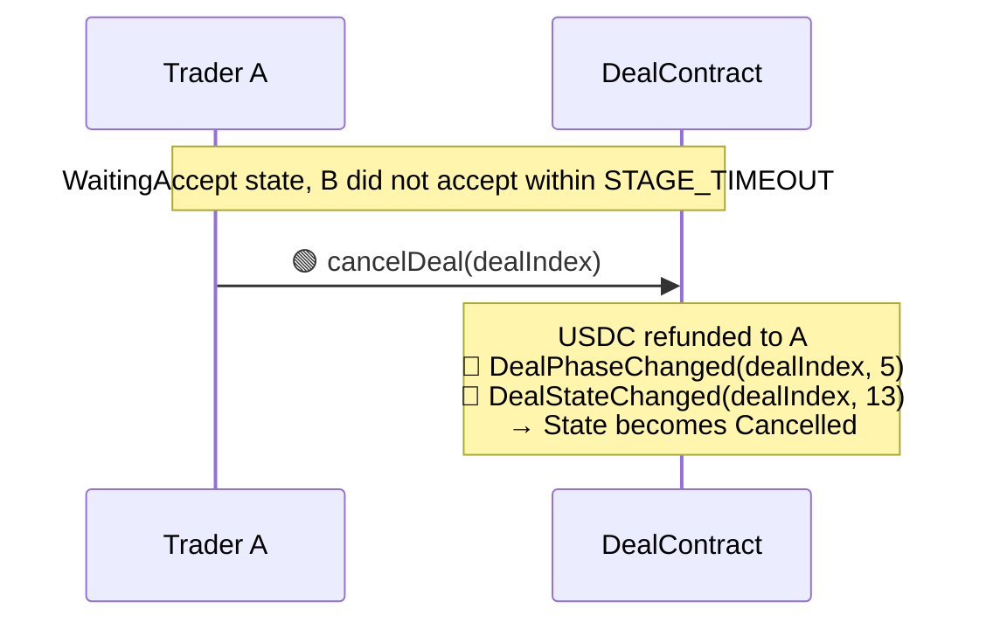
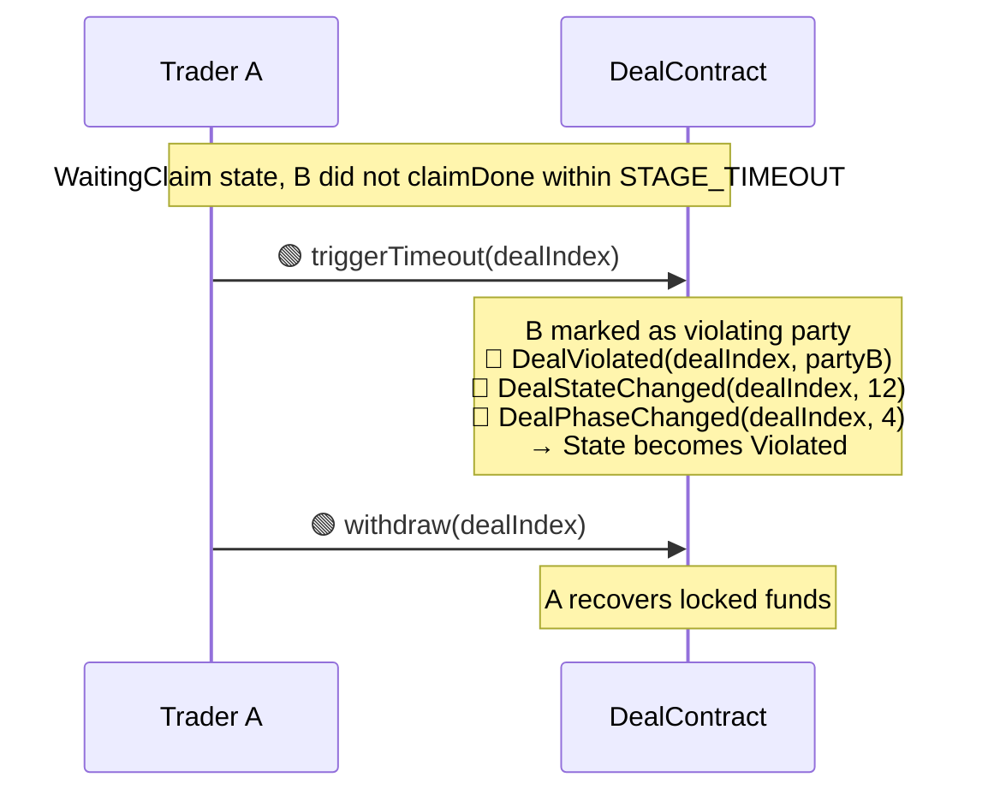
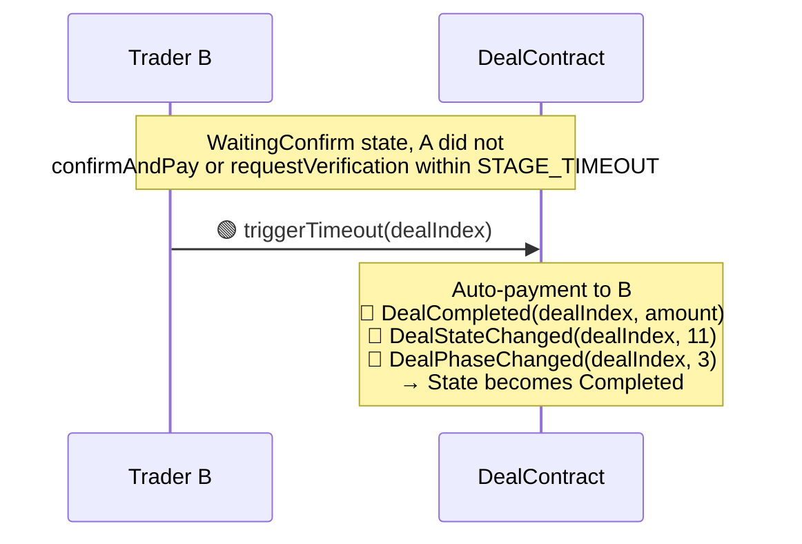
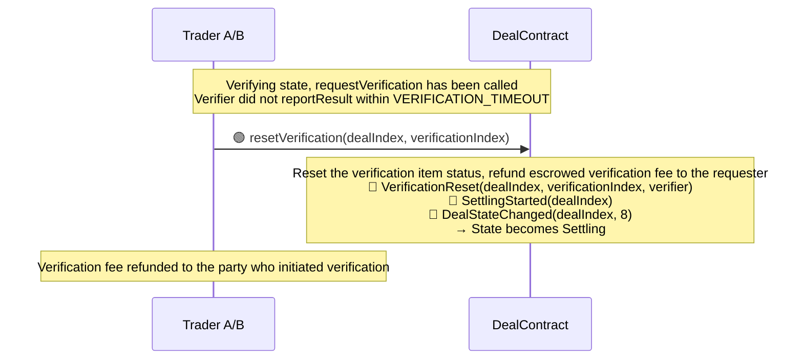
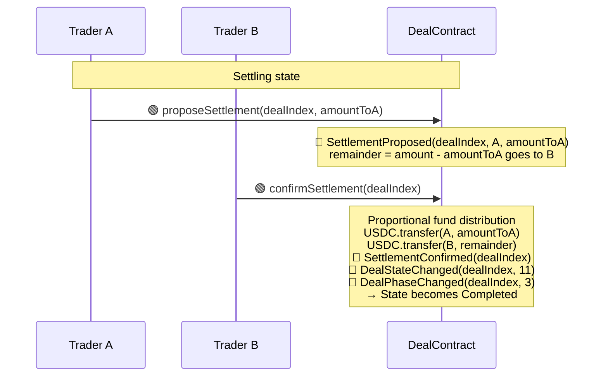
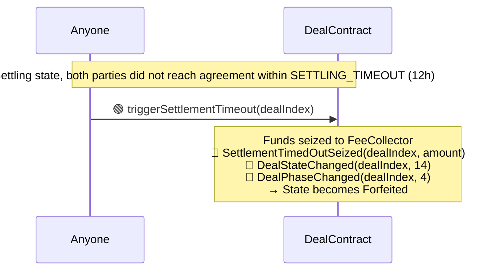
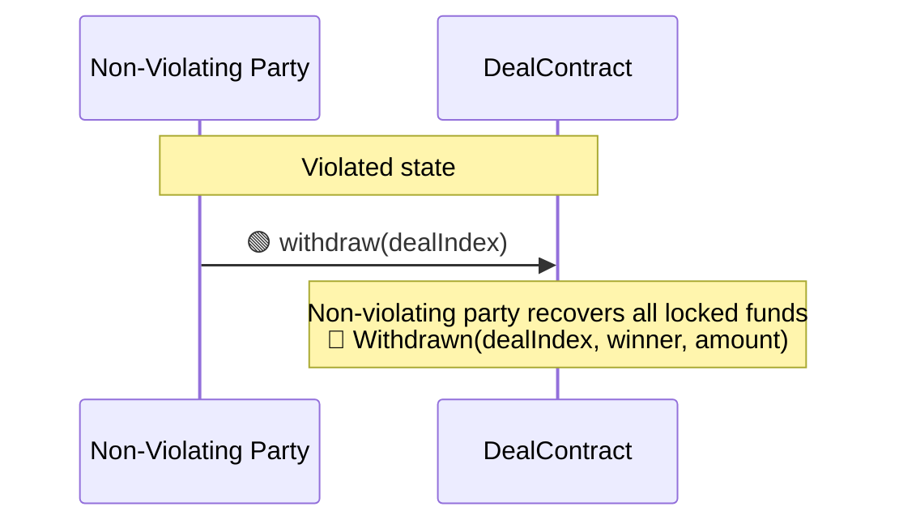

# XQuoteDealContract Design Document

> Complete design of XQuoteDealContract extracted from the core architecture document, including contract interfaces, transaction flow, state machine, timeout handling, and error handling.

---

## 1. Overview

XQuoteDealContract is a concrete DealContract implementation for the **"A pays B to quote a specified tweet"** transaction scenario.

- **Inheritance:** `IDeal → DealBase → XQuoteDealContract`
- **Verification system:** Single verification slot, requiring the spec to be `XQuoteVerifierSpec`
- **Payment token:** USDC
- **Tags:** `["x", "quote"]`

---

## 2. Function Reference

### 2.1 All XQuoteDealContract Functions

> Inheritance chain: `IDeal → DealBase → XQuoteDealContract`

| Method | Parameters | Return Value | Defined In | Implemented In | Description |
|--------|------------|--------------|------------|----------------|-------------|
| `standard()` | — | `string` | IDeal | DealBase | Returns `"1.0"`. `pure`, cannot be overridden |
| `supportsInterface(id)` | `bytes4 id` | `bool` | IDeal | DealBase | ERC-165. `pure`, cannot be overridden |
| `_recordStart(...)` | `address[] traders, address[] verifiers` | `uint256 dealIndex` | DealBase | DealBase | Internal utility. Emits DealCreated, returns dealIndex |
| `_emitPhaseChanged(dealIndex, toPhase)` | `uint256 dealIndex, uint8 toPhase` | — | DealBase | DealBase | Internal utility. Emits DealPhaseChanged. phase: 2=Active, 3=Success, 4=Failed, 5=Cancelled |
| `_emitStateChanged(...)` | `uint256 dealIndex, uint8 stateIndex` | — | DealBase | DealBase | Internal utility. Emits DealStateChanged |
| `_emitViolated(...)` | `uint256 dealIndex, address violator` | — | DealBase | DealBase | Internal utility. Emits DealViolated |
| `name()` | — | `string` | IDeal | XQuoteDealContract | Returns `"XQuoteDealContract"`. `pure` |
| `description()` | — | `string` | IDeal | XQuoteDealContract | Contract description, used for SyncTx search. `pure` |
| `tags()` | — | `string[]` | IDeal | XQuoteDealContract | Returns `["x", "quote"]`. `pure` |
| `version()` | — | `string` | IDeal | XQuoteDealContract | Deal rule version number. `pure` |
| `protocolFeePolicy()` | — | `string` | IDeal | XQuoteDealContract | Human-readable protocol fee policy. `view` |
| `protocolFee()` | — | `uint96` | XQuoteDealContract | XQuoteDealContract | Convenience helper for the exact fee amount. `view` |
| `instruction()` | — | `string` (Markdown) | IDeal | XQuoteDealContract | Operation guide, consistent with MCP terminology. `view` |
| `phase(dealIndex)` | `uint256 dealIndex` | `uint8` | IDeal | XQuoteDealContract | General phase: 0=NotFound 1=Pending 2=Active 3=Success 4=Failed 5=Cancelled. `view` |
| `dealStatus(dealIndex)` | `uint256 dealIndex` | `uint8` | IDeal | XQuoteDealContract | Caller-independent business status. Returns 0-14 plus 255 for NotFound. `view` |
| `dealExists(dealIndex)` | `uint256 dealIndex` | `bool` | IDeal | XQuoteDealContract | Whether the deal exists. `view` |
| `requiredSpecs()` | — | `address[]` | IDeal | XQuoteDealContract | Returns the list of spec addresses required for each verification slot. XQuoteDealContract has only 1 slot, pointing to the XQuoteVerifierSpec address. `view` |
| `verificationParams(...)` | `uint256 dealIndex, uint256 verificationIndex` | `(address verifier, uint256 fee, uint256 deadline, bytes sig, bytes specParams)` | IDeal | XQuoteDealContract | Called by the Verifier after receiving notification to obtain verification parameters. `specParams = abi.encode(tweet_id, quoter_username, quote_tweet_id)`. `view` |
| `requestVerification(...)` | `uint256 dealIndex, uint256 verificationIndex` | — | IDeal | XQuoteDealContract | Triggered by a Trader to initiate verification. Escrows verification fee + emits VerificationRequested. `external` |
| `onVerificationResult(...)` | `uint256 dealIndex, uint256 verificationIndex, int8 result, string reason` | — | IDeal | XQuoteDealContract | Verifier → DealContract callback. DealBase reverts by default, subclasses must override. `external` |
| `createDeal(...)` | `address partyB, uint256 grossAmount, address verifier, uint256 verifierFee, uint256 deadline, bytes sig, string tweet_id, string quoter_username` | `uint256 dealIndex` | XQuoteDealContract | XQuoteDealContract | Creates a deal. Internally calls `XQuoteVerifierSpec.check()` for signature verification, then compares the recovered signer with `verifier.signer()`. Business parameters are passed as flat arguments |
| `accept(dealIndex)` | `uint256 dealIndex` | — | XQuoteDealContract | XQuoteDealContract | Trader B accepts the deal. WaitingAccept → WaitingClaim |
| `claimDone(...)` | `uint256 dealIndex, string quote_tweet_id` | — | XQuoteDealContract | XQuoteDealContract | Trader B claims task completion and submits the quote tweet ID. WaitingClaim → WaitingConfirm |
| `confirmAndPay(dealIndex)` | `uint256 dealIndex` | — | XQuoteDealContract | XQuoteDealContract | Trader A confirms completion and releases payment. WaitingConfirm → Completed |
| `cancelDeal(dealIndex)` | `uint256 dealIndex` | — | XQuoteDealContract | XQuoteDealContract | A cancels after timeout in WaitingAccept stage, refunding all funds. WaitingAccept → Cancelled |
| `triggerTimeout(dealIndex)` | `uint256 dealIndex` | — | XQuoteDealContract | XQuoteDealContract | Triggers timeout handling. WaitingClaim timeout → Violated; WaitingConfirm timeout (unverified) → auto-payment Completed |
| `resetVerification(...)` | `uint256 dealIndex, uint256 verificationIndex` | — | XQuoteDealContract | XQuoteDealContract | Resets verification after Verifier timeout, refunding escrowed verification fee. WaitingConfirm → Settling |
| `proposeSettlement(...)` | `uint256 dealIndex, uint256 amountToA` | — | XQuoteDealContract | XQuoteDealContract | Proposes a fund distribution plan. The proposer cannot confirm their own proposal; the counterparty can overwrite the previous proposal |
| `confirmSettlement(dealIndex)` | `uint256 dealIndex` | — | XQuoteDealContract | XQuoteDealContract | Confirms the counterparty's distribution plan and executes fund distribution. Settling → Completed |
| `triggerSettlementTimeout(dealIndex)` | `uint256 dealIndex` | — | XQuoteDealContract | XQuoteDealContract | After 12h negotiation timeout, anyone can call to seize funds to FeeCollector. Settling → Forfeited |
| `withdraw(dealIndex)` | `uint256 dealIndex` | — | XQuoteDealContract | XQuoteDealContract | The non-violating party withdraws all locked funds. Only callable in Violated state; the violating party cannot call |

### 2.2 All XQuoteVerifier Functions

> Inheritance chain: `IVerifier → VerifierBase → XQuoteVerifier`
> Spec contract: `VerifierSpec → XQuoteVerifierSpec` (pointed to by XQuoteVerifier.spec())

| Method | Parameters | Return Value | Defined In | Implemented In | Description |
|--------|------------|--------------|------------|----------------|-------------|
| `reportResult(...)` | `address dealContract, uint256 dealIndex, uint256 verificationIndex, int8 result, string reason, uint256 expectedFee` | — | IVerifier | VerifierBase | Called by the Verifier signer (EOA), internally calls back `IDeal(dealContract).onVerificationResult()`. `external` |
| `owner()` | — | `address` | IVerifier | VerifierBase | Contract owner. `view` |
| `signer()` | — | `address` | IVerifier | VerifierBase | Signing / reporting EOA. `view` |
| `supportsInterface(id)` | `bytes4 id` | `bool` | IVerifier | VerifierBase | ERC-165. `pure` |
| `transferOwnership(...)` | `address newOwner` | — | VerifierBase | VerifierBase | Instance ownership management |
| `acceptOwnership()` | — | — | VerifierBase | VerifierBase | Two-step ownership acceptance |
| `setSigner(...)` | `address newSigner` | — | VerifierBase | VerifierBase | Change verifier signer EOA |
| `withdrawFees(...)` | `address to, uint256 amount` | — | VerifierBase | VerifierBase | Withdraw fees received by the instance |
| `DOMAIN_SEPARATOR` | — | `bytes32` | VerifierBase | VerifierBase | Public immutable, read by the Spec contract's `check()` |
| `description()` | — | `string` | IVerifier | XQuoteVerifier | Instance self-description. `view` |
| `spec()` | — | `address` | IVerifier | XQuoteVerifier | Points to the business specification contract XQuoteVerifierSpec address. `view` |
| `spec()->name()` | — | `string` | VerifierSpec | XQuoteVerifierSpec | Returns `"X Quote Tweet Verifier Spec"`. Called indirectly via spec() |
| `spec()->version()` | — | `string` | VerifierSpec | XQuoteVerifierSpec | Returns `"1.0"`. Called indirectly via spec() |
| `spec()->description()` | — | `string` | VerifierSpec | XQuoteVerifierSpec | Specification description: includes parameter definitions, check semantics, and specParams abi.encode format. Called indirectly via spec() |
| `spec()->check(...)` | `address verifierInstance, string tweet_id, string quoter_username, uint256 fee, uint256 deadline, bytes sig` | `address` | XQuoteVerifierSpec | XQuoteVerifierSpec | Business validation entry point. Reads DOMAIN_SEPARATOR from the instance and verifies the recovered signer matches `verifierInstance.signer()`. Reverts: SignatureExpired / InvalidSignature / InvalidVerifierSignature. Called by DealContract internally during createDeal |

---

## 3. Event Reference

| Event Name | Parameters | Implemented In | Trigger Timing | Description |
|------------|------------|----------------|----------------|-------------|
| `DealCreated` | `uint256 dealIndex, address[] traders, address[] verifiers` | DealBase (`_recordStart`) | When `createDeal` succeeds | traders and verifiers record the participants |
| `DealStateChanged` | `uint256 dealIndex, uint8 stateIndex` | DealBase (`_emitStateChanged`) | On every state change | stateIndex corresponds to the base dealStatus value. SyncTx uses this + instruction() to infer who needs to act |
| `DealPhaseChanged` | `uint256 indexed dealIndex, uint8 indexed phase` | DealBase (`_emitPhaseChanged`) | On phase transitions: accept (2), normal completion (3), violation (4), cancellation (5) | phase: 2=Active, 3=Success, 4=Failed, 5=Cancelled |
| `DealViolated` | `uint256 dealIndex, address violator` | DealBase (`_emitViolated`) | triggerTimeout (Accepted stage) / verification failure (result<0) | violator is the address of the violating party |
| `VerificationRequested` | `uint256 dealIndex, uint256 verificationIndex, address verifier` | XQuoteDealContract (`requestVerification`) | When `requestVerification` succeeds | Also transfers verification fee to contract escrow. Verifier calls verificationParams after receiving notification |
| `VerificationReceived` | `uint256 dealIndex, uint256 verificationIndex, address verifier, int8 result` | XQuoteDealContract (`onVerificationResult`) | When Verifier reports result | Emitted in the onVerificationResult callback |
| `DealCompleted` | `uint256 dealIndex, uint256 amount` | XQuoteDealContract | confirmAndPay / verification passed (result>0) / WaitingConfirm timeout auto-payment | Normal payment completion |
| `VerificationReset` | `uint256 dealIndex, uint256 verificationIndex, address verifier` | XQuoteDealContract | On `resetVerification` (Verifier timeout) | Refunds escrowed verification fee to the initiator |
| `SettlingStarted` | `uint256 dealIndex` | XQuoteDealContract | Verification inconclusive (result==0) / resetVerification | Enters Settling state |
| `SettlementProposed` | `uint256 dealIndex, address proposer, uint256 amountToA` | XQuoteDealContract | On `proposeSettlement` | remainder = amount - amountToA goes to B |
| `SettlementConfirmed` | `uint256 dealIndex` | XQuoteDealContract | On `confirmSettlement` | Emitted after proportional fund distribution |
| `FundsSeized` | `uint256 dealIndex, uint256 amount` | XQuoteDealContract | On `triggerSettlementTimeout` (negotiation timeout 12h) | Funds seized to FeeCollector |
| `Withdrawn` | `uint256 dealIndex, address winner, uint256 amount` | XQuoteDealContract | On `withdraw` (Violated state) | Non-violating party recovers all locked funds |

---

## 4. Verification System

### 4.1 Contract Structure

```
VerifierSpec ← XQuoteVerifierSpec (business specification contract)
IVerifier ← VerifierBase ← XQuoteVerifier (instance contract)
XQuoteVerifier.spec() → XQuoteVerifierSpec (composition relationship)
```

### 4.2 Responsibility Division

| Contract | Responsibility |
|----------|---------------|
| **XQuoteVerifierSpec** | Business specification contract. Fixed `name/version/description`. Defines and implements `check()`: receives the instance contract address and business parameters, constructs structHash, calls back to the instance's DOMAIN_SEPARATOR and signer to complete EIP-712 signature verification |
| **VerifierBase** | Abstract base class. Provides `DOMAIN_SEPARATOR` (public immutable), `owner`, `signer`, `reportResult` callback, fee withdrawal, ownership management |
| **XQuoteVerifier** | Instance contract. Inherits VerifierBase, composes XQuoteVerifierSpec. Exposes `spec()` and `description()`. **Does not implement `check()`** |

### 4.3 check() Signature Verification Flow

```
XQuoteVerifierSpec.check(verifierInstance, tweet_id, quoter_username, fee, deadline, sig)
  │
  ├── 1. Construct structHash(tweet_id, quoter_username, fee, deadline)
  ├── 2. Read DOMAIN_SEPARATOR from verifierInstance
  ├── 3. Construct EIP-712 digest = keccak256(0x1901 || DOMAIN_SEPARATOR || structHash)
  ├── 4. Recover signer from sig (with EIP-2 low-s value check)
  └── 5. Verify signer == verifierInstance.signer()
       ├── Failure → revert SignatureExpired / InvalidSignature / InvalidVerifierSignature
       └── Success → passed
```

### 4.4 specParams Encoding

The `specParams` encoding format returned by `verificationParams()`:

```solidity
specParams = abi.encode(
    string tweet_id,          // Original tweet ID
    string quoter_username,   // Quoter's username
    string quote_tweet_id     // Quote tweet ID submitted by B
)
```

Verifier-side decoding: `abi.decode(specParams, (string, string, string))`

### 4.5 Invocation Rules

- First validate `spec()`, then call the business specification contract; instance-related methods should always call the actual verifier instance contract
- Specification metadata (name/version/description) must be read from `spec()->`, not directly from the instance contract's methods of the same name
- `description()` has different meanings on the instance contract and the specification contract: the instance's is a self-description, the specification's is a spec description

---

## 5. Transaction Flow

> **Legend:**
> - Solid line `——▸` = direct call; dashed line `┈┈▸` = async message (counterparty must poll via get_messages)
> - 🟣 = MCP call (SyncTx interface); 🟢 = on-chain write call; 🟡 = on-chain read call
> - 🔵 = emit Event
>
> **Role description:** Trader A = initiator (paying party), Trader B = counterparty (executing party). requestVerification and notify_verifier can be called by either party.



---

## 6. State Machine and Transitions

### 6.1 State Enum

| stateIndex | State | Meaning |
|-----------|-------|---------|
| 0 | WaitingAccept | Deal created, waiting for B to accept |
| 1 | AcceptTimedOut | B failed to accept before timeout |
| 2 | WaitingClaim | B accepted, waiting for B to execute the task |
| 3 | ClaimTimedOut | B failed to claim before timeout |
| 4 | WaitingConfirm | B claims completion, waiting for A to confirm or trigger verification |
| 5 | ConfirmTimedOut | A failed to confirm before timeout |
| 6 | Verifying | Verification in progress, waiting for Verifier |
| 7 | VerifierTimedOut | Verifier failed to respond in time |
| 8 | Settling | Entered settlement negotiation phase |
| 9 | SettlementProposed | A settlement proposal exists |
| 10 | SettlementTimedOut | Settlement timed out, pending proposals can still be confirmed |
| 11 | Completed | Deal completed, funds released |
| 12 | Violated | Violation occurred, non-violating party may withdraw |
| 13 | Cancelled | Deal cancelled before B accepted |
| 14 | Forfeited | Funds seized to protocol |

> stateIndex is the stored base `dealStatus` value used by the contract. Different contracts may have different numbering, but XQuote uses the values above.

### 6.2 State Transition Diagram



---

## 7. Timeouts and Abnormal Paths

### 7.1 Timeout Constants

| Constant | Value | Applicable Stage |
|----------|-------|------------------|
| `STAGE_TIMEOUT` | 30 minutes | WaitingAccept / WaitingClaim / WaitingConfirm |
| `VERIFICATION_TIMEOUT` | 30 minutes | Verifier response time limit |
| `SETTLING_TIMEOUT` | 12 hours | Negotiation time limit |

The `stageTimestamp` for each stage is updated upon entering that state; timeout is counted from that moment.

### 7.2 Created → Timeout (B did not accept)

> B has not accepted yet, so it does not constitute a violation. A recovers funds, deal is cancelled, no statistics are affected for anyone.



### 7.3 Accepted → Timeout (B did not claimDone)



### 7.4 WaitingConfirm → Timeout (A neither confirmed nor initiated verification)



> **Note:** If A has already called requestVerification (verificationRequested = true), B cannot call triggerTimeout and must wait for the Verifier to respond or for Verifier timeout followed by resetVerification.

### 7.5 Verifier Timeout → resetVerification → Settling



### 7.6 Settling → Negotiated Distribution



> The proposer cannot confirm their own proposal; the counterparty can reject and propose a new plan (overwriting the previous proposal).

### 7.7 Settling → Negotiation Timeout (Funds Seized)



> Anyone can trigger this (no permission restrictions), incentivizing timely negotiation.

### 7.8 Violated → Non-Violating Party Withdrawal



> The violating party (violator) cannot call withdraw.

### 7.9 Settling Design Principles

Entry conditions: Verifier reports `result == 0` (inconclusive) or Verifier timeout followed by `resetVerification`.

- Whoever's turn it is to act and fails to do so gets penalized
- In the final deadlock, funds are seized, encouraging both parties to actively compromise
- In the Settling stage there is no clearly at-fault party (Verifier inconclusive or Verifier timeout are not A/B's responsibility), therefore **only a negotiation path is provided, re-initiating verification is not supported**

| Exit | Trigger Method | Description |
|------|---------------|-------------|
| Negotiated distribution | One party calls `proposeSettlement(dealIndex, amountToA)` + counterparty calls `confirmSettlement(dealIndex)` | Both parties negotiate fund distribution ratio; once agreed, each withdraws their share |
| Negotiation timeout seizure | Anyone calls `triggerSettlementTimeout(dealIndex)` (after `SETTLING_TIMEOUT`) | Both parties failed to reach agreement within the time limit; funds seized to FeeCollector |

---

## 8. Fund Flow

### 8.1 Fund Escrow at createDeal

```
Trader A approve amount = reward + protocolFee + verifierFee
At createDeal, USDC.transferFrom(A → contract) escrows all funds
```

- `protocolFee` policy is read via `protocolFeePolicy()`; the exact amount is available from the convenience helper `protocolFee()`
- `verifierFee` is obtained from the Verifier's signature reply (`{accepted: true, fee: 2000000, sig: "0x..."}`)

### 8.2 Normal Completion (confirmAndPay / Verification Passed / WaitingConfirm Timeout Auto-Payment)

```
reward        → Trader B
protocolFee   → FeeCollector (protocol revenue)
verifierFee   → Contract escrow, settled when requestVerification is called
```

### 8.3 Verification Fee Flow

```
At requestVerification:
  USDC.transferFrom(caller → contract) escrows verification fee

At reportResult callback (inside onVerificationResult):
  Transfer escrowed verification fee to Verifier contract
  Verifier contract verifies received amount ≥ expectedFee

At Verifier timeout resetVerification:
  Escrowed verification fee refunded to the party who initiated verification
```

### 8.4 Abnormal Path Fund Destinations

| Scenario | Fund Destination |
|----------|-----------------|
| WaitingAccept timeout → cancelDeal | Full refund to A |
| WaitingClaim timeout → triggerTimeout → Violated | A recovers via withdraw |
| WaitingConfirm timeout (unverified) → triggerTimeout | Auto-payment to B |
| Verification failed (result<0) → Violated | Non-violating party recovers via withdraw |
| Verification inconclusive (result==0) → Settling → negotiation | Distributed per proposeSettlement ratio |
| Settling timeout → triggerSettlementTimeout | All seized to FeeCollector; deal enters Forfeited (14) |

---

## 9. Validation Checklist

### 9.1 Internal Validations in createDeal

| # | Validation Item | Failure Handling |
|---|-----------------|------------------|
| 1 | Verifier spec match: `verifier.spec() == requiredSpecs()[0]` (i.e., XQuoteVerifierSpec) | revert |
| 2 | Signature verification: calls `XQuoteVerifierSpec.check(verifier, tweet_id, quoter_username, verifierFee, deadline, sig)` | revert SignatureExpired / InvalidSignature / InvalidVerifierSignature |
| 3 | Fund transfer: `USDC.transferFrom(A, contract, grossAmount)` | revert (insufficient allowance or balance) |
| 4 | Recording and events: `_recordStart([A, B], [verifier])` → emits DealCreated + DealStateChanged(0) | — |

### 9.2 Internal Validations in requestVerification

| # | Validation Item | Failure Handling |
|---|-----------------|------------------|
| 1 | Deal is in a state that allows triggering verification (WaitingConfirm) | revert |
| 2 | `msg.sender` is one of the deal's traders | revert |
| 3 | Caller's USDC allowance and balance ≥ the fee agreed upon in the verifier's signature | revert |
| 4 | Execute: `USDC.transferFrom(msg.sender → contract)` escrow verification fee, emit `VerificationRequested(dealIndex, verificationIndex, verifier)` | — |

### 9.3 Internal Validations in onVerificationResult

| # | Validation Item | Failure Handling |
|---|-----------------|------------------|
| 1 | Caller validation: `msg.sender` must be the VerifierContract corresponding to that verificationIndex | revert |
| 2 | Emit `VerificationReceived(dealIndex, verificationIndex, msg.sender, result)` | — |
| 3 | Transfer escrowed verification fee to Verifier contract | — |
| 4 | Handle business logic based on result: | — |
|   | `result > 0` (passed): release payment to B → DealCompleted → DealStateChanged(11) → `_emitPhaseChanged` → DealPhaseChanged(dealIndex, 3) | — |
|   | `result < 0` (failed): `_emitViolated(dealIndex, partyB)` → DealStateChanged(12) → `_emitPhaseChanged` → DealPhaseChanged(dealIndex, 4) | — |
|   | `result == 0` (inconclusive): SettlingStarted → DealStateChanged(8) → enter Settling | — |
